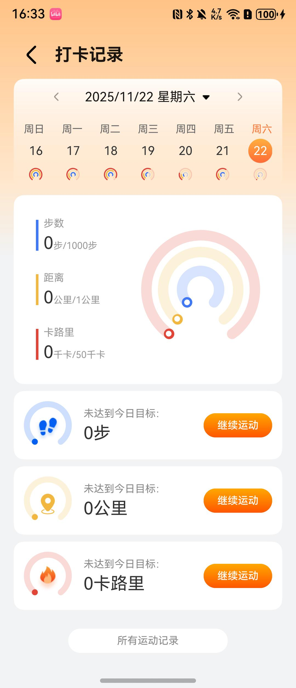

# 每日打卡组件快速入门

## 目录

- [简介](#简介)
- [约束与限制](#环境)
- [快速入门](#快速入门)
- [API参考](#API参考)
- [示例代码](#示例代码)
- [开源许可协议](#开源许可协议)

## 简介

本组件提供了每日运动记录的展示功能，包括周视图日历、三层圆环仪表盘展示步数/距离/卡路里的完成情况、未达标记录列表等功能。支持滑动切换周，选择日期查看详细数据，并可跳转到运动页面。



## 约束与限制
### 环境

- DevEco Studio版本：DevEco Studio 5.0.5 Release及以上
- HarmonyOS SDK版本：HarmonyOS 5.0.5 Release SDK及以上
- 设备类型：华为手机(直板机)
- 系统版本：HarmonyOS 5.0.5(17)及以上

## 快速入门

1. 安装组件。

   如果是在DevEco Studio使用插件集成组件，则无需安装组件，请忽略此步骤。

   如果是从生态市场下载组件，请参考以下步骤安装组件。

   a. 解压下载的组件包，将包中所有文件夹拷贝至您工程根目录的XXX目录下。

   b. 在项目根目录build-profile.json5添加module_daily模块。

   ```
   // 项目根目录下build-profile.json5填写module_daily路径。其中XXX为组件存放的目录名
   "modules": [
     {
       "name": "module_daily",
       "srcPath": "./XXX/module_daily"
     }
   ]
   ```

   c. 在项目根目录oh-package.json5添加依赖。

   ```
   // XXX为组件存放的目录名称
   "dependencies": {
     "module_daily": "file:./XXX/module_daily"
   }
   ```
2. 在EntryAbility的onWindowStageCreate中设置全屏模式。

   ```typescript
   let windowClass: window.Window = windowStage.getMainWindowSync();

   await windowClass.setWindowLayoutFullScreen(true);
   ```

3. 引入组件。

   ```
   import { DailyRecord} from 'module_daily'
   ```

4. 调用组件，详细参数配置说明参见[API参考](#API参考)。

   ```typescript
   DailyRecord()
   ```

## API参考

### 接口

#### DailyRecord(options?: [DailyRecordOptions](#DailyRecordOptions对象说明))

每日运动记录页面组件，包含周视图日历、三层圆环仪表盘、未达标记录列表等功能。

### DailyRecordOptions对象说明

| 参数名             | 类型                                                                                         | 是否必填 | 说明                                |
|-----------------|--------------------------------------------------------------------------------------------|------|-----------------------------------|
| calendarBuilder | () => void                                                                                 | 是    | 日历构建器，用于自定义日历组件                   |
| toAllSportPage  | () => void                                                                                 | 否    | 点击"所有运动记录"按钮时的回调函数                |
| toSportPage     | (date: Date, sportSingleRingType: [SportSingleRingType](#SportSingleRingType枚举说明)) => void | 否    | 点击未达标记录"继续运动"按钮时的回调函数，返回选中日期和运动类型 |

### SportSingleRingType枚举说明

运动单环类型枚举，用于标识运动数据类型。

| 枚举值      | 值 | 说明  |
|----------|---|-----|
| Step     | 0 | 步数  |
| Distance | 1 | 距离  |
| Calorie  | 2 | 卡路里 |

### DailyRecordVM对象说明

每日运动记录数据模型，通过`@Provider('attendanceRecordVM')`在父组件中提供，子组件通过`@Consumer('attendanceRecordVM')`接收。

| 参数名               | 类型                                    | 是否必填 | 说明               |
|-------------------|---------------------------------------|------|------------------|
| swiperData        | number[]                              | 否    | 滑动器数据            |
| weekDateModel     | [WeekDateModel](#WeekDateModel对象说明)[] | 否    | 周日期模型列表          |
| weekModel         | [WeekModel](#WeekModel对象说明)[]         | 否    | 周模型列表            |
| swiperIndex       | number                                | 否    | 当前滑动器索引，默认值为1    |
| dateIndex         | number                                | 否    | 当前选中的周索引，默认值为0   |
| weekDateModelItem | [WeekDateModel](#WeekDateModel对象说明)   | 否    | 当前选中的日期模型        |
| currentDate       | Date                                  | 否    | 当前选中的日期，默认值为当前日期 |

### WeekDateModel对象说明

周日期模型，包含单个日期的运动数据。

| 参数名          | 类型       | 是否必填 | 说明                                   |
|--------------|----------|------|--------------------------------------|
| selected     | boolean  | 否    | 是否选中，默认值为false                       |
| date         | Date     | 否    | 日期，默认值为当前日期                          |
| week         | string   | 否    | 周几，如"周一"                             |
| day          | string   | 否    | 日期，如"01"                             |
| stepData     | number[] | 否    | 步数数据，[当前值, 目标值]，默认值为[0, 1000]        |
| distanceData | number[] | 否    | 距离数据，[当前值(米), 目标值(公里)]，默认值为[0, 1000] |
| caloriesData | number[] | 否    | 卡路里数据，[当前值, 目标值]，默认值为[0, 1000]       |

### WeekModel对象说明

周模型，包含一周的日期数据。

| 参数名           | 类型                                    | 是否必填 | 说明      |
|---------------|---------------------------------------|------|---------|
| weekDateModel | [WeekDateModel](#WeekDateModel对象说明)[] | 是    | 周日期模型列表 |

#### DailyRecordVM方法说明

| 方法名                  | 参数                                                                                               | 返回值                                 | 说明                        |
|----------------------|--------------------------------------------------------------------------------------------------|-------------------------------------|---------------------------|
| initDataList         | date: Date                                                                                       | void                                | 初始化周数据列表，传入要显示的日期         |
| swiperChange         | -                                                                                                | void                                | 周面板数据切换时调用                |
| selectDate           | date: Date, swiperIndex: number, itemIndex: number, weekModelData: [WeekModel](#WeekModel对象说明)[] | void                                | 选择日期时调用，更新选中状态            |
| queryDateRunningData | date: Date                                                                                       | [WeekDateModel](#WeekDateModel对象说明) | 查询指定日期的运动数据，返回步数、距离、卡路里数据 |

### 事件

支持以下事件：

#### toAllSportPage

toAllSportPage: () => void;

点击"所有运动记录"按钮时触发，用于跳转到所有运动记录页面。

#### toSportPage

toSportPage: (date: Date, sportSingleRingType: SportSingleRingType) => void;

点击未达标记录的"继续运动"按钮时触发，返回选中的日期和运动类型，用于跳转到运动页面。

## 示例代码

```ts
import { DailyRecord, DailyRecordVM } from 'module_daily';
import { SportSingleRingType } from 'module_daily/src/main/ets/components/SportSingleRing';
import { SportRecord, SportTarget } from 'module_daily/src/main/ets/models/SportRecord';
import { PreferenceUtil } from 'module_daily/src/main/ets/utils/PreferenceUtil';

@Entry
@ComponentV2
struct Index {
  @Provider('attendanceRecordVM') attendanceRecordVM: DailyRecordVM = new DailyRecordVM()

  aboutToAppear() {
    // 初始化Mock数据
    this.initMockData()
    // 初始化周数据
    this.attendanceRecordVM.initDataList(new Date())
  }

  /**
   * 初始化Mock运动记录数据
   */
  initMockData() {
    const today = new Date()
    const mockRecords: SportRecord[] = []
    
    // 生成最近7天的Mock数据
    for (let i = 0; i < 7; i++) {
      const date = new Date(today)
      date.setDate(date.getDate() - i)
      
      // 创建目标数据
      const target: SportTarget = {
        stepCount: 10000,      // 目标步数：10000步
        distance: 8000,        // 目标距离：8公里（单位：米，8000米=8公里）
        deplete: 500,          // 目标消耗：500千卡
        timeLength: 60      // 目标时长：60分钟
      }
      
      // 创建运动记录，每天的数据略有不同
      const record: SportRecord = {
        year: date.getFullYear(),
        month: date.getMonth() + 1,
        day: date.getDate(),
        totalTarget: target,
        // 模拟实际完成数据（完成度在60%-120%之间）
        totalStepCount: Math.floor(6000 + Math.random() * 6000),  // 6000-12000步
        // 距离：4-9公里，转换为米存储（4000-9000米）
        totalDistance: Math.floor((4 + Math.random() * 5) * 1000),
        totalDeplete: Math.floor(300 + Math.random() * 300)  // 300-600千卡
      }
      
      mockRecords.push(record)
    }
    
    // 将Mock数据存储到AppStorage，供SportServiceApi使用
    AppStorage.setOrCreate(PreferenceUtil.ALL_RECORD_DATA_KEY, mockRecords)
  }

  /**
   * 日历构建器示例
   * 注意：实际使用时需要根据项目中的日历组件进行自定义
   */
  @Builder
  calendarBuilder() {
    Row() {
      // 左箭头按钮（切换到上一周）
      // 注意：需要替换为实际的图标资源路径
      Text('<')
        .fontSize(18)
        .fontColor('#333333')
        .onClick(() => {
          // 切换到上一周
          const date = new Date(this.attendanceRecordVM.currentDate)
          date.setDate(date.getDate() - 7)
          this.attendanceRecordVM.currentDate = date
          this.attendanceRecordVM.initDataList(date)
        })

      // 显示当前日期
      Text(this.formatDate(this.attendanceRecordVM.currentDate))
        .fontSize(15)
        .fontColor('#333333')
        .padding({ left: 12, right: 12 })

      // 右箭头按钮（切换到下一周）
      // 注意：需要替换为实际的图标资源路径
      Text('>')
        .fontSize(18)
        .fontColor('#333333')
        .onClick(() => {
          // 切换到下一周
          const date = new Date(this.attendanceRecordVM.currentDate)
          date.setDate(date.getDate() + 7)
          this.attendanceRecordVM.currentDate = date
          this.attendanceRecordVM.initDataList(date)
        })
    }
    .justifyContent(FlexAlign.SpaceEvenly)
    .width('100%')
    .padding({ top: 8, bottom: 8 })
  }

  /**
   * 格式化日期
   */
  formatDate(date: Date): string {
    const year = date.getFullYear()
    const month = String(date.getMonth() + 1).padStart(2, '0')
    const day = String(date.getDate()).padStart(2, '0')
    return `${year}-${month}-${day}`
  }

  build() {
    NavDestination() {
      DailyRecord({
        calendarBuilder: () => {
          this.calendarBuilder()
        },
        toAllSportPage: () => {
          // 跳转到所有运动记录页面
          console.info('跳转到所有运动记录页面')
          // 实际使用时，可以调用路由跳转：
          // RouterUtils.pushPathByName(RouterMap.ALL_SPORT_RECORDS_PAGE)
        },
        toSportPage: (date: Date, sportSingleRingType: SportSingleRingType) => {
          // 跳转到运动页面
          const typeName = sportSingleRingType === SportSingleRingType.Step ? '步数' :
            sportSingleRingType === SportSingleRingType.Distance ? '距离' : '卡路里'
          console.info(`跳转到运动页面，日期：${this.formatDate(date)}，类型：${typeName}`)
          // 实际使用时，可以调用路由跳转：
          // RouterUtils.pushPathByName(RouterMap.REAL_TIME_MOTION_PAGE, {
          //   'date': date,
          //   'sportType': sportSingleRingType
          // } as ESObject)
        }
      })
    }
    .hideTitleBar(true)
    .backgroundColor($r('sys.color.background_secondary'))
    .onWillShow(() => {
      // 页面显示时初始化数据
      this.attendanceRecordVM.initDataList(this.attendanceRecordVM.currentDate)
    })
  }
}
```

## 开源许可协议

该代码经过[Apache 2.0 授权许可](http://www.apache.org/licenses/LICENSE-2.0)。
