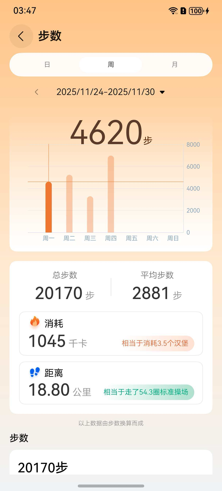
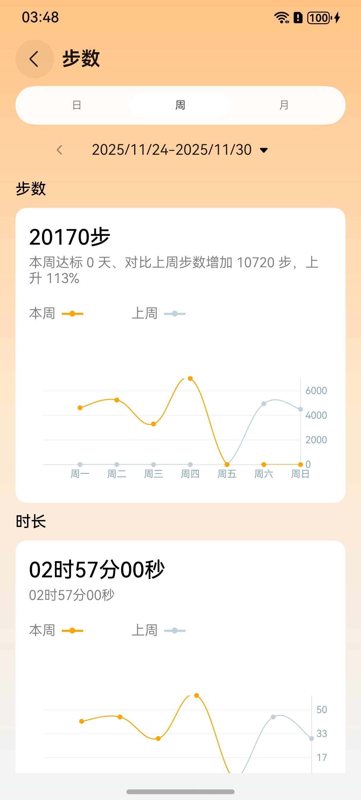
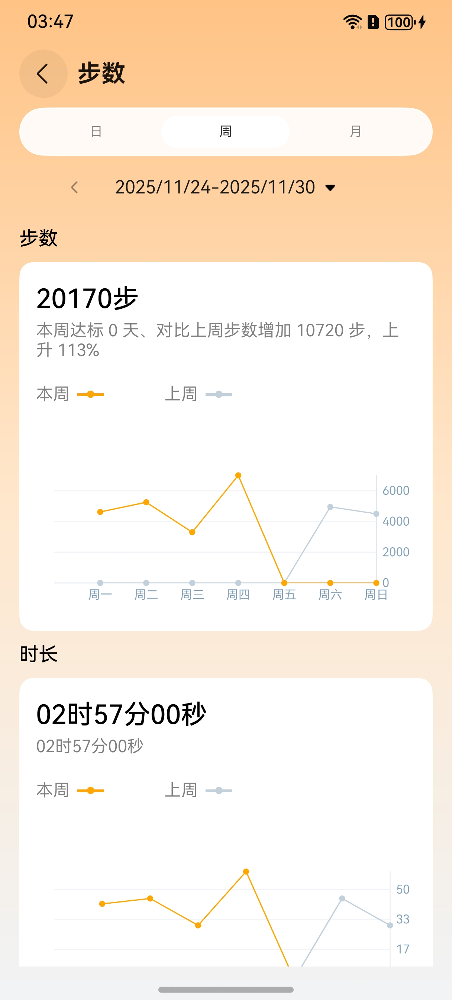

# 图表及数据展示组件快速入门

## 目录

- [简介](#简介)
- [约束与限制](#约束与限制)
- [快速入门](#快速入门)
- [API参考](#API参考)
- [示例代码](#示例代码)
- [开源许可协议](#开源许可协议)

## 简介

本组件提供了按日、周、月展示折线图、曲线图和柱状图等功能。

| 柱状图 | 曲线图 | 折线图 |
| ------ | ------ | ------ |
||||

## 约束与限制

### 环境

- DevEco Studio版本：DevEco Studio 5.0.5 Release及以上
- HarmonyOS SDK版本：HarmonyOS 5.0.5 Release SDK及以上
- 设备类型：华为手机(直板机)
- 系统版本：HarmonyOS 5.0.5(17)及以上

## 快速入门

1. 安装组件。

   如果是在DevEco Studio使用插件集成组件，则无需安装组件，请忽略此步骤。

   如果是从生态市场下载组件，请参考以下步骤安装组件。

   a. 解压下载的组件包，将包中所有文件夹拷贝至您工程根目录的XXX目录下。

   b. 在项目根目录build-profile.json5添加module_datechart模块。

   ```typescript
   // 在项目根目录build-profile.json5填写module_datechart路径。其中XXX为组件存放的目录名
   "modules": [
     {
       "name": "module_datechart",
       "srcPath": "./XXX/module_datechart",
     }
   ]
   ```
   c. 在项目根目录oh-package.json5中添加依赖。
   ```typescript
   // XXX为组件存放的目录名称
   "dependencies": {
       "module_datechart": "file:./XXX/module_datechart",
   }
   ```

2. 引入组件。

   ```typescript
   import { LineChartDataModel, SportChartPage } from 'module_datechart'
   ```

3. 调用组件，详细参数配置说明参见[API参考](#API参考)。

   ```typescript
    // 调用DateLineChart组件
    SportChartPage()
   ```

4. 切换折线图

   ```typescript
   // 图表模式
   @Provider() lineChartMode: LineChartMode = LineChartMode.LINEAR
   ```
5. 切换曲线图

   ```typescript
   // 图表模式
   @Provider() lineChartMode: LineChartMode = LineChartMode.CUBIC_BEZIER
   ```
   

## API参考

### 接口
SportChartPage(options?: [SportChartPageOptions](#SportChartPageOptions对象说明))

运动图表展示组件。

### SportChartPageOptions对象说明

| 参数名                       | 类型                                                      | 是否必填 | 说明                                   |
|---------------------------|---------------------------------------------------------|------|--------------------------------------|
| dateType          | [DateType](#DateType枚举说明)                                           | 是    | 显示类型枚举（支持按日/DAY、周/WEEK、月/MONTH展示折线图） |                          |
| dayStepModel          | [DayChartCardModel](#DayChartCardModel对象说明)             | 否    | 每天步数数据模型                             |
| dayTimeModel           | [DayChartCardModel](#DayChartCardModel对象说明)             | 否    | 每天时长数据模型                             |
| dayDepleteModel          | [DayChartCardModel](#DayChartCardModel对象说明)             | 否    | 每天消耗数据模型                             |
| dayDistanceModel          | [DayChartCardModel](#DayChartCardModel对象说明)             | 否    | 每天距离数据模型                             |
| wmStepModel          | [WeekMonthChartCardModel](#WeekMonthChartCardModel对象说明) | 否    | 每周、月步数数据模型                           |
| wmTimeModel           | [WeekMonthChartCardModel](#WeekMonthChartCardModel对象说明) | 否    | 每周、月时长数据模型                           |
| wmDepleteModel          | [WeekMonthChartCardModel](#WeekMonthChartCardModel对象说明) | 否    | 每周、月消耗数据模型                           |

### DayChartCardModel对象说明

| 参数名                       | 类型         | 是否必填 | 说明     |
|---------------------------|------------|------|--------|
| target          | number   | 是    | 目标数值   |                          |
| process          | number   | 否    | 完成数值   |
| charData           | [LineChartDataModel[]](#LineChartDataModel对象说明)  | 否    | 图标数据   |
| isShowArrow          | boolean   | 否    |  布尔值，控制是否显示箭头 |

### WeekMonthChartCardModel对象说明

| 参数名                       | 类型         | 是否必填 | 说明                                   |
|---------------------------|------------|------|--------------------------------------|
| dateType          | [DateType](#DateType枚举说明)      | 是    | 显示类型枚举（支持按日/DAY、周/WEEK、月/MONTH展示折线图） |                          |
| desc          | ResourceStr   | 否    | 标题                                   |
| descInfo           | ResourceStr   | 否    | 描述                                   |
| curData          | [LineChartDataModel[]](#LineChartDataModel对象说明)   | 否    | 当前数据模型                               |
| lastData          | [LineChartDataModel[]](#LineChartDataModel对象说明)   | 否    | 比较数据模型                               |
| curDateStr          | ResourceStr   | 否    | 当前数据                          |
| lastDateStr           | ResourceStr   | 否    | 比较数据                           |


### DateLineChartOptions对象说明

| 参数名        | 类型                                                | 是否必填 | 说明                                                            |
|------------|---------------------------------------------------|------|---------------------------------------------------------------|
| dateType | [DateType](#DateType枚举说明)                                          | 是    | 图表显示类型枚举（支持按日/DAY、周/WEEK、月/MONTH展示线形图）                        |
| data     | [LineChartDataModel[]](#LineChartDataModel对象说明)   | 是    | 数据集合，按不同日期类型装载：<br>- 日类型：每小时数据<br>- 周类型：周一至周日数据<br>- 月类型：每天数据 |
| options  | [LineChartDataOptions](#LineChartDataOptions对象说明) | 否    | 图表样式配置，可设置：<br>- 坐标轴颜色/宽度<br>- 文本尺寸<br>- Y轴最大值<br>- 自定义X轴标签格式 |

#### 事件

| 事件名              | 回调参数                                | 触发时机         |
|------------------|-------------------------------------|--------------|
| onSelectedData | [CharDataModel](#CharDataModel对象说明) | 用户点击图表数据点时触发 |

---

### DateBarChartOptions对象说明

| 参数名             | 类型                                        | 是否必填 | 说明                                                            |
|-----------------|-------------------------------------------|------|---------------------------------------------------------------|
| dateType      | [DateType](#DateType枚举说明)                                   | 是    | 图表显示类型枚举（支持按日/DAY、周/WEEK、月/MONTH展示柱状图）                        |
| data          | [CharDataModel[]](#CharDataModel对象说明)     | 是    | 数据集合，按不同日期类型装载：<br>- 日类型：每小时数据<br>- 周类型：周一至周日数据<br>- 月类型：每天数据 |
| options       | [BarChartOptions[]](#BarChartOptions对象说明) | 否    | 图表样式配置，可设置：<br>- 柱体颜色/高亮色<br>- 柱体宽度/圆角                        |
| selectedIndex | number                                  | 否    | 初始选中柱体的索引位置                                                   |

### 事件

| 事件名              | 回调参数                                | 触发时机          |
|------------------|-------------------------------------|---------------|
| onSelectedData | [CharDataModel](#CharDataModel对象说明) | 用户点击柱状图数据点时触发 |

### LineChartDataModel对象说明

| 名称            | 类型                                                | 是否必填 | 说明    |
|:--------------|:--------------------------------------------------|------|-------|
| dataModel   | [CharDataModel[]](#CharDataModel对象说明)             | 是    | 数据集合  |
| dataOptions | [LineChartDataOptions](#LineChartDataOptions对象说明) | 否    | 线样式说明 |

### CharDataModel对象说明

| 名称     | 类型       | 是否必填 | 说明  |
|:-------|:---------|------|-----|
| data | number | 是    | 数据值 |
| date | Date   | 是    | 时间  |
| obj  | Object | 否    | 未知  |

### LineChartDataOptions对象说明

| 参数名                  | 类型       | 是否必填 | 说明               |
|----------------------|----------|------|------------------|
| lineColor          | number | 否    | 线颜色（支持十六进制或资源引用） |
| lineWidth          | number | 否    | 线宽（单位：像素）        |
| circleRadius       | number | 否    | 数据点圆圈半径（单位：像素）   |
| lineHighLightColor | number | 否    | 高亮状态下的线颜色        |

### LineChartOptions对象说明

| 参数名                       | 类型         | 是否必填 | 说明                                              |
|---------------------------|------------|------|-------------------------------------------------|
| xAxisLineColor          | number   | 否    | X轴线颜色（支持十六进制或资源引用）                              |
| xAxisTextColor          | number   | 否    | X轴标签文本颜色（支持十六进制或资源引用）                           |
| xAxisTextSize           | number   | 否    | X轴标签字体大小（单位：像素）                                 |
| xAxisLineWidth          | number   | 否    | X轴线粗细（单位：像素）                                    |
| yAxisLineColor          | number   | 否    | Y轴线颜色（支持十六进制或资源引用）                              |
| yAxisTextColor          | number   | 否    | Y轴标签文本颜色（支持十六进制或资源引用）                           |
| yAxisTextSize           | number   | 否    | Y轴标签字体大小（单位：像素）                                 |
| yAxisLineWidth          | number   | 否    | Y轴线粗细（单位：像素）                                    |
| maxXRange               | number   | 否    | 设置图表最大X轴显示范围，未设置时默认显示全部数据                       |
| yAxisLabelCount         | number   | 否    | Y轴标签显示数量                                        |
| yAxisMaximum            | number   | 否    | Y轴最大值设定                                         |
| customYAxisLabels       | number[] | 否    | 自定义Y轴标签数组（需配合enableCustomYAxisLabels使用）       |
| enableCustomYAxisLabels | boolean  | 否    | 启用完全自定义Y轴标签模式（设为true时必须提供customYAxisLabels数组） |

### CharDataModel对象说明

| 名称     | 类型       | 是否必填 | 说明  |
|:-------|:---------|------|-----|
| data | number | 是    | 数据值 |
| date | Date   | 是    | 时间  |
| obj  | Object | 否    | 未知  |

### BarChartOptions对象说明

| 参数名                 | 类型        | 是否必填 | 说明                                  |
|---------------------|-----------|------|-------------------------------------|
| xAxisLineColor    | number  | 否    | X轴线颜色（支持十六进制或资源引用）                  |
| xAxisTextColor    | number  | 否    | X轴标签文本颜色（支持十六进制或资源引用）               |
| xAxisTextSize     | number  | 否    | X轴标签字体大小（单位：像素）                     |
| xAxisLineWidth    | number  | 否    | X轴线粗细（单位：像素）                        |
| yAxisLineColor    | number  | 否    | Y轴线颜色（支持十六进制或资源引用）                  |
| yAxisTextColor    | number  | 否    | Y轴标签文本颜色（支持十六进制或资源引用）               |
| yAxisTextSize     | number  | 否    | Y轴标签字体大小（单位：像素）                     |
| yAxisLineWidth    | number  | 否    | Y轴线粗细（单位：像素）                        |
| maxXRange         | number  | 否    | 图表最大X轴显示范围，未设置时默认显示全部数据             |
| yAxisLabelCount   | number  | 否    | Y轴标签显示数量                            |
| yAxisMaximum      | number  | 否    | Y轴最大值设定                             |
| barHighLightColor | number  | 否    | 柱状体选中状态颜色（支持十六进制或资源引用）              |
| barColor          | number  | 否    | 柱状体默认颜色（支持十六进制或资源引用）                |
| barWidth          | number  | 否    | 柱状体宽度比例（取值范围0-1，1表示占满数据点间距）         |
| barTopRadius      | number  | 否    | 柱状体顶部圆角半径（单位：像素）                    |
| autoHighlight     | boolean | 否    | 是否自动高亮最新数据（默认false）                 |
| highLightLine     | boolean | 否    | 是否显示高亮辅助线（需配合barHighLightColor使用） |

### DateType枚举说明

| 枚举值      | 值 | 说明  |
|----------|---|-----|
| DAY     | 0 | 日  |
| WEEK | 1 | 周  |
| MONTH  | 2 | 月 |

### 示例代码

```
import { LineChartDataModel, LineChartMode, SportChartPage } from 'module_datechart'
import { common } from '@kit.AbilityKit'
import { mapCommon } from '@kit.MapKit'

@Entry
@ComponentV2
struct Index {
  private context: common.UIAbilityContext = this.getUIContext().getHostContext() as common.UIAbilityContext
  // 图表模式
  @Provider() lineChartMode: LineChartMode = LineChartMode.LINEAR
  @Local vm: StepCountVM = {
    curRecords: [{
      year: 2025,
      month: 10,
      day: 1,
      totalTarget: {
        timeLength: 180,
        stepCount: 10000,
        distance: 10000,
        deplete: 500
      },
      totalStepCount: 5000,
      totalDistance: 5000,
      totalDeplete: 300,
      totalSportTimeLength: 1200,
      hourStepCount: [],
      hourDistance: [],
      hourDeplete: [],
      hourSportTimeLength: [],
      sportItemList: []
    }],
    dateType: DateType.DAY,
    curDate: new Date(),
    lastRecords: [],
    curStepCharModel: [new CharDataModel(0, new Date('2025/10/1'), "00:00"),
      new CharDataModel(0, new Date('2025/10/1'), "01:00"), new CharDataModel(0, new Date('2025/10/1'), "02:00"),
      new CharDataModel(0, new Date('2025/10/1'), "03:00"), new CharDataModel(0, new Date('2025/10/1'), "04:00"),
      new CharDataModel(0, new Date('2025/10/1'), "05:00"), new CharDataModel(0, new Date('2025/10/1'), "06:00"),
      new CharDataModel(0, new Date('2025/10/1'), "07:00"), new CharDataModel(0, new Date('2025/10/1'), "08:00"),
      new CharDataModel(0, new Date('2025/10/1'), "09:00"), new CharDataModel(500, new Date('2025/10/1'), "10:00"),
      new CharDataModel(1000, new Date('2025/10/1'), "11:00"), new CharDataModel(1500, new Date('2025/10/1'), "12:00"),
      new CharDataModel(800, new Date('2025/10/1'), "13:00"), new CharDataModel(1200, new Date('2025/10/1'), "14:00"),
      new CharDataModel(0, new Date('2025/10/1'), "15:00"), new CharDataModel(0, new Date('2025/10/1'), "16:00"),
      new CharDataModel(0, new Date('2025/10/1'), "17:00"), new CharDataModel(0, new Date('2025/10/1'), "18:00"),
      new CharDataModel(0, new Date('2025/10/1'), "19:00"), new CharDataModel(0, new Date('2025/10/1'), "20:00"),
      new CharDataModel(0, new Date('2025/10/1'), "21:00"), new CharDataModel(0, new Date('2025/10/1'), "22:00"),
      new CharDataModel(0, new Date('2025/10/1'), "23:00")],
    curTimeLengthCharModel: [new CharDataModel(0, new Date('2025/10/1'), "00:00"),
      new CharDataModel(0, new Date('2025/10/1'), "01:00"), new CharDataModel(0, new Date('2025/10/1'), "02:00"),
      new CharDataModel(0, new Date('2025/10/1'), "03:00"), new CharDataModel(0, new Date('2025/10/1'), "04:00"),
      new CharDataModel(0, new Date('2025/10/1'), "05:00"), new CharDataModel(0, new Date('2025/10/1'), "06:00"),
      new CharDataModel(0, new Date('2025/10/1'), "07:00"), new CharDataModel(0, new Date('2025/10/1'), "08:00"),
      new CharDataModel(0, new Date('2025/10/1'), "09:00"), new CharDataModel(100, new Date('2025/10/1'), "10:00"),
      new CharDataModel(200, new Date('2025/10/1'), "11:00"), new CharDataModel(300, new Date('2025/10/1'), "12:00"),
      new CharDataModel(200, new Date('2025/10/1'), "13:00"), new CharDataModel(400, new Date('2025/10/1'), "14:00"),
      new CharDataModel(0, new Date('2025/10/1'), "15:00"), new CharDataModel(0, new Date('2025/10/1'), "16:00"),
      new CharDataModel(5, new Date('2025/10/1'), "17:00"), new CharDataModel(0, new Date('2025/10/1'), "18:00"),
      new CharDataModel(0, new Date('2025/10/1'), "19:00"), new CharDataModel(0, new Date('2025/10/1'), "20:00"),
      new CharDataModel(0, new Date('2025/10/1'), "21:00"), new CharDataModel(0, new Date('2025/10/1'), "22:00"),
      new CharDataModel(0, new Date('2025/10/1'), "23:00")],
    curDepleteCharModel: [new CharDataModel(0, new Date('2025/10/1'), "00:00"),
      new CharDataModel(0, new Date('2025/10/1'), "01:00"), new CharDataModel(0, new Date('2025/10/1'), "02:00"),
      new CharDataModel(0, new Date('2025/10/1'), "03:00"), new CharDataModel(0, new Date('2025/10/1'), "04:00"),
      new CharDataModel(0, new Date('2025/10/1'), "05:00"), new CharDataModel(0, new Date('2025/10/1'), "06:00"),
      new CharDataModel(0, new Date('2025/10/1'), "07:00"), new CharDataModel(0, new Date('2025/10/1'), "08:00"),
      new CharDataModel(0, new Date('2025/10/1'), "09:00"), new CharDataModel(50, new Date('2025/10/1'), "10:00"),
      new CharDataModel(60, new Date('2025/10/1'), "11:00"), new CharDataModel(60, new Date('2025/10/1'), "12:00"),
      new CharDataModel(30, new Date('2025/10/1'), "13:00"), new CharDataModel(100, new Date('2025/10/1'), "14:00"),
      new CharDataModel(0, new Date('2025/10/1'), "15:00"), new CharDataModel(0, new Date('2025/10/1'), "16:00"),
      new CharDataModel(0, new Date('2025/10/1'), "17:00"), new CharDataModel(0, new Date('2025/10/1'), "18:00"),
      new CharDataModel(0, new Date('2025/10/1'), "19:00"), new CharDataModel(0, new Date('2025/10/1'), "20:00"),
      new CharDataModel(0, new Date('2025/10/1'), "21:00"), new CharDataModel(0, new Date('2025/10/1'), "22:00"),
      new CharDataModel(0, new Date('2025/10/1'), "23:00")],
    curDistanceCharModel: [new CharDataModel(0, new Date('2025/10/1'), "00:00"),
      new CharDataModel(0, new Date('2025/10/1'), "01:00"), new CharDataModel(0, new Date('2025/10/1'), "02:00"),
      new CharDataModel(0, new Date('2025/10/1'), "03:00"), new CharDataModel(0, new Date('2025/10/1'), "04:00"),
      new CharDataModel(0, new Date('2025/10/1'), "05:00"), new CharDataModel(0, new Date('2025/10/1'), "06:00"),
      new CharDataModel(0, new Date('2025/10/1'), "07:00"), new CharDataModel(0, new Date('2025/10/1'), "08:00"),
      new CharDataModel(0, new Date('2025/10/1'), "09:00"), new CharDataModel(100, new Date('2025/10/1'), "10:00"),
      new CharDataModel(500, new Date('2025/10/1'), "11:00"), new CharDataModel(1000, new Date('2025/10/1'), "12:00"),
      new CharDataModel(400, new Date('2025/10/1'), "13:00"), new CharDataModel(2000, new Date('2025/10/1'), "14:00"),
      new CharDataModel(500, new Date('2025/10/1'), "15:00"), new CharDataModel(500, new Date('2025/10/1'), "16:00"),
      new CharDataModel(5, new Date('2025/10/1'), "17:00"), new CharDataModel(0, new Date('2025/10/1'), "18:00"),
      new CharDataModel(0, new Date('2025/10/1'), "19:00"), new CharDataModel(0, new Date('2025/10/1'), "20:00"),
      new CharDataModel(0, new Date('2025/10/1'), "21:00"), new CharDataModel(0, new Date('2025/10/1'), "22:00"),
      new CharDataModel(0, new Date('2025/10/1'), "23:00")],
    sportCompareModel: new SportCompareModel,
    selectedIndex: 0
  }

  build() {
    Scroll() {
      SportChartPage({
        dateType: DateType.DAY,
        dayStepModel: {
          target: this.vm.curRecords[0].totalTarget?.stepCount ?? 0,
          process: this.vm.curRecords[0].totalStepCount,
          charData: [new LineChartDataModel(this.vm.curStepCharModel, {
            lineHighLightColor: this.context.resourceManager.getColorSync($r('app.color.color_FFA700')),
            lineColor: this.context.resourceManager.getColorSync($r('app.color.color_FFA700')),
            lineWidth: 1,
            circleRadius: 2.5
          })],
          isShowArrow: true
        },
        dayTimeModel: {
          target: 30,
          process: this.vm.curRecords[0].totalSportTimeLength / 60,
          charData: [new LineChartDataModel(this.vm.curTimeLengthCharModel, {
            lineHighLightColor: this.context.resourceManager.getColorSync($r('app.color.color_FFA700')),
            lineColor: this.context.resourceManager.getColorSync($r('app.color.color_FFA700')),
            lineWidth: 1,
            circleRadius: 2.5
          })],
          isShowArrow: false
        },
        dayDepleteModel: {
          target: this.vm.curRecords[0].totalTarget?.deplete ?? 0,
          process: this.vm.curRecords[0].totalDeplete,
          charData: [new LineChartDataModel(this.vm.curDepleteCharModel, {
            lineHighLightColor: this.context.resourceManager.getColorSync($r('app.color.color_FFA700')),
            lineColor: this.context.resourceManager.getColorSync($r('app.color.color_FFA700')),
            lineWidth: 1,
            circleRadius: 2.5
          })],
          isShowArrow: false
        },
        dayDistanceModel: {
          target: (this.vm.curRecords[0].totalTarget?.distance ?? 0) / 1000,
          process: this.vm.curRecords[0].totalDistance / 1000,
          charData: [new LineChartDataModel(this.vm.curDistanceCharModel, {
            lineHighLightColor: this.context.resourceManager.getColorSync($r('app.color.color_FFA700')),
            lineColor: this.context.resourceManager.getColorSync($r('app.color.color_FFA700')),
            lineWidth: 1,
            circleRadius: 2.5
          })],
          isShowArrow: false
        },
        chartCardClick: () => {
          this.getUIContext().getPromptAction().showDialog({
            title: '跳转详情页面',
          })
        }
      })
    }

  }
}

@ObservedV2
export class StepCountVM {
  @Trace dateType: DateType = DateType.DAY
  @Trace curDate: Date = new Date()
  @Trace curRecords: SportRecord[] = []
  @Trace lastRecords: SportRecord[] = []
  @Trace selectData?: CharDataModel
  @Trace curStepCharModel: CharDataModel[] = []
  @Trace curTimeLengthCharModel: CharDataModel[] = []
  @Trace curDepleteCharModel: CharDataModel[] = []
  @Trace curDistanceCharModel: CharDataModel[] = []
  @Trace sportCompareModel: SportCompareModel = new SportCompareModel()
  @Trace selectedIndex: number = 0
}

/**
 * 每天运动记录
 */
export interface SportRecord {
  //年
  year: number
  //月
  month: number
  //日
  day: number
  //当日目标
  totalTarget: SportTarget | null
  //当日总步数
  totalStepCount: number
  //当日总距离 单位 米
  totalDistance: number
  //当日总消耗
  totalDeplete: number
  //当日总锻炼时长
  totalSportTimeLength: number
  //每小时步数
  hourStepCount: number[]
  //每小时距离
  hourDistance: number[]
  //每小时消耗
  hourDeplete: number[]
  //每小时锻炼时长
  hourSportTimeLength: number[]
  //当日所有运动记录
  sportItemList: SportItem[]
}

export enum TargetTypeStr {
  //距离
  DISTANCE = '距离',
  //消耗
  DEPLETE = '热量',
  //时长
  TIME_LENGTH = '时长',
  //配速
  PACE = '配速'
}

export class MonthItemModel implements SportItem {
  month: number
  day: number
  type: SportType
  childType: ChildSportType
  hour: number
  minute: number
  distance: number
  timeLength: number
  target: SportItemTarget | undefined
  deplete: number
  stepCount: number
  locusPoints?: mapCommon.LatLng[]
  year: number

  constructor(month: number, day: number, type: SportType, childType: ChildSportType, hour: number, minute: number,
    distance: number,
    timeLength: number, target: SportItemTarget | undefined, deplete: number, stepCount: number,
    locusPoints?: mapCommon.LatLng[], year?: number) {
    this.month = month
    this.day = day
    this.type = type
    this.childType = childType
    this.hour = hour
    this.minute = minute
    this.distance = distance
    this.timeLength = timeLength
    this.target = target
    this.deplete = deplete
    this.stepCount = stepCount
    this.locusPoints = locusPoints
    this.year = year ?? new Date().getFullYear()
  }
}

export interface SportTarget {
  //目标步数
  stepCount: number
  //目标距离
  distance: number
  //目标消耗
  deplete: number
  //目标时长
  timeLength: number
}

export interface SportItem {
  //运动类型
  type: SportType
  //运动子类型
  childType: ChildSportType
  //开始时间
  hour: number
  //开始时间
  minute: number
  //运动距离 单位米
  distance: number
  //运动时长 单位秒
  timeLength: number
  //单次运动目标
  target?: SportItemTarget
  //运动消耗 单位 卡
  deplete: number
  //步数（跑步，步行）
  stepCount: number
  //轨迹点
  locusPoints?: mapCommon.LatLng[]
}

export interface SportItemTarget {
  //目标类型
  targetType: TargetType
  //目标值  距离：单位米   消耗：单位千卡   时长：单位秒   配速：单位秒
  value: number
}

export enum SportType {
  //所有运动
  ALL,
  //步行
  WALKING,
  //跑步
  JOGGING,
  //骑行
  CYCLING,
  //计时运动
  CLOCK_BASE_EXCERCISE
}

export enum ChildSportType {
  //自由走
  FREE_WALKING,
  //目标走
  TARGET_WALKING,
  //遛狗
  DOG_WALKING,
  //自由跑
  FREE_JOGGING,
  //目标跑
  TARGET_JOGGING,
  //自由骑
  FREE_CYCLING,
  //目标骑
  TARGET_CYCLING,
  //计时运动
  TIMING_SPORT
}

export enum TargetType {
  //距离
  DISTANCE,
  //消耗
  DEPLETE,
  //时长
  TIME_LENGTH,
  //配速
  PACE
}

export class CharDataModel {
  data: number
  date: Date
  obj?: Object

  constructor(data: number, date: Date, obj?: Object) {
    this.data = data
    this.date = date
    this.obj = obj
  }
}

@ObservedV2
export class SportStatistics {
  @Trace
  totalStepCount: number = 0
  @Trace
  averageStepCount: number = 0
  @Trace
  totalDeplete: number = 0
  @Trace
  totalDistance: number = 0
  @Trace
  averageDistance: number = 0
  @Trace
  totalSportTimeLength: number = 0
  @Trace
  stepComplete: number = 0
  @Trace
  totalCount: number = 0
}

@ObservedV2
export class SportCompareModel {
  @Trace
  compareType: DateType = DateType.WEEK
  @Trace lastStepCharModel: CharDataModel[] = []
  @Trace lastTimeLengthCharModel: CharDataModel[] = []
  @Trace lastDepleteCharModel: CharDataModel[] = []
  @Trace
  lastSportRecord = new SportStatistics()
  @Trace
  curSportStatistics = new SportStatistics()
  @Trace
  lastSportStatistics = new SportStatistics()
  @Trace
  stepTrendTitle: ResourceStr = ''
  @Trace
  stepTrendDesc: ResourceStr = ''
  @Trace
  stepCompleteTitle: ResourceStr = ''
  @Trace
  stepCompleteDesc: ResourceStr = ''
  @Trace
  sportDistanceTitle: ResourceStr = ''
  @Trace
  sportDistanceDesc: ResourceStr = ''
  @Trace
  sportTimeLengthTitle: ResourceStr = ''
  @Trace
  sportDepleteTitle: ResourceStr = ''
  @Trace
  curDateStr: ResourceStr = ''
  @Trace
  lastDateStr: ResourceStr = ''
  @Trace
  stepDesc: ResourceStr = ''
  @Trace
  stepDescInfo: ResourceStr = ''
  @Trace
  timeLengthDesc: ResourceStr = ''
  @Trace
  timeLengthDescInfo: ResourceStr = ''
  @Trace
  depleteDesc: ResourceStr = ''
  @Trace
  depleteDescInfo: ResourceStr = ''
}

export enum DateType {
  DAY, WEEK, MONTH
}

```

## 开源许可协议

该代码经过[Apache 2.0 授权许可](http://www.apache.org/licenses/LICENSE-2.0)。
