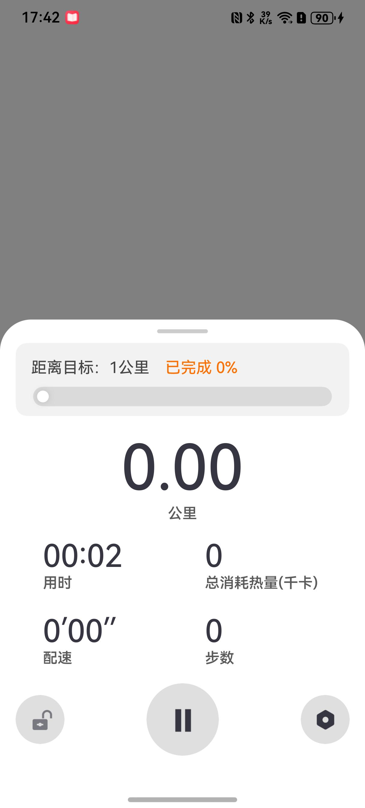
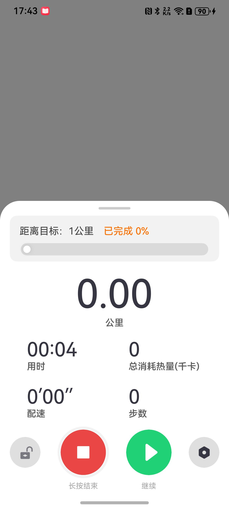

# 开始运动组件快速入门

## 目录

- [简介](#简介)
- [约束与限制](#约束与限制)
- [快速入门](#快速入门)
- [API参考](#API参考)
- [示例代码](#示例代码)
- [开源许可协议](#开源许可协议)

## 简介

本组件提供了控制运动进度，展示运动轨迹和数据的功能。

| 运动中 | 暂停运动 |
| ------ | -------- |
|  ||


## 约束与限制

### 环境

- DevEco Studio版本：DevEco Studio 5.0.5 Release及以上
- HarmonyOS SDK版本：HarmonyOS 5.0.5 Release SDK及以上
- 设备类型：华为手机(直板机)
- 系统版本：HarmonyOS 5.0.5(17)及以上

### 权限

- 读取用户的运动状态权限：ohos.permission.ACTIVITY_MOTION

## 快速入门

1. 安装组件。

   如果是在DevEco Studio使用插件集成组件，则无需安装组件，请忽略此步骤。

   如果是从生态市场下载组件，请参考以下步骤安装组件。

   a. 解压下载的组件包，将包中所有文件夹拷贝至您工程根目录的XXX目录下。

   b. 在项目根目录build-profile.json5添加module_running模块。

   ```
   // 项目根目录下build-profile.json5填写module_running路径。其中XXX为组件存放的目录名
   "modules": [
        {
          "name": "module_running",
          "srcPath": "./XXX/module_running",
        },
   ]
   ```

   c. 在项目根目录oh-package.json5添加依赖。

   ```
   // XXX为组件存放的目录名称
   "dependencies": {
     "module_running": "file:./XXX/module_running"
   }
   ```
2. 在EntryAbility的onCreate中对RunResUtil初始化

   a. 在EntryAbility中引入RunResUtil。
   ```typescript
   import { RunResUtil } from 'module_running';
   ```
   b. 在EntryAbility的onCreate中调用RunResUtil初始化方法。
   ```typescript
   RunResUtil.init(this.context)
   ```

3. 引入组件。

   ```
   import { RealTimeMotionMain } from 'module_running';
   ```
   
4. 调用组件，详细参数配置说明参见[API参考](#API参考)。

   ```typescript
   RealTimeMotionMain()
   ```

## API参考

### 接口

#### RealTimeMotionMain(options?: [RealTimeMotionMainOptions](#RealTimeMotionMainOptions对象说明))

实时运动主页面组件，提供运动控制、数据展示、地图轨迹等功能。

### RealTimeMotionMainOptions对象说明

| 参数名                | 类型                                        | 是否必填 | 说明                                                                 |
|--------------------|-------------------------------------------|------|--------------------------------------------------------------------|
| mainBuilder        | () => void                                | 否    | 自定义主内容构建器，用于自定义地图等主内容区域                                            |
| isRun              | [RunState](#RunState枚举)                   | 否    | 运动状态，通过`@Provider('isRun')`提供，默认值为Stop                             |
| runningControlLock | boolean                                   | 否    | 锁屏状态，通过`@Provider('runningControlLock')`提供，锁屏时无法操作运动控制面板，默认值为false |
| realTimeMotionVM   | [RealTimeMotionVM](#RealTimeMotionVM对象说明) | 否    | 页面数据模型，通过`@Provider('realTimeMotionVM')`提供                         |
| titleShow          | boolean                                   | 否    | 是否显示标题栏，通过`@Provider('titleShow')`提供，默认值为true                      |
| bindSheetShow      | boolean                                   | 否    | 是否显示底部弹窗，通过`@Provider('bindSheetShow')`提供，默认值为false                |
| moveType           | [SportType](#SportType枚举)                 | 否    | 运动类型，通过`@Provider('moveType')`提供，默认值为WALKING                       |
| motionType         | [MotionType](#MotionType枚举)                                     | 否    | 运动模式，通过`@Provider('motionType')`提供，如'自由'、'目标'、'遛狗'                 |

### RealTimeMotionVM对象说明

实时运动数据模型，通过`@Provider('realTimeMotionVM')`在父组件中提供，子组件通过`@Consumer('realTimeMotionVM')`接收。

| 参数名           | 类型                          | 是否必填 | 说明                      |
|---------------|-----------------------------|------|-------------------------|
| distance      | number                      | 否    | 运动距离（单位：米），默认值为0        |
| distanceKM    | string                      | 否    | 运动距离（单位：公里），默认值为'0.00'  |
| heat          | number                      | 否    | 运动消耗（单位：千卡），默认值为0       |
| steps         | number                      | 否    | 运动步数，默认值为0              |
| duration      | number                      | 否    | 运动时长（单位：秒），默认值为0        |
| durationMS    | string                      | 否    | 运动时长（格式化显示），默认值为'00:00' |
| pace          | string                      | 否    | 配速（分'秒''/公里），默认值为'00'   |
| move          | [MoveState](#MoveState枚举)   | 否    | 运动状态，默认值为pauseMove      |
| targetType    | [TargetType](#TargetType枚举) | 否    | 目标类型，默认值为DISTANCE       |
| parameter     | number                      | 否    | 目标参数值，默认值为0             |
| parameterDesc | string                      | 否    | 目标参数描述，默认值为''           |
| progressValue | string                      | 否    | 进度百分比，默认值为''            |
| showAll       | boolean                     | 否    | 是否显示全部信息，默认值为true       |
| sportType     | [SportType](#SportType枚举)   | 否    | 运动类型，默认值为WALKING        |
| motion        | [MotionType](#MotionType枚举) | 否    | 运动模式，默认值为target         |

#### RealTimeMotionVM方法说明

| 方法名                  | 参数               | 返回值    | 说明                     |
|----------------------|------------------|--------|------------------------|
| startExercising      | -                | void   | 开始运动，启动计时器和传感器订阅       |
| addDistance          | distance: number | void   | 添加距离数据，更新总距离和配速计算      |
| calculatePace        | -                | string | 计算配速，返回格式化的配速字符串       |

### RunState枚举

| 枚举值   | 值 | 说明 |
|-------|---|----|
| Start | 0 | 开始 |
| Pause | 1 | 暂停 |
| Stop  | 2 | 停止 |

### MoveState枚举

| 枚举值       | 值 | 说明   |
|-----------|---|------|
| startMove | 0 | 开始运动 |
| pauseMove | 1 | 暂停运动 |
| stopMove  | 2 | 停止运动 |

### SportType枚举

| 枚举值                  | 值 | 说明   |
|----------------------|---|------|
| ALL                  | 0 | 所有运动 |
| WALKING              | 1 | 步行   |
| JOGGING              | 2 | 跑步   |
| CYCLING              | 3 | 骑行   |
| CLOCK_BASE_EXCERCISE | 4 | 计时运动 |

### MotionType枚举

| 枚举值       | 值    | 说明   |
|-----------|------|------|
| isFreedom | '自由' | 自由模式 |
| target    | '目标' | 目标模式 |
| walkDog   | '遛狗' | 遛狗模式 |

### TargetType枚举

| 枚举值         | 值    | 说明 |
|-------------|------|----|
| DISTANCE    | '距离' | 距离 |
| DEPLETE     | '热量' | 消耗 |
| TIME_LENGTH | '时长' | 时长 |
| PACE        | '配速' | 配速 |

### ControlType枚举

| 枚举值     | 值 | 说明     |
|---------|---|--------|
| Start   | 0 | 开始     |
| Pause   | 1 | 暂停     |
| End     | 2 | 结束     |
| Setting | 3 | 设置     |
| Lock    | 4 | 锁定     |
| Unlock  | 5 | 解锁     |
| Begin   | 6 | 开始 |

## 示例代码

```ts
import {
  ControlType,
  MoveState,
  RealTimeMotionMain,
  RealTimeMotionVM,
  RunningConstants,
  RunState,
  SportType,
  TargetType
} from 'module_running';
import { abilityAccessCtrl, common } from '@kit.AbilityKit';
import { promptAction } from '@kit.ArkUI';
import { emitter } from '@kit.BasicServicesKit';

@Entry
@ComponentV2
struct Index {
  @Local countDownBg: ResourceStr = $r('app.media.ic_walking_bg')
  @Local startTimer: number = -1
  // 运动控件状态控制
  @Provider('isRun') isRun: RunState = RunState.Start;
  @Provider('runningControlLock') runningControlLock: boolean = false;
  @Local showCountDown: boolean = true;
  @Local countDown: number = 3;
  // 运行相关演示数据
  @Provider('realTimeMotionVM') realTimeMotionVM: RealTimeMotionVM =
    new RealTimeMotionVM(SportType.WALKING, TargetType.DISTANCE, '0.1公里', '目标');
  @Provider('bindSheetShow') bindSheetShow: boolean = true;
  @Provider('titleShow') titleShow: boolean = false
  @Provider('moveType') moveType: SportType = SportType.WALKING
  @Provider('motionType') motionType: string = '目标'
  @Provider('currentClickControlType') currentClickControlType: ControlType = ControlType.Start;
  @Local target: TargetType = TargetType.DISTANCE
  @Local params: string = '0.1公里'

  @Monitor('realTimeMotionVM.steps')
  stepsMonitor() {
    // 模拟距离,通过监听步数来模拟距离.可替换成定位计算距离
    if (this.realTimeMotionVM.move === MoveState.startMove) {
      this.realTimeMotionVM.addDistance(0.4)
    }
  }

  @Monitor('isRun')
  runMonitor() {
    // 监听长按结束
    if (this.isRun === RunState.Stop) {
      // 停止运动
      this.getUIContext().showAlertDialog({
        message: '是否结束本次运动？',
        primaryButton: {
          value: '继续运动',
          fontColor: '#5a5a5a',
          action: () => {
            emitter.emit('continueExercising')
          }
        },
        secondaryButton: {
          value: '结束运动',
          fontColor: '#FF6017',
          action: () => {
            this.countDown = 3
            this.showCountDown = true;
            this.bindSheetShow = false;
            this.isRun = RunState.Stop;
            this.realTimeMotionVM!.move = MoveState.stopMove
            this.aboutToAppear()
          }
        },
        autoCancel: false
      })
    }
  }

  async checkPermissions() {
    try {
      let atManager: abilityAccessCtrl.AtManager = abilityAccessCtrl.createAtManager();
      const requestResult =
        await atManager.requestPermissionsFromUser(getContext() as common.UIAbilityContext,
          ['ohos.permission.ACTIVITY_MOTION']);
      if (requestResult.authResults && requestResult.authResults[0] === 0) {
        this.countDownHandler()
      } else {
        promptAction.showToast({ message: '获取权限失败' });
      }
    } catch (e) {
      promptAction.showToast({ message: '获取权限异常' });
    }
  }

  aboutToAppear(): void {
    // 初始化数据模型-按目标/步行/按距离-0.1公里
    this.realTimeMotionVM = new RealTimeMotionVM(this.moveType, this.target, this.params, this.motionType)
    // 获取传感器权限
    this.checkPermissions()
  }

  countDownHandler(): void {
    // 模拟开始运动倒计时,倒计时结束自动开始
    this.startTimer = setInterval(() => {
      this.countDown--;
      if (this.countDown <= 0) {
        clearInterval(this.startTimer);
        this.startTimer = -1
        this.showCountDown = false;
        this.bindSheetShow = true;
        this.isRun = RunState.Start;
        this.realTimeMotionVM!.move = MoveState.startMove
      }
    }, 1000)
  }

  build() {
    Column() {
      if (this.countDown === 0) {
        RealTimeMotionMain()
      }
    }
    .overlay(this.showCountDown ? this.CountDownBuilder() : undefined)
    .backgroundColor(Color.Gray)
  }

  @Builder
  CountDownBuilder() {
    Column() {
      Text(this.countDown + '')
        .fontSize(200)
        .fontStyle(FontStyle.Italic)
        .fontColor('#ffffffff')
    }
    .backgroundImage(this.countDownBg)
    .backgroundImageSize(ImageSize.Cover)
    .justifyContent(FlexAlign.Center)
    .width(RunningConstants.FULL_PERCENT)
    .height(RunningConstants.FULL_PERCENT)
  }
}
```

## 开源许可协议

该代码经过[Apache 2.0 授权许可](http://www.apache.org/licenses/LICENSE-2.0)。