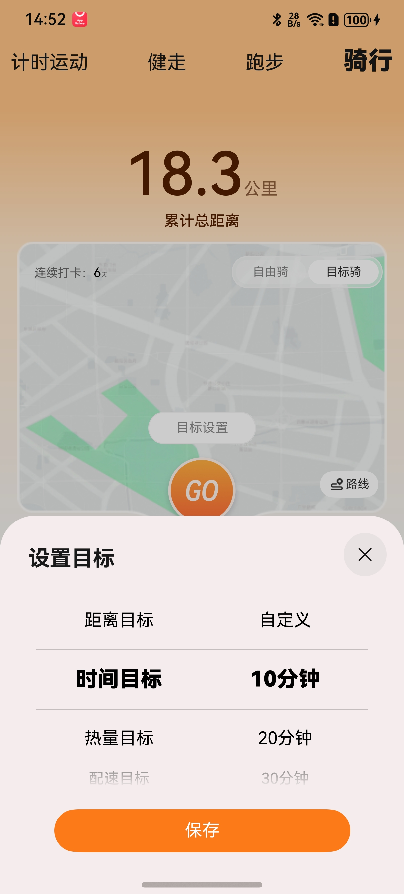
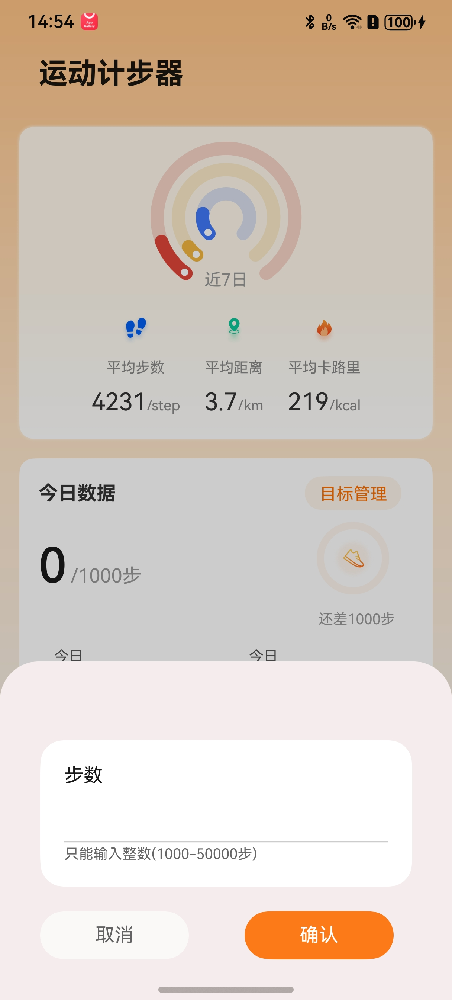
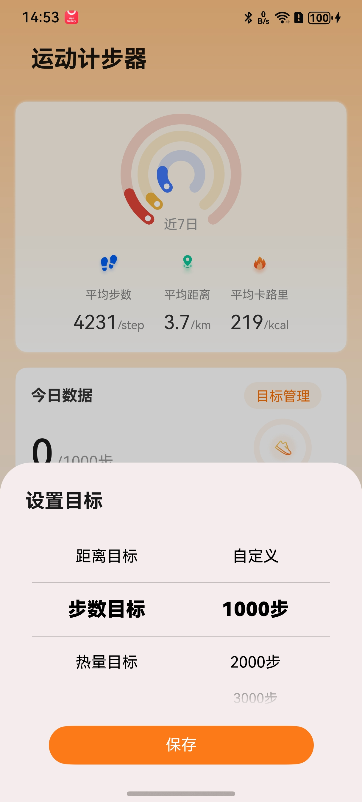

# 目标设定面板组件快速入门

## 目录

- [简介](#简介)
- [约束与限制](#环境)
- [快速入门](#快速入门)
- [API参考](#API参考)
- [示例代码](#示例代码)
- [开源许可协议](#开源许可协议)
## 简介

本组件提供了选择运动目标功能，按次、按日设置不同运动目标或自定义设置运动目标。

| 时间目标 | 步数目标 | 自定义目标 |
| -------- | -------- | ---------- |
| |||

## 约束与限制
### 环境

- DevEco Studio版本：DevEco Studio 5.0.5 Release及以上
- HarmonyOS SDK版本：HarmonyOS 5.0.5 Release SDK及以上
- 设备类型：华为手机(直板机)
- 系统版本：HarmonyOS 5.0.5(17)及以上

## 快速入门

1. 安装组件。

   如果是在DevEco Studio使用插件集成组件，则无需安装组件，请忽略此步骤。

   如果是从生态市场下载组件，请参考以下步骤安装组件。

   a. 解压下载的组件包，将包中所有文件夹拷贝至您工程根目录的XXX目录下。

   b. 在项目根目录build-profile.json5添加module_target模块。

   ```
   // 项目根目录下build-profile.json5填写module_target路径。其中XXX为组件存放的目录名
   "modules": [
     {
       "name": "module_target",
       "srcPath": "./XXX/module_target"
     }
   ]
   ```

   c. 在项目根目录oh-package.json5添加依赖。

   ```
   // XXX为组件存放的目录名称
   "dependencies": {
     "module_target": "file:./XXX/module_target"
   }
   ```
2. 引入组件。

   ```
   import { TargetMainPage } from 'module_target';
   ```

3. 调用组件，详细参数配置说明参见[API参考](#API参考)。

   ```typescript
    TargetMainPage()
   ```


## API参考

### 接口
TargetMainPage(options?: [TargetOptions](#TargetOptions对象说明)  )

### TargetOptions对象说明

| 参数名           | 类型      | 是否必填 | 说明                                           |
|---------------|------------|------|----------------------------------------------|
| isEveryDay      | boolean    | 是    | true：每天目标，false：每次目标                         |
| parameterSet    | (target: string, parameter: string) => void       | 是    | target：目标类型，parameter：目标值，组件选择后通过该方法将参数返回 |
| changeSheetHeight | (sheetHeight: number) => void       | 否    | sheetHeight：组件高度，切换指定目标和自定义目标时会更改组件高度        |

## 示例代码

```ts
import { promptAction } from '@kit.ArkUI'
import { TargetMainPage } from 'module_target'

@Entry
@ComponentV2
struct Index {
  pageInfo: NavPathStack = new NavPathStack()

  build() {
    Navigation(this.pageInfo) {
      TargetMainPage({
        isEveryDay: false, // 每天目标true，每次目标false
        changeSheetHeight: (sheetHeight: number) => { // 返回组件高度
        },
        parameterSet: (target: string, parameter: string) => { // 返回目标target和值parameter
          promptAction.showToast({ message: '目标' + target + ',值' + parameter })
        }
      })
    }.hideTitleBar(true)
  }
}
```

## 开源许可协议

该代码经过[Apache 2.0 授权许可](http://www.apache.org/licenses/LICENSE-2.0)。
