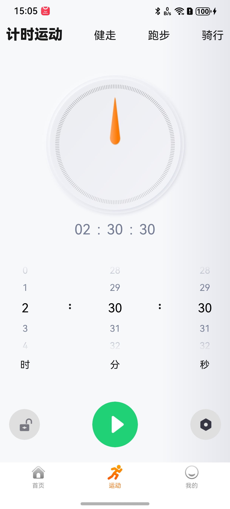
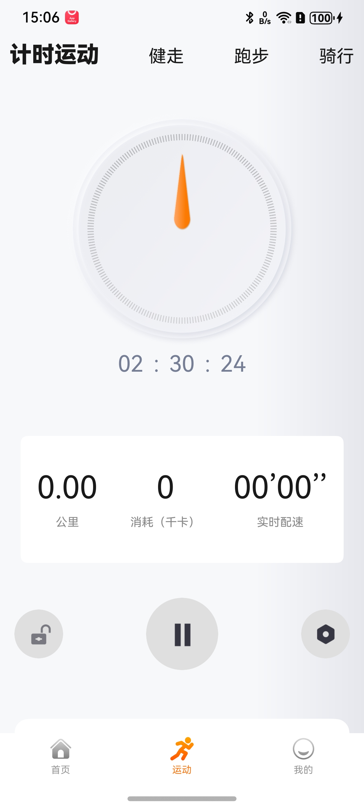
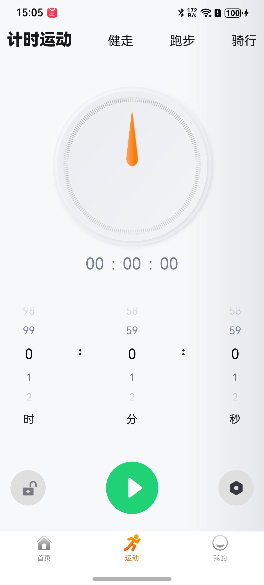

# 运动计时面板组件快速入门

## 目录

- [简介](#简介)
- [约束与限制](#约束与限制)
- [快速入门](#快速入门)
- [API参考](#API参考)
- [示例代码](#示例代码)
- [开源许可协议](#开源许可协议)
## 简介

本组件提供了倒计时展示功能，选择时分秒后，即可控制其开始、停止、暂停倒计时，返回倒计时进度。

| 开始计时 | 倒计时中 | 停止倒计时 |
| -------- | -------- | ---------- |
||||

## 约束与限制

### 环境

- DevEco Studio版本：DevEco Studio 5.0.5 Release及以上
- HarmonyOS SDK版本：HarmonyOS 5.0.5 Release SDK及以上
- 设备类型：华为手机(直板机)
- 系统版本：HarmonyOS 5.0.5(17)及以上


## 快速入门

1. 安装组件。

   如果是在DevEco Studio使用插件集成组件，则无需安装组件，请忽略此步骤。

   如果是从生态市场下载组件，请参考以下步骤安装组件。

   a. 解压下载的组件包，将包中所有文件夹拷贝至您工程根目录的XXX目录下。

   b. 在项目根目录build-profile.json5添加module_timer模块。

   ```
   // 项目根目录下build-profile.json5填写module_timer路径。其中XXX为组件存放的目录名
   "modules": [
     {
       "name": "module_timer",
       "srcPath": "./XXX/module_timer"
     }
   ]
   ```

   c. 在项目根目录oh-package.json5添加依赖。

   ```
   // XXX为组件存放的目录名称
   "dependencies": {
     "module_timer": "file:./XXX/module_timer"
   }
   ```
2. 引入组件。

   ```
   import { executionStatus, TimeMainPage } from 'module_timer'
   ```

3. 调用组件，详细参数配置说明参见[API参考](#API参考)。

   ```typescript
   TimeMainPage()
   ```

## API参考

### 接口

TimeMainPage(options?: [TimeOptions](#TimeOptions对象说明) )

### TimeOptions对象说明

| 参数名              | 类型                                            | 是否必填 | 说明                   |
|------------------|-----------------------------------------------|------|----------------------|
| isRunningChange  | (status: [executionStatus](#executionStatus对象说明)) => void | 否    | status:接收计时组件返回的执行状态 |
| onProgressChange | (progress: number) => void                    | 否    | progress：返回当前倒计时进度   |

### executionStatus对象说明

| 枚举值   | 值 | 说明 |
|-------|---|----|
| Start | 0 | 开始 |
| Pause | 1 | 暂停 |
| over  | 2 | 结束 |

## 示例代码

```ts
import { executionStatus, TimeMainPage } from 'module_timer'

@Entry
@ComponentV2
struct Index {
  pageInfo: NavPathStack = new NavPathStack()
  @Provider('isRunning') isRunning: executionStatus = executionStatus.over


  build() {
    Navigation(this.pageInfo) {
      TimeMainPage({
        isRunningChange: (status: executionStatus) => {
          this.isRunning = status
        },
        onProgressChange: (progress: number) => {
        }
      })
      Row() {
        Text('开始')
          .onClick(() => {
            this.isRunning = executionStatus.Start
          })
          .backgroundColor(Color.Green)
          .flexGrow(1)  // 均匀占据空间
          .textAlign(TextAlign.Center)  // 文字水平居中
          .height('100%')

        Text('暂停')
          .onClick(() => {
            this.isRunning = executionStatus.Pause
          })
          .backgroundColor(Color.Yellow)
          .flexGrow(1)
          .textAlign(TextAlign.Center)
          .height('100%')

        Text('结束')
          .onClick(() => {
            this.isRunning = executionStatus.over
          })
          .backgroundColor(Color.Red)
          .flexGrow(1)
          .textAlign(TextAlign.Center)
          .height('100%')
      }
      .width('100%')
      .height(100)
      .justifyContent(FlexAlign.SpaceEvenly)  // 均匀分布
      .alignItems(VerticalAlign.Center)  // 垂直居中
    }.hideTitleBar(true)
  }
}
```

## 开源许可协议

该代码经过[Apache 2.0 授权许可](http://www.apache.org/licenses/LICENSE-2.0)。