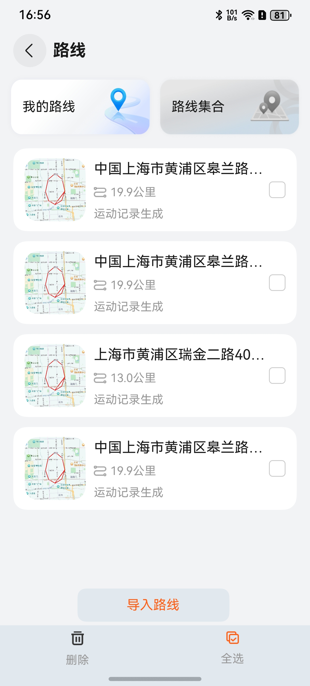
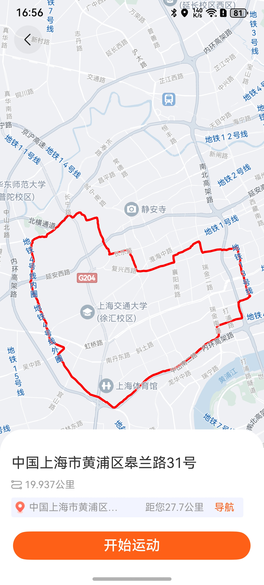

# 轨迹地图面板组件快速入门

## 目录

- [简介](#简介)
- [约束与限制](#环境)
- [快速入门](#快速入门)
- [API参考](#API参考)
- [示例代码](#示例代码)
- [开源许可协议](#开源许可协议)

## 简介

本组件使用华为地图，提供了展示运动路径列表、删除路径、展示运动路径的功能，支持上传运动生成的路线，点击开始运动可按当前查看的路线信息返回。

| 路线列表 | 运动轨迹 |
| -------- | -------- |
|          |          |

## 约束与限制
### 环境

- DevEco Studio版本：DevEco Studio 5.0.5 Release及以上
- HarmonyOS SDK版本：HarmonyOS 5.0.5 Release SDK及以上
- 设备类型：华为手机(直板机)
- 系统版本：HarmonyOS 5.0.5(17)及以上

### 权限

- 网络权限：ohos.permission.INTERNET
- 位置权限：ohos.permission.LOCATION
- 设备模糊位置权限：ohos.permission.APPROXIMATELY_LOCATION

## 快速入门

1. 安装组件。

   如果是在DevEco Studio使用插件集成组件，则无需安装组件，请忽略此步骤。

   如果是从生态市场下载组件，请参考以下步骤安装组件。

   a. 解压下载的组件包，将包中所有文件夹拷贝至您工程根目录的XXX目录下。

   b. 在项目根目录build-profile.json5添加module_trajectory模块。

   ```
   // 项目根目录下build-profile.json5填写module_trajectory路径。其中XXX为组件存放的目录名
   "modules": [
     {
       "name": "module_trajectory",
       "srcPath": "./XXX/module_trajectory"
     }
   ]
   ```

   c. 在项目根目录oh-package.json5添加依赖。

   ```
   // XXX为组件存放的目录名称
   "dependencies": {
     "module_trajectory": "file:./XXX/module_trajectory"
   }
   ```
2. 引入组件。

   ```
   import { LineSummaryPage } from 'module_trajectory'
   ```
3. [开通地图服务](https://developer.huawei.com/consumer/cn/doc/harmonyos-guides/map-config-agc#section16133115441516)。

4. 调用组件，详细参数配置说明参见[API参考](#API参考)。

   ```typescript
    LineSummaryPage()
   ```

## API参考

### 接口

LineSummaryPage(options?: [LineSummaryOptions](#LineSummaryOptions对象说明))

### LineSummaryOptions对象说明

| 参数名                    | 类型                                      | 是否必填 | 说明                    |
|------------------------|-----------------------------------------|------|-----------------------|
| onPopCallBack          | (value: PopInfo) => void                | 否    | 页面关闭回调                  |
| deleteSportData        | (deleteItem: [MonthItemModel](#MonthItemModel对象说明)[]) => void  | 否    | deleteItem：返回被删除的运动列表 |
| currentTypeTransmit    | [MonthItemModel](#MonthItemModel对象说明)[] | 是    | 我的路线数据                |
| allCurrentTypeTransmit | [MonthItemModel](#MonthItemModel对象说明)[] | 是    | 全部路线数据                |
| stack                  | NavPathStack                            | 是    | 路由对象                  |

### MonthItemModel对象说明

| 参数名      | 类型                                            | 是否必填 | 说明       |
| ----------- | ----------------------------------------------- | -------- | ---------- |
| year        | number                                          | 否       | 年         |
| month       | number                                          | 是       | 月         |
| day         | number                                          | 是       | 日         |
| type        | [SportType](#SportType运动类型枚举)             | 是       | 运动类型   |
| childType   | [ChildSportType](#ChildSportType运动子类型枚举) | 是       | 运动子类型 |
| hour        | number                                          | 是       | 小时       |
| minute      | number                                          | 是       | 分钟       |
| distance    | number                                          | 是       | 运动距离   |
| toDistance  | number                                          | 否       | 目标距离   |
| timeLength  | number                                          | 是       | 运动时长   |
| target      | [SportItemTarget](#SportItemTarget对象说明)     | 是       | 运动目标   |
| deplete     | number                                          | 是       | 运动消耗   |
| stepCount   | number                                          | 是       | 运动步数   |
| locusPoints | mapCommon.LatLng[]                              | 否       | 运动轨迹   |

### SportItemTarget对象说明

| 参数名        | 类型         | 是否必填 | 说明   |
|------------|------------|------|------|
| targetType | [TargetType](#TargetType运动类型枚举) | 是    | 目标类型 |
| value      | number     | 是    | 目标值  |

### TargetType运动类型枚举

| 枚举值         | 值 | 说明 |
|-------------|---|----|
| DISTANCE    | 0 | 距离 |
| DEPLETE     | 1 | 消耗 |
| TIME_LENGTH | 2 | 时长 |
| PACE        | 3 | 配速 |

### SportType运动类型枚举

| 枚举值     | 值 | 说明   |
|---------|---|------|
| ALL     | 0 | 所有运动 |
| WALKING | 1 | 步行   |
| JOGGING | 2 | 跑步   |
| CYCLING | 3 | 骑行   |

### ChildSportType运动子类型枚举

| 枚举值            | 值 | 说明  |
|----------------|---|-----|
| FREE_WALKING   | 0 | 自由走 |
| TARGET_WALKING | 1 | 目标走 |
| DOG_WALKING    | 2 | 遛狗  |
| FREE_JOGGING   | 4 | 自由跑 |
| TARGET_JOGGING | 5 | 目标跑 |
| FREE_CYCLING   | 6 | 自由骑 |
| TARGET_CYCLING | 7 | 目标骑 |

### 事件

支持以下事件：

#### onPopCallBack

onPopCallBack: (value: PopInfo) => void;

返回选择的运动数据

#### deleteSportData

deleteSportData: (deleteItem: [MonthItemModel](#MonthItemModel对象说明)[]) => void;

返回被删除的我的路线数据列表

## 示例代码

```ts
import { LineSummaryPage, MonthItemModel, SportType, SportItemTarget, TargetType, RouterMap } from 'module_trajectory';
import { mapCommon } from '@kit.MapKit';

@Entry
@ComponentV2
struct Index {
  @Local sportTarget: SportItemTarget = { targetType: TargetType.DISTANCE, value: 1000 }
  @Local locusPoints: mapCommon.LatLng[] =
    [{ "latitude": 30.55446543006316, "longitude": 114.50535414078917 },
      { "latitude": 30.554622743246032, "longitude": 114.50497062350281 },
      { "latitude": 30.555146449544978, "longitude": 114.50420151519222 },
      { "latitude": 30.555417701359442, "longitude": 114.50405041735033 },
      { "latitude": 30.557001234895676, "longitude": 114.50455631390652 },
      { "latitude": 30.557953278758934, "longitude": 114.5047200676718 },
      { "latitude": 30.558028973976786, "longitude": 114.50482995308323 },
      { "latitude": 30.55764912967691, "longitude": 114.5061249599082 },
      { "latitude": 30.556920455303846, "longitude": 114.50782030962125 },
      { "latitude": 30.55634842386656, "longitude": 114.50885809458103 },
      { "latitude": 30.554756646254575, "longitude": 114.5110562769805 },
      { "latitude": 30.554575375199867, "longitude": 114.51102537916381 },
      { "latitude": 30.55233438933314, "longitude": 114.50770416307091 },
      { "latitude": 30.55497748834956, "longitude": 114.50390384146597 },
      { "latitude": 30.555441365712614, "longitude": 114.5031039462691 },
      { "latitude": 30.556299632801135, "longitude": 114.5012583893614 },
      { "latitude": 30.55673521147347, "longitude": 114.49982132608326 },
      { "latitude": 30.556836474640654, "longitude": 114.49967917834083 },
      { "latitude": 30.557154124330545, "longitude": 114.49956703430831 },
      { "latitude": 30.558266208794173, "longitude": 114.4995373429403 },
      { "latitude": 30.55843127774418, "longitude": 114.49963378829172 },
      { "latitude": 30.558479369721926, "longitude": 114.50186814042952 },
      { "latitude": 30.5582461142039, "longitude": 114.50391457930684 },
      { "latitude": 30.557644722530924, "longitude": 114.50609367932171 },
      { "latitude": 30.556907106458247, "longitude": 114.50780177934695 },
      { "latitude": 30.556744333057704, "longitude": 114.50787329200867 },
      { "latitude": 30.55590494215303, "longitude": 114.50714191819603 },
      { "latitude": 30.55433271393855, "longitude": 114.50557588006492 },
      { "latitude": 30.55442160156265, "longitude": 114.50539159357686 }]
  @Provider() currentTypeTransmit: MonthItemModel[] = []
  @Provider() allCurrentTypeTransmit: MonthItemModel[] = []
  @Provider() stack: NavPathStack = new NavPathStack();

aboutToAppear(): void {
  let current1: MonthItemModel =
    new MonthItemModel(11, 17, SportType.CYCLING, 6, 17, 0, 3300, 600, this.sportTarget, 100, 2000, this.locusPoints,
      2025)
  let current2: MonthItemModel =
    new MonthItemModel(11, 17, SportType.CYCLING, 6, 17, 0, 8000, 600, this.sportTarget, 100, 2200, this.locusPoints,
      2025)
  this.currentTypeTransmit.push(current1)
  this.allCurrentTypeTransmit.push(current1)
  this.allCurrentTypeTransmit.push(current2)
}

  build() {
    Navigation(this.stack) {
      Column() {
        LineSummaryPage({
          onPopCallBack: (value: PopInfo) => {

          },
          deleteSportData: (deleteItem: MonthItemModel[]) => {

          }
        }).layoutWeight(1)
      }
      .width('100%')
      .layoutWeight(1)
    }
    .hideTitleBar(true)
    .backgroundColor($r('sys.color.background_secondary'))
  }
}
```

## 开源许可协议

该代码经过[Apache 2.0 授权许可](http://www.apache.org/licenses/LICENSE-2.0)。