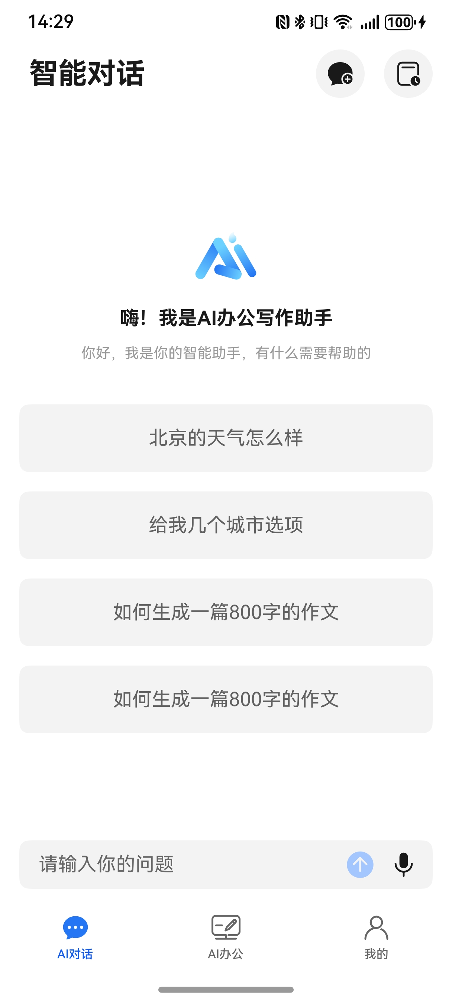
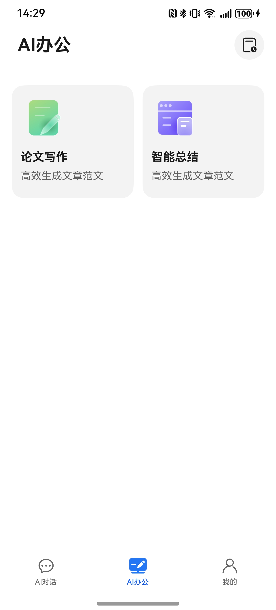
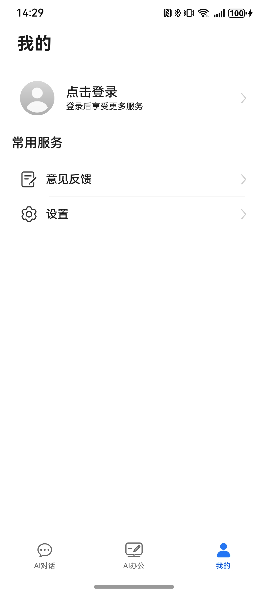

# 工具（AI）应用模板快速入门

## 目录

- [功能介绍](#功能介绍)
- [约束与限制](#约束与限制)
- [快速入门](#快速入门)
- [示例效果](#示例效果)
- [开源许可协议](#开源许可协议)

## 功能介绍

您可以基于此模板直接定制应用，也可以挑选此模板中提供的多种组件使用，从而降低您的开发难度，提高您的开发效率。

本模板为AI应用提供了常用功能的开发样例，模板主要分为AI对话、AI办公、和我的三大模块：

- AI对话：基于大语言模型提供智能对话功能等智能交互。

- AI办公：主要提供论文写作、AI总结等办公场景的AI能力。

- 我的：提供用户个人信息管理、设置、意见反馈等功能。


**【注意】**
* 本模版提供的是模拟数据，所有服务跳转到的页面为本地mock页面，实际开发中请以具体业务为准。
* 使用AI对话功能需要配置真实的API Key，请在ChatPage.ets中替换相应配置。
* 各个模型的API Key会产生费用，费用由模型提供方进行收取，与本模板无关。

本模板主要页面及核心功能如下所示：

```ts
AI办公模板
 |-- AI对话
 |    |-- 智能对话
 |    |-- 对话历史
 |    |-- 天气查询
 |    |-- 选项选择
 |-- AI办公
 |    |-- 论文写作
 |    |-- AI总结
 |    |-- 办公历史
 └-- 我的
      |-- 个人信息
      |-- 设置
      |-- 意见反馈
      └-- 关于
```

本模板工程代码结构如下所示：

```ts
AIOffice
├──components                               // 公共组件
│   ├──business_mine/src/main/ets           // 我的页面业务组件
│   │  └──components                        // 业务组件（个人信息、设置等）
│   │  └──Index.ets                         // 对外接口类
│   ├──business_setting/src/main/ets        // 设置页面业务组件
│   │  └──components                        // 设置相关组件
│   │  └──Index.ets                         // 对外接口类
│   ├──lib_account/src/main/ets             // 账号相关组件
│   │  └──components                        // 账号管理组件
│   │  └──Index.ets                         // 对外接口类
│   ├──lib_api/src/main/ets                 // API接口组件
│   │  └──apis                              // 接口定义
│   │  └──Index.ets                         // 对外接口类
│   ├──lib_common/src/main/ets              // 通用组件
│   │  └──common                            // 公共常量和工具
│   │  └──components                        // 基础组件
│   │  └──utils                             // 工具类
│   │  └──Index.ets                         // 对外接口类
│   ├──lib_widget/src/main/ets              // UI组件库
│   │  └──components                        // 通用UI组件
│   │  └──Index.ets                         // 对外接口类
│   ├──module_feedback/src/main/ets         // 意见反馈组件
│   │  └──components                        // 反馈相关组件
│   │  └──Index.ets                         // 对外接口类
│   ├──module_imagepreview/src/main/ets     // 图片预览组件
│   │  └──components                        // 预览相关组件
│   │  └──Index.ets                         // 对外接口类
├──products/phone/src/main                  // 手机产品
│   ├──ets
│   │  ├──entryability
│   │  │  ├──EntryAbility.ets               // 应用程序入口
│   │  ├──pages
│   │  │  ├──Index.ets                      // 主入口页面
│   │  │  ├──IndexPage.ets                  // 主页面
│   │  │  ├──chat                           // AI对话相关页面
│   │  │  │  ├──ChatPage.ets                // 对话页面
│   │  │  │  ├──ChatHistoryPage.ets         // 对话历史页面
│   │  │  │  └──action                      // 对话动作
│   │  │  └──office                         // AI办公相关页面
│   │  │     ├──OfficePage.ets              // 办公主页
│   │  │     ├──PaperWritingPage.ets        // 论文写作页面
│   │  │     ├──AISummaryPage.ets           // AI总结页面
│   │  │     └──OfficeHistoryPage.ets       // 办公历史页面
│   │  ├──viewmodels                        // 视图模型
│   │  └──components                        // 页面组件
```


## 约束与限制

### 环境

* DevEco Studio版本：DevEco Studio 5.0.5 Release及以上
* HarmonyOS SDK版本：HarmonyOS 5.0.5 Release SDK及以上
* 设备类型：华为手机（包括双折叠和阔折叠）、平板
* HarmonyOS版本：HarmonyOS 5.0.5(17)及以上

### 权限

* 网络权限：ohos.permission.INTERNET
* 麦克风权限：ohos.permission.MICROPHONE

## 快速入门

### 配置工程

在运行此模板前，需要完成以下配置：

1. 在AppGallery Connect创建应用，将包名配置到模板中。

   - 参考[创建应用](https://developer.huawei.com/consumer/cn/doc/app/agc-help-create-atomic-service-0000002247795706)为应用创建APP ID，并将APP ID与应用进行关联。

   - 返回应用列表页面，查看应用的包名。

   - 将模板工程根目录下AppScope/app.json5文件中的bundleName替换为创建应用的包名。

2. 配置AI服务API Key。

   - 在products/phone/src/main/ets/pages/chat/ChatPage.ets文件中，将apiKey替换为真实的API Key。

   - 在products/phone/src/main/ets/pages/office/OfficeResultPage.ets文件中，将apiKey替换为真实的API Key。

   - 根据需要调整baseUrl和model配置。

3. 对应用进行[手工签名](https://developer.huawei.com/consumer/cn/doc/harmonyos-guides/ide-signing#section297715173233)。

### 运行调试工程

1. 用USB线连接调试手机和PC。

2. 点击"Run"，运行模板工程。

## 示例效果

本模板提供了完整的AI办公功能展示，包括：

- **AI对话**：智能对话界面，支持多轮对话和上下文理解
- **AI办公**：论文写作和AI总结功能
- **我的**：个人信息管理和设置功能

| AI对话                                                           | AI办公                                                           | 我的                                                     |
|----------------------------------------------------------------|----------------------------------------------------------------|--------------------------------------------|
|  |  |  |

*注：由于涉及AI服务配置，实际效果图需要在配置完成API Key后运行查看*

## 开源许可协议

该代码经过[Apache 2.0 授权许可](http://www.apache.org/licenses/LICENSE-2.0)。