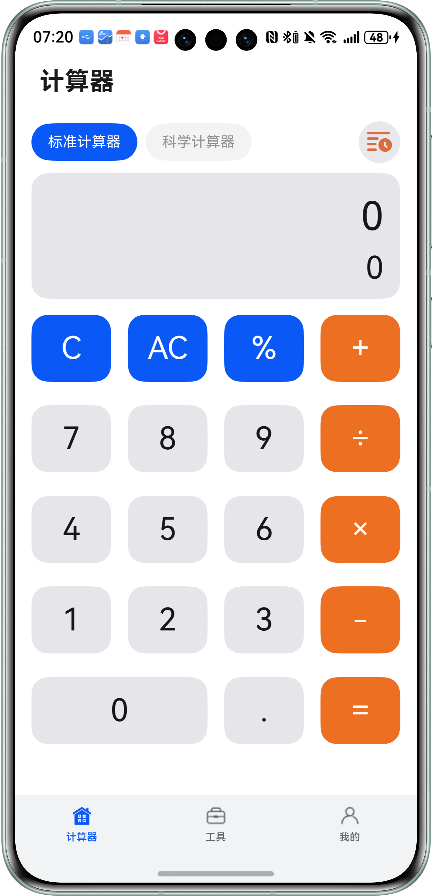
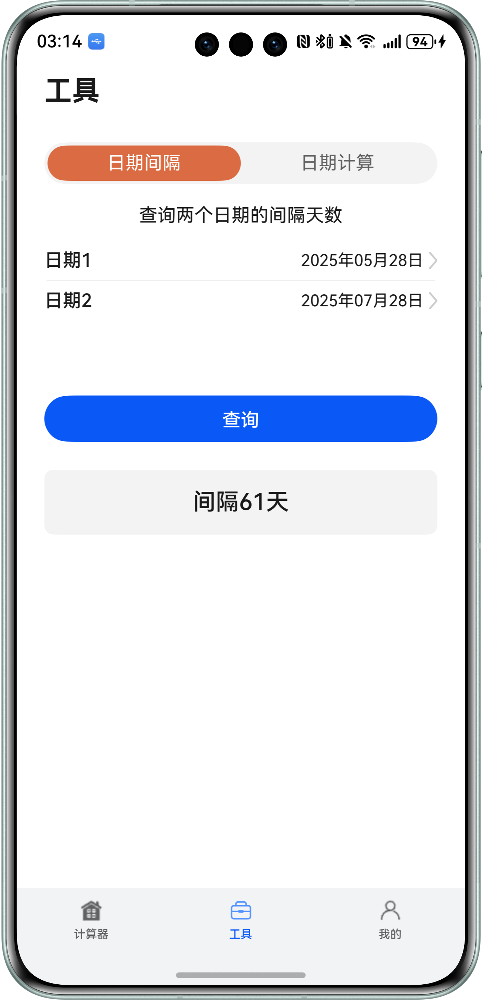
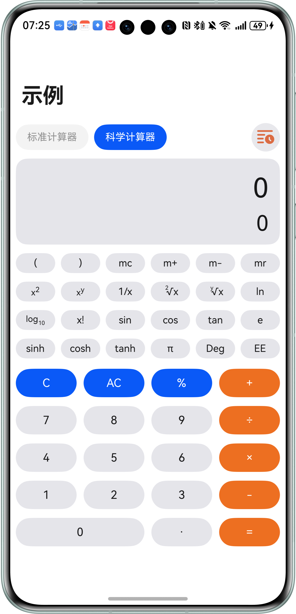

# 工具（计算器）应用模板快速入门

## 目录

- [功能介绍](#功能介绍)
- [约束与限制](#约束与限制)
- [快速入门](#快速入门)
- [示例效果](#示例效果)
- [开源许可协议](#开源许可协议)

## 功能介绍

您可以基于此模板直接定制应用，也可以挑选此模板中提供的多种组件使用，从而降低您的开发难度，提高您的开发效率。

本模板中提供了多种组件，您可以按需选择合适的组件进行使用，所有组件存放在工程根目录的components下。

| 组件                        | 描述                         | 使用指导                                             |
|---------------------------|----------------------------|--------------------------------------------------|
| 日期间隔与计算（module_date_calculation） | 本组件提供日期之间计算能力，包括计算2个日期之间的天数，计算选中日期前后的时间等功能 | [使用指导](components/module_date_calculation/README.md)    |
| 计算器（module_standard_calculator） | 提供标准计算器计算、科学计算器以及查看历史记录能力        | [使用指导](components/module_standard_calculator/README.md)     |

本模板为计算器应用提供了常用功能的开发样例，模板主要分为计算器、工具、和我的三大模块：

- 计算器：主要提供标准计算器、科学计算器、查看历史记录等功能。

- 工具：主要提供日期间隔计算、日期计算功能。

- 我的：展示关于信息。


**【注意】**
* 本模版提供的均是模拟数据，所有服务跳转到的页面均为本地mock页面，实际开发中请以具体业务为准。

| 计算器                                                   | 工具                                                   | 我的             |
|-------------------------------------------------------|------------------------------------------------------|------------------------------ |
|  |  |  |

本模板主要页面及核心功能如下所示：

```ts
计算器模板
 |-- 计算器
 |    |-- 计算器
 |    |-- 查看历史记录
 |-- 工具
 |    |-- 日期间隔
 |    |-- 日期计算
 └-- 我的
 |     └-- 关于
 |       └-- 用于协议与隐私政策  
```

本模板工程代码结构如下所示：

```ts
Calculator
├──├──commons
│   ├──lib_foundation/src/main/ets          // 公共能力层
│     │  └──common                           // 公共常量
│     │  └──router                           // 全局路由组件
│     │  └──utils                            // 工具类
│     └──Index.ets                           // 对外接口类
├──├──components                             // 公共组件
│   ├──module_base_apis/src/main/ets         // 通用组件
│     │  └──apis                             // 基础函数
│     │  └──components                       // 基础组件（模态框，弹窗，选择器等）
│     │  └──model                            // 基础组件数据模型
│     │  └──utils                            // 工具类
│     └──Index.ets                           // 对外接口类
│   ├──module_date_calculation               // 日历组件
│     │  └──components                       // 基础组件（日期间隔，日期计算等）
│     │  └──constants                        // 常量定义
│     │  └──model                            // 基础组件数据模型
│     │  └──utils                            // 工具类
│     │  └──views                            // 对外组件
│     └──Index.ets                           // 对外接口类
│   ├──module_standard_calculator            // 标准计算器组件
│     │  └──common                           // 常量定义
│     │  └──components                       // 基础组件计算器键盘
│     │  └──model                            // 基础组件数据模型
│     │  └──utils                            // 工具类
│     └──Index.ets                           // 对外接口类
├──features                                  // 基础特性层
│  ├──business_home/src/main/ets             // 计算器
│  │  ├──components                          
│     │  ├──HomePage.ets                     // 计算器入口
│  ├──business_home/Index.ets                // 对外接口类
│  ├──business_mine/src/main/ets             // 我的
│     ├──components                          
│     │  ├──AboutPage.ets                    // 关于入口
│     │  ├──AgreementPrivacy.ets             // 用户协议与隐私政策入口
│     │  ├──MinePage.ets                     // 我的入口
│  ├──business_mine/Index.ets                // 对外接口类
│  ├──business_tool/src/main/ets             // 工具
│     ├──components                          
│     │  ├──ToolPage.ets                     // 工具入口
└─products/entry/src/main   
   ├─ets  
   │  ├─entryability
   │  │  ├──EntryAbility.ets                 // 应用程序入口
   │  ├─entryformability
   │  │  ├──EntryFormAbility.ets             // 应用程序入口
   │  ├─page
   │  │  ├──Index.ets                        // 入口
   │  ├─model
   │  │  ├──TabItemModel.ets                 // tab数据模型
   │  ├─widget
   │  │  ├──pages            
   │  │      ├──WidgetCard.ets               // 服务卡片  
```


## 约束与限制

### 软件

* DevEco Studio版本：DevEco Studio 5.0.4 Release及以上
* HarmonyOS SDK版本：HarmonyOS 5.0.4 Release SDK及以上

### 硬件

* 设备类型：华为手机（包括双折叠和阔折叠）
* HarmonyOS版本：HarmonyOS 5.0.4(16)及以上

## 快速入门

### 配置工程

在运行此模板前，需要完成以下配置：

1. 在AppGallery Connect创建应用，将包名配置到模板中。

   a. 参考[创建应用](https://developer.huawei.com/consumer/cn/doc/app/agc-help-create-app-0000002247955506)为应用创建APP ID，并将APP ID与应用进行关联。

   b. 返回应用列表页面，查看应用的包名。

   c. 将模板工程根目录下AppScope/app.json5文件中的bundleName替换为创建应用的包名。


2. 对应用进行[手工签名](https://developer.huawei.com/consumer/cn/doc/harmonyos-guides/ide-signing#section297715173233)。

### 运行调试工程

1. 用USB线连接调试手机和PC。

2. 配置多模块调试：由于本模板存在多个模块，运行时需确保所有模块安装至调试设备。

   a. 运行模块选择“entry”。

   b. 下拉框选择“Edit Configurations”，在“Run/Debug Configurations”界面，选择“Deploy Multi Hap”页签，勾选上模板中所有模块。

   

   c. 点击"Run"，运行模板工程。

## 示例效果



## 开源许可协议

该代码经过[Apache 2.0 授权许可](http://www.apache.org/licenses/LICENSE-2.0)。
