# 工具(网盘)应用模板快速入门

## 目录

- [功能介绍](#功能介绍)
- [约束与限制](#约束与限制)
- [快速入门](#快速入门)
- [示例效果](#示例效果)
- [开源许可协议](#开源许可协议)
- [附录](#附录)

## 功能介绍

您可以基于此模板直接定制网盘应用，也可以挑选此模板中提供的多种组件使用，从而降低您的开发难度，提高您的开发效率。

此模板提供如下组件，所有组件存放在工程根目录的components下，如果您仅需使用组件，可参考对应组件的指导链接；如果您使用此模板，请参考本文档。

| 组件                                    | 描述                                    | 使用指导                                                                     |
|:--------------------------------------|:--------------------------------------|:--------------------------------------------------------------------------|
| 通用登录组件（aggregated_login）              | 提供华为账号一键登录及其他方式登录（微信、手机号登录）            | [使用指导](components/aggregated_login/README.md)                           |
| 支付组件（aggregated_payment）              | 提供华为支付、支付宝支付和微信支付方式进行订单支付的能力                   | [使用指导](components/aggregated_payment/README.md)   |
| 集成能力组件（base_apis）                     | 提供日历、弹窗、时间选择、文本选择、滑块切换等基础能力                        | [使用指导](components/base_apis/README.md)            |
| 检测应用更新组件（check_app_update）            | 提供检测应用是否存在新版本功能                      | [使用指导](components/check_app_update/README.md)                           |
| 网盘备份状态组件（clouddisk_backup_status）     | 提供备份进度显示、备份状态管理、备份控制等能力               | [使用指导](components/clouddisk_backup_status/README.md)                    |
| 网盘文件详情组件（clouddisk_file_detail）       | 提供图片、视频、音频、PDF等多种文件类型的预览与播放      | [使用指导](components/clouddisk_file_detail/README.md)                      |
| 网盘文件操作组件（clouddisk_file_operation）    | 提供文件下载、删除、分享、重命名、移动、收藏等操作      | [使用指导](components/clouddisk_file_operation/README.md)                   |
| 网盘文件搜索组件（clouddisk_file_search）       | 提供关键词搜索、结果列表展示与返回导航能力          | [使用指导](components/clouddisk_file_search/README.md)                      |
| 网盘文件选择组件（clouddisk_file_select）       | 提供文件列表选择与视图切换、单选/多选、全选/反选     | [使用指导](components/clouddisk_file_select/README.md)                      |
| 通用个人信息组件（collect_personal_info）       | 支持编辑头像、昵称、姓名、性别、手机号、生日、个人简介等                    | [使用指导](components/collect_personal_info/README.md)                      |
| 通用问题反馈组件（feedback）                    | 提供通用的问题反馈功能                   | [使用指导](components/feedback/README.md)                                   |
| 看广告领奖励组件（look_ad）                     | 提供看广告领奖励的功能                          | [使用指导](components/look_ad/README.md)                                    |
| 云存储上传组件（module_cloud_upload）          | 提供文档和媒体文件上传到华为云存储的功能                | [使用指导](components/module_cloud_upload/README.md)                        |
| 分享组件（module_share）                    | 支持微信、朋友圈、QQ、生成海报、系统分享等功能       | [使用指导](components/module_share/README.md)                               |
| 会员中心组件（vip_center）                    | 提供用户会员开通功能                     | [使用指导](components/vip_center/README.md)           |
| 文件基础组件（cloud_file_base）               | 提供网盘文件展示的基础UI组件库，支持文件列表和宫格两种视图模式        | [使用指导](components/cloud_file_base/README.md)          |
| 网盘文件操作项组件（cloud_operation_item）       | 提供网盘文件操作菜单和操作项的UI及逻辑               | [使用指导](components/cloud_operation_item/README.md)     |
| 网盘视图切换组件（cloud_view_switch）           | 提供完整的文件视图管理功能，包括列表/宫格视图切换、文件排序、类型筛选、文件选择和批量操作等功能          | [使用指导](components/cloud_view_switch/README.md)        |
| 网盘多级导航组件（cloud_multilevel_navigation） | 提供网盘文件夹的多级目录导航功能，支持面包屑导航、目录层级跳转、返回上级等操作        | [使用指导](components/cloud_multilevel_navigation/README.md) |
| 网盘隐私空间组件（cloud_privatespace）          | 提供网盘隐私空间文件管理功能                     | [使用指导](components/cloud_privatespace/README.md)       |
| 网盘分享管理组件（cloud_share）                 | 提供网盘文件分享管理功能，包括我的分享列表展示、分享详情查看、分享状态管理等              | [使用指导](components/cloud_share/README.md)              |

本模板为网盘类应用提供了常用功能的开发样例，模板主要分首页、备份、文件管理和个人中心四大模块：

* 首页：提供文件浏览、搜索、快速访问等功能。

* 备份：支持自动备份、手动备份、备份状态查看等功能。

* 文件管理：提供文件上传、下载、预览、分享、移动、删除等完整的文件管理功能。

* 个人中心：提供个人信息管理、VIP服务、意见反馈、设置等功能。

本模板已集成华为账号、云存储、推送、支付等服务，支持深色模式、适老化、无障碍等特性，提供完整的网盘应用解决方案，只需做少量配置和定制即可快速实现网盘应用的核心功能。

模板特色功能：
- 文件传输管理：支持上传下载进度显示、断点续传
- 隐私空间：提供密码保护的私密文件存储空间
- 回收站：已删除文件可恢复管理
- 设备管理：支持多设备登录管理
- 第三方分享：集成微信、支付宝等第三方分享能力
- 应用备份：支持应用数据备份与恢复


本模板主要页面及核心功能如下所示：

```text
网盘应用模板
  ├──首页                           
  │   ├──顶部栏-搜索  
  │   │   ├── 文件搜索                          
  │   │   └── 搜索历史                      
  │   │         
  │   ├──快速访问         
  │   │   ├── 最近使用                                             
  │   │   └── 收藏文件
  │   │
  │   ├──文件分类    
  │   │   ├── 图片                                             
  │   │   ├── 视频                         
  │   │   ├── 文档
  │   │   └── 其他 
  │   │
  │   └──存储空间管理    
  │       ├── 空间使用情况                                             
  │       ├── VIP扩容                         
  │       └── 清理建议 
  │
  ├──文件管理                           
  │   ├──文件列表  
  │   │   ├── 列表视图 
  │   │   ├── 宫格视图
  │   │   ├── 文件选择
  │   │   └── 批量操作                      
  │   │         
  │   ├──文件操作         
  │   │   ├── 上传文件
  │   │   ├── 新建文件夹
  │   │   ├── 下载、分享、移动、删除
  │   │   └── 重命名、收藏                            
  │   │                    
  │   ├──文件预览    
  │   │   ├── 图片预览（缩放、旋转）                                             
  │   │   ├── 视频播放（进度控制、全屏）                         
  │   │   ├── 音频播放                                 
  │   │   └── PDF文档预览                       
  │   │
  │   └──隐私空间    
  │       ├── 私密文件管理                                        
  │       ├── 安全验证                   
  │       └── 隐私保护                       
  │
  ├──备份                           
  │   ├──自动备份  
  │   │   ├── 相册备份                          
  │   │   ├── 文档备份                                                   
  │   │   └── 备份设置                       
  │   │         
  │   ├──手动备份         
  │   │   ├── 选择备份内容
  │   │   ├── 备份进度显示
  │   │   └── 备份历史
  │   │                    
  │   └──备份管理    
  │       ├── 备份文件查看                                        
  │       ├── 恢复文件                   
  │       └── 备份空间管理                             
  │
  └──个人中心                           
      ├──账号管理  
      │   ├── 华为账号登录                          
      │   ├── 个人信息编辑                                                   
      │   └── 账号安全设置                       
      │         
      ├──VIP服务         
      │   ├── 会员权益
      │   ├── 升级VIP
      │   └── 会员中心
      │                    
      ├──我的功能    
      │   ├── 我的收藏                                        
      │   ├── 我的分享                   
      │   ├── 回收站                             
      │   └── 个人空间
      │
      ├──应用设置    
      │   ├── 账号与隐私                                        
      │   ├── 隐私设置                   
      │   ├── 设备管理                             
      │   └── 修改隐私空间密码
      │
      └──帮助与反馈    
          ├── 意见反馈                                        
          ├── 关于我们                   
          └── 版本更新                               
```

本模板工程代码结构如下所示：

```text
CloudDisk
├──commons                                            // 公共模块
│  ├──common/src/main/ets                             // 基础公共模块             
│  │    ├──basic                                      // 基础类（ViewModel、日志等）
│  │    ├──constant                                   // 通用常量（路由、偏好设置等）
│  │    ├──core                                       // 核心功能（路由器）
│  │    ├──model                                      // 数据模型（文件信息、用户信息等）
│  │    ├──service                                    // 服务层（Mock服务）
│  │    ├──ui                                         // 通用UI组件（头部、协议页等）
│  │    └──util                                       // 通用工具类（权限、缓存、下载等）
│  │
│  ├──OHRouter                                        // 路由模块
│  │
│  └──widgets/src/main/ets                            // 通用组件库
│       ├──const                                      // 组件常量
│       └──ui                                         // UI组件（避让区、断点等）
│
├──components                                         // 业务组件
│  ├──aggregated_login                                // 通用登录组件                     
│  ├──check_app_update                                // 应用更新检查组件
│  ├──clouddisk_backup_status                         // 网盘备份状态组件
│  ├──clouddisk_file_detail                           // 网盘文件详情组件
│  ├──clouddisk_file_operation                        // 网盘文件操作组件
│  ├──coulddisk_file_search                           // 网盘文件搜索组件
│  ├──coulddisk_file_select                           // 网盘文件选择组件
│  ├──collect_personal_info                           // 个人信息收集组件
│  ├──feedback                                        // 意见反馈组件
│  ├──look_ad                                         // 广告查看组件
│  ├──module_cloud_upload                             // 云存储上传组件
│  ├──module_share                                    // 分享组件
│  └──vip_center_components                           // VIP中心组件集合
│      ├──aggregated_payment                          // 通用支付组件
│      ├──base_apis                                   // 基础API组件
│      └──vip_center                                  // VIP中心组件             
│      
├──features                                           // 功能模块
│  ├──clouddisk_backup/src/main/ets                   // 备份模块             
│  │    ├──viewModel                                  // 视图模型
│  │    │   ├──BackupSetUpVM.ets                      // 备份设置视图模型
│  │    │   └──BackupVM.ets                           // 备份视图模型
│  │    └──views                                      // 视图页面
│  │        ├──Backup.ets                             // 备份页面
│  │        └──BackupSetUp.ets                        // 备份设置页面
│  │
│  ├──clouddisk_file/src/main/ets                     // 文件管理模块             
│  │    ├──components                                 // 组件
│  │    │   ├──FileTransferDownloadView.ets           // 文件下载视图
│  │    │   ├──FileTransferUploadView.ets             // 文件上传视图
│  │    │   └──...                                    // 其他组件
│  │    ├──pages                                      // 页面
│  │    │   ├──FileManagerPage.ets                    // 文件管理页面
│  │    │   ├──FileTransferManagerPage.ets            // 文件传输管理页面
│  │    │   ├──PrivateSpagePage.ets                   // 隐私空间页面
│  │    │   ├──SettingPrivateSpacePasswordPage.ets    // 设置隐私空间密码页面
│  │    │   └──...                                    // 其他页面
│  │    └──viermodel                                  // 视图模型
│  │
│  ├──clouddisk_homepage/src/main/ets                 // 首页模块             
│  │    ├──common                                     // 公共类
│  │    │   └──ListDataSource.ets                     // 列表数据源
│  │    ├──components                                 // 组件
│  │    │   ├──FileTransferSearchView.ets             // 文件搜索视图
│  │    │   └──FileTransferView.ets                   // 文件传输视图
│  │    ├──view                                       // 视图页面
│  │    │   ├──MainPage.ets                           // 首页主页面
│  │    │   ├──SearchPage.ets                         // 搜索页面
│  │    │   └──SearchClassificationPage.ets           // 搜索分类页面
│  │    └──viewmodel                                  // 视图模型
│  │
│  └──person/src/main/ets                             // 个人中心模块             
│       ├──comp                                       // 组件
│       │   ├──UserInfoRow.ets                        // 用户信息行组件
│       │   ├──ShareListView.ets                      // 分享列表视图
│       │   └──...                                    // 其他组件
│       ├──viewmodel                                  // 视图模型
│       │   ├──MineModel.ets                          // 我的模型
│       │   ├──RecycleBinViewModel.ets                // 回收站视图模型
│       │   ├──SetUpVM.ets                            // 设置视图模型
│       │   └──...                                    // 其他视图模型
│       └──views                                      // 视图页面
│           ├──MinePage.ets                           // 我的页面
│           ├──SetupPage.ets                          // 设置页面
│           ├──RecycleBinPage.ets                     // 回收站页面
│           ├──MySharePage.ets                        // 我的分享页面
│           ├──MyCollectPage.ets                      // 我的收藏页面
│           ├──PrivacySettingsPage.ets                // 隐私设置页面
│           ├──EquipmentManagementPage.ets            // 设备管理页面
│           └──...                                    // 其他页面
│
└──products                                           // 产品模块
   └──entry/src/main/ets                              // 应用入口模块
        ├──entryability                               // 入口能力
        │   └──EntryAbility.ets                       // 应用入口能力
        ├──entrybackupability                         // 备份能力
        │   └──EntryBackupAbility.ets                 // 应用备份能力
        ├──pages                                      // 页面
        │   ├──HomePage.ets                           // 主页面
        │   └──Index.ets                              // 入口页面
        └──viewmodels                                 // 视图模型
            └──IndexVM.ets                            // 入口页面视图模型
```

## 约束与限制

### 环境

- DevEco Studio版本：DevEco Studio 5.0.5 Release及以上
- HarmonyOS SDK版本：HarmonyOS 5.0.3 Release SDK及以上
- 设备类型：华为手机（包括双折叠和阔折叠）
- 系统版本：HarmonyOS 5.0.3(15) 及以上

### 权限

- 网络权限: ohos.permission.INTERNET


## 快速入门

### 配置工程

在运行此模板前，需要完成以下配置：

1. 在AppGallery Connect创建应用，将包名配置到模板中。

   a. 参考[创建HarmonyOS应用](https://developer.huawei.com/consumer/cn/doc/app/agc-help-create-app-0000002247955506)为应用创建APP ID，并将APP ID与应用进行关联。

   b. 返回应用列表页面，查看应用的包名。

   c. 将模板工程根目录下AppScope/app.json5文件中的bundleName（当前为"com.huawei.clouddisk"）替换为创建应用的包名。

2. 配置华为账号服务。

   a. 将应用的Client ID配置到products/entry/src/main路径下的module.json5文件中的metadata部分（当前为"xxxxxx"），详细参考：[配置Client ID](https://developer.huawei.com/consumer/cn/doc/harmonyos-guides/account-client-id)。

   b. 申请华为账号一键登录所需权限，详细参考：[配置scope权限](https://developer.huawei.com/consumer/cn/doc/harmonyos-guides/account-config-permissions)。

3. 配置云存储服务。

   a. [开启云存储服务](https://developer.huawei.com/consumer/cn/doc/harmonyos-guides/cloudfoundation-enable-storage)。

   b. 在components/module_cloud_upload/src/main/ets/utils/FileOperationUtil.ets文件中配置正确的bucket名称

4. 配置推送服务（可选）。

   a. [开启推送服务](https://developer.huawei.com/consumer/cn/doc/harmonyos-guides/push-config-setting)。

   b. [按照需要申请通知消息权益](https://developer.huawei.com/consumer/cn/doc/harmonyos-guides/push-apply-right)

5. 对应用进行[手工签名](https://developer.huawei.com/consumer/cn/doc/harmonyos-guides/ide-signing#section297715173233)。

6. 添加手工签名所用证书对应的公钥指纹，详细参考：[配置应用签名证书指纹](https://developer.huawei.com/consumer/cn/doc/app/agc-help-cert-fingerprint-0000002278002933)


### 运行调试工程

1. 连接调试手机和PC。

2. 菜单选择"Run > Run 'entry' "或者"Run > Debug 'entry' "，运行或调试模板工程。

## 示例效果

运行应用后，您可以体验以下功能：

### 1. 首页模块

首页提供文件浏览、搜索、快速访问、文件分类等功能。

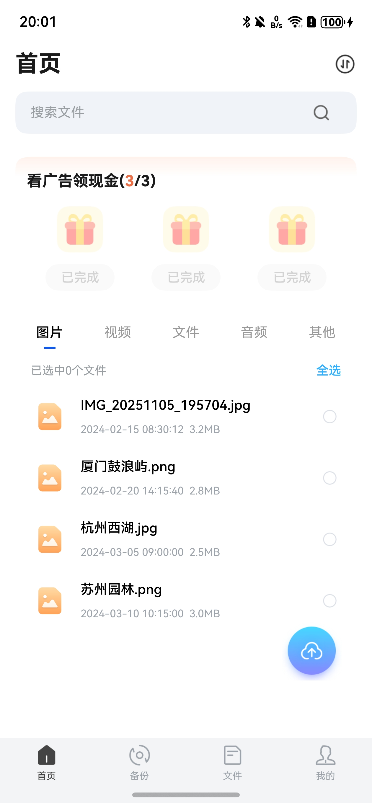

**文件分类展示**

支持按文件类型分类浏览：图片、视频、音频、文档等。

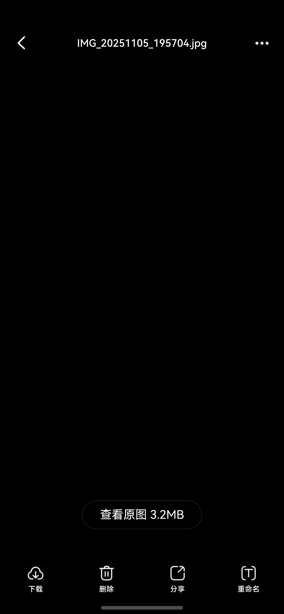  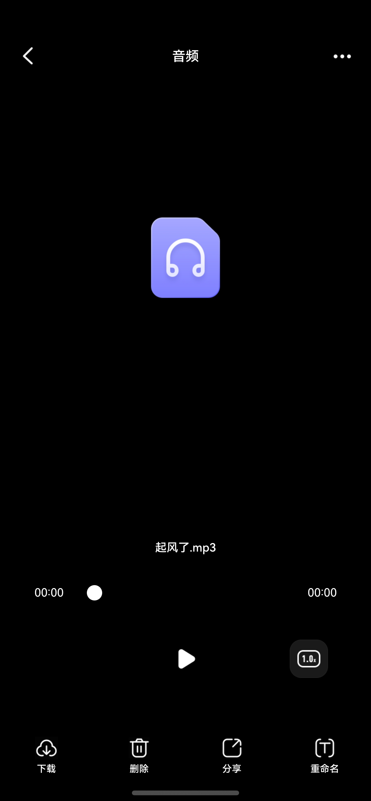 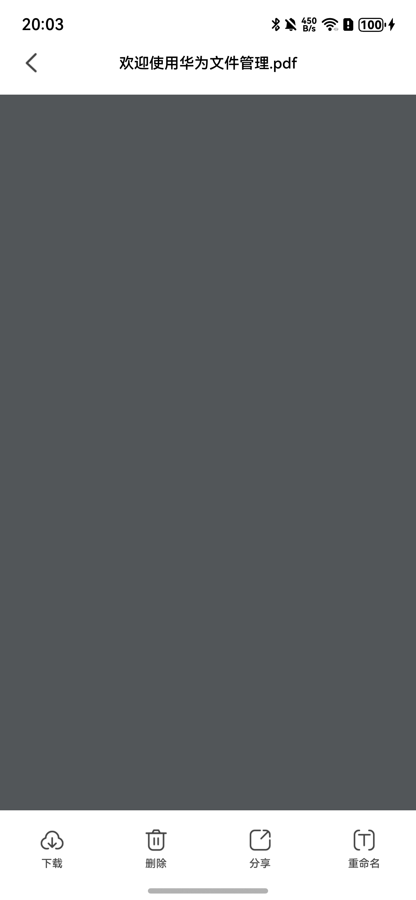

**文件搜索**

支持关键词搜索、搜索历史管理。

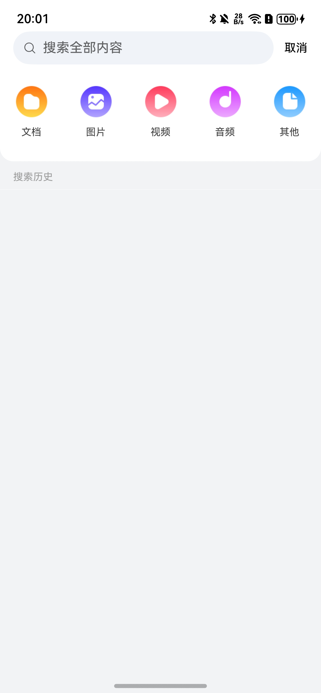

### 2. 备份模块

支持自动备份、手动备份、备份状态查看等功能。

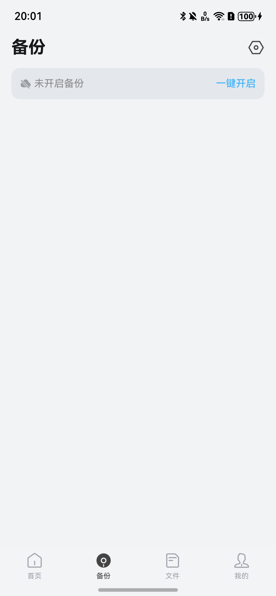

### 3. 文件管理模块

提供完整的文件管理功能，包括文件上传下载、列表/宫格视图切换、文件操作等。

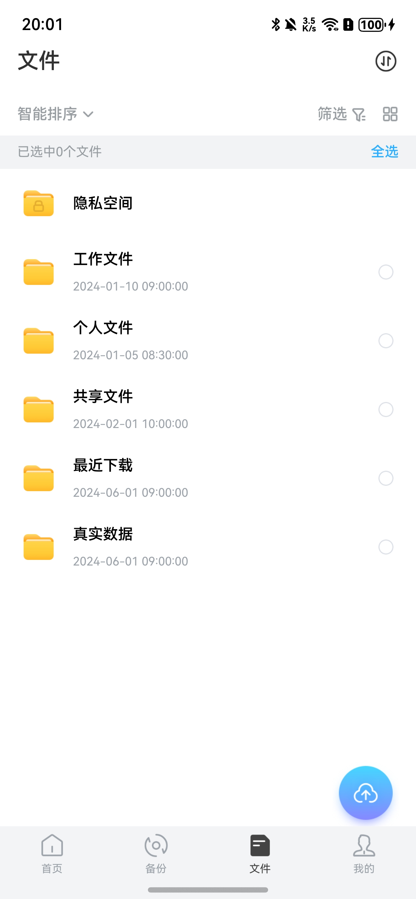

**文件目录浏览**

支持多级目录浏览、面包屑导航。

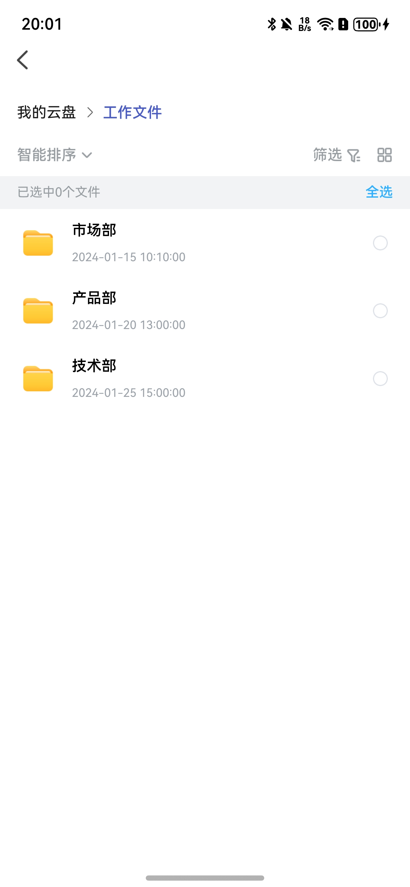

### 4. 个人中心模块

提供账号管理、VIP服务、设置、分享管理、回收站等功能。

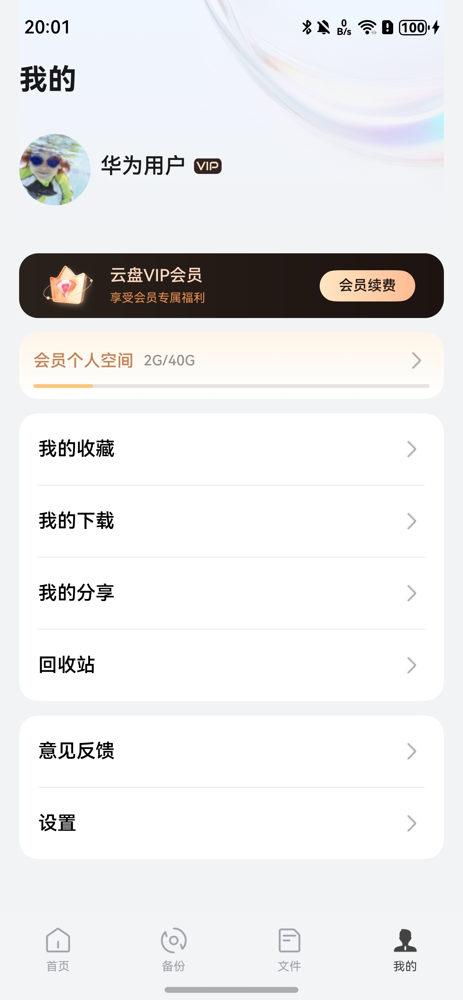

**文件传输管理**

支持上传下载进度显示、断点续传。


**我的分享**

管理已分享的文件，支持查看分享详情、取消分享。

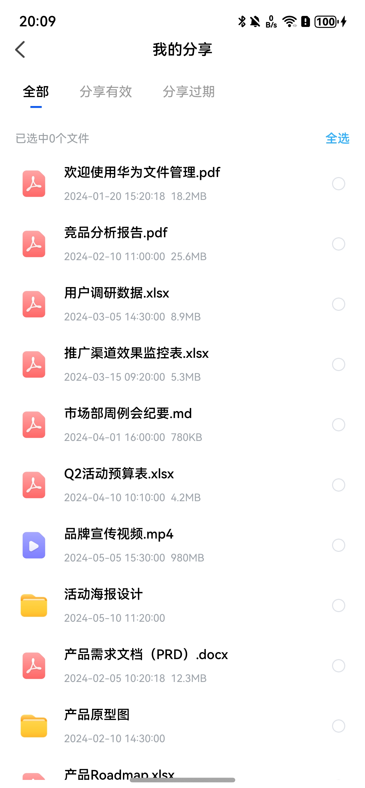

**个人空间**

查看存储空间使用情况，支持VIP扩容。

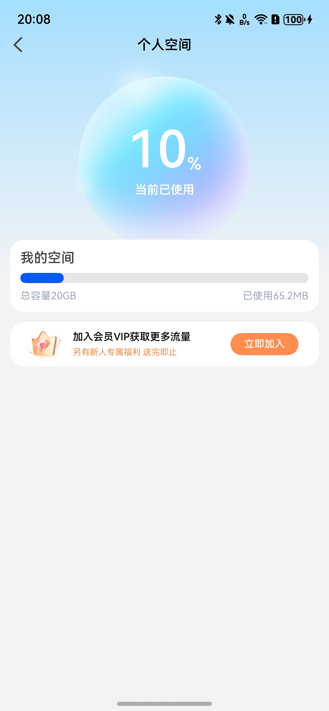

## 开源许可协议

该代码经过[Apache 2.0 授权许可](http://www.apache.org/licenses/LICENSE-2.0)。

