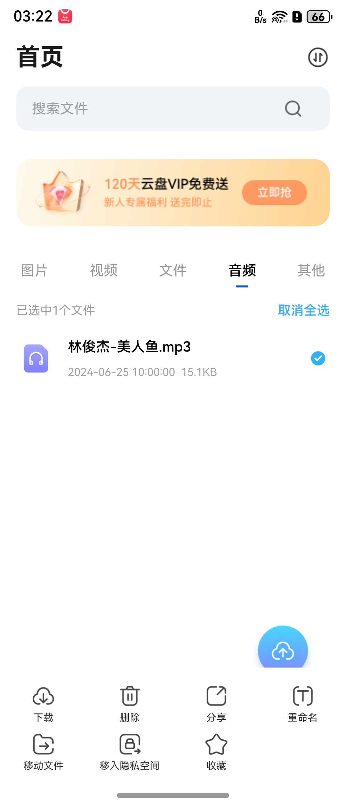

# 网盘文件操作项组件快速入门

## 目录
- [简介](#简介)
- [约束与限制](#约束与限制)
- [快速入门](#快速入门)
- [API参考](#API参考)
- [示例代码](#示例代码)

## 简介

本组件提供了网盘文件操作菜单和操作项的UI及逻辑，支持下载、删除、分享、重命名、移动、收藏、移入/移出隐私空间、取消分享、复制链接等多种文件操作。组件可根据文件类型和状态动态调整可用操作项。



## 约束与限制

### 环境

- DevEco Studio版本：DevEco Studio 5.0.5 Release及以上
- HarmonyOS SDK版本：HarmonyOS 5.0.3 Release SDK及以上
- 设备类型：华为手机（包括双折叠和阔折叠）
- 系统版本：HarmonyOS 5.0.3(15) 及以上

## 快速入门

1. 安装组件。  
   如果是在DevEco Studio使用插件集成组件，则无需安装组件，请忽略此步骤。
   如果是从生态市场下载组件，请参考以下步骤安装组件。  
   a. 解压下载的组件包，将包中所有文件夹拷贝至您工程根目录的xxx目录下。  
   b. 在项目根目录build-profile.json5并添加cloud_operation_item模块。
   ```typescript
   // 在项目根目录的build-profile.json5填写cloud_operation_item路径。其中xxx为组件存在的目录名
   "modules": [
     {
       "name": "cloud_operation_item",
       "srcPath": "./xxx/cloud_operation_item",
     }
   ]
   ```
   c. 在项目根目录oh-package.json5中添加依赖
   ```typescript
   // xxx为组件存放的目录名称
   "dependencies": {
     "cloud_operation_item": "file:./xxx/cloud_operation_item"
   }
   ```

2. 引入组件。

   ```typescript
   import { 
     OperationItemView,
     RenameDialog,
     OperationItemModel,
     OperationItemType,
     OperationItemViewModel
   } from 'cloud_operation_item';
   ```

3. 调用组件，详细参数配置说明参见[API参考](#API参考)。

   ```typescript
   // 操作项视图
   OperationItemView({
     vm: this.operationVM,
     onOperationClick: (type: OperationItemType) => {
       console.info('操作类型:', type);
     }
   })
   ```

## API参考

### 接口

#### OperationItemView

OperationItemView(options: { vm?: OperationItemViewModel; bgColor?: Color | string | Resource })

操作项视图组件，展示文件操作菜单。

**参数：**

| 参数名   | 类型                           | 是否必填 | 说明                          |
|---------|-------------------------------|------|------------------------------|
| vm      | [OperationItemViewModel](#OperationItemViewModel) | 否    | 操作项视图模型，默认创建新实例 |
| bgColor | Color \| string \| Resource   | 否    | 背景色，默认 Color.White      |

**注意：** 组件使用 `@Param` 装饰器，参数通过对象形式传递。

#### RenameDialog

RenameDialog(options: { name: string; icon: ResourceStr; changeCompletedAction?: (success: boolean, text?: string) => void })

重命名对话框组件。

**参数：**

| 参数名                 | 类型                                      | 是否必填 | 说明                                    |
|-----------------------|------------------------------------------|------|----------------------------------------|
| name                  | string                                   | 是    | 原始文件名                              |
| icon                  | ResourceStr                              | 是    | 文件图标资源                            |
| changeCompletedAction | (success: boolean, text?: string) => void| 否    | 完成回调（success-是否成功，text-新名称）|

**注意：** 组件使用 `@Require @Param` 装饰器，name 和 icon 为必填参数。

### 数据模型

#### OperationItemModel

操作项数据模型。

**构造函数：**

```typescript
constructor(operationType: OperationItemType)
```

**参数：**

| 参数名        | 类型                                  | 是否必填 | 说明     |
|--------------|--------------------------------------|------|----------|
| operationType| [OperationItemType](#OperationItemType) | 是   | 操作类型 |

**属性：**

| 名称           | 类型                                  | 说明           |
|---------------|--------------------------------------|---------------|
| operationType | [OperationItemType](#OperationItemType) | 操作类型       |
| iconName      | ResourceStr                          | 操作名称资源   |
| iconSource    | ResourceStr                          | 操作图标资源   |

#### OperationItemType

操作类型枚举。

| 值 | 名称                  | 说明         |
|----|-----------------------|-------------|
| 0  | DOWNLOAD              | 下载         |
| 1  | DELETE                | 删除         |
| 2  | SHARE                 | 分享         |
| 3  | RENAME                | 重命名       |
| 4  | MOVE                  | 移动         |
| 5  | MOVETO_PRIVATESPACE   | 移入隐私空间 |
| 6  | MOVEOUT_PRIVATESPACE  | 移出隐私空间 |
| 7  | UNCOLLECTED           | 未收藏       |
| 8  | COLLECTED             | 已收藏       |
| 9  | CANCELSHARE           | 取消分享     |
| 10 | COPYLINK              | 复制链接     |

#### OperationItemViewModel

操作项视图模型，管理操作项列表和状态。

**构造函数：**

```typescript
constructor(
  items?: OperationItemType[],
  callbackAction?: (actionType: OperationItemType) => void
)
```

**参数：**

| 参数名         | 类型                                                      | 是否必填 | 说明           |
|---------------|----------------------------------------------------------|------|---------------|
| items         | [OperationItemType](#OperationItemType)[]                | 否   | 操作类型列表   |
| callbackAction| (actionType: [OperationItemType](#OperationItemType)) => void | 否   | 操作回调函数   |

**主要属性：**

| 名称                    | 类型                                                      | 说明                   |
|------------------------|----------------------------------------------------------|------------------------|
| operationList          | [OperationItemType](#OperationItemType)[]                | 默认支持的操作类型列表  |
| showList               | [OperationItemModel](#OperationItemModel)[]              | 展示列表               |
| originalOperationCount | number                                                   | 原始操作数量           |
| didSelectedItemAction  | (actionType: [OperationItemType](#OperationItemType)) => void | 选择操作项回调      |

## 示例代码

```typescript
import { 
  OperationItemView,
  RenameDialog,
  OperationItemModel,
  OperationItemType,
  OperationItemViewModel
} from 'cloud_operation_item';
import { promptAction } from '@kit.ArkUI';

@Entry
@ComponentV2
export struct OperationTestPage {
   // 操作项视图模型
   operationVM: OperationItemViewModel = new OperationItemViewModel();
   @Local showRenameDialog: boolean = false;
   @Local currentFileName: string = '文档.pdf';

   aboutToAppear() {
      // 初始化操作项列表
      this.operationVM.operationList = [
         OperationItemType.DOWNLOAD,
         OperationItemType.SHARE,
         OperationItemType.RENAME,
         OperationItemType.MOVE,
         OperationItemType.MOVETO_PRIVATESPACE,
         OperationItemType.UNCOLLECTED,
         OperationItemType.DELETE
      ];

      // 设置操作项选择回调
      this.operationVM.didSelectedItemAction = (type: OperationItemType) => {
         this.handleOperation(type);
      };
   }

   handleOperation(type: OperationItemType) {
      switch (type) {
         case OperationItemType.DOWNLOAD:
            promptAction.showToast({ message: '开始下载' });
            break;
         case OperationItemType.SHARE:
            promptAction.showToast({ message: '打开分享' });
            break;
         case OperationItemType.RENAME:
            this.showRenameDialog = true;
            break;
         case OperationItemType.MOVE:
            promptAction.showToast({ message: '选择移动位置' });
            break;
         case OperationItemType.MOVETO_PRIVATESPACE:
            promptAction.showToast({ message: '移入隐私空间' });
            break;
         case OperationItemType.UNCOLLECTED:
            promptAction.showToast({ message: '已收藏' });
            break;
         case OperationItemType.DELETE:
            promptAction.showToast({ message: '确认删除' });
            break;
         default:
            break;
      }
   }

   build() {
      Column() {
         Text('文件操作项组件示例')
            .fontSize(18)
            .fontWeight(FontWeight.Bold)
            .margin({ bottom: 20 })

         Text(`当前文件: ${this.currentFileName}`)
            .fontSize(14)
            .margin({ bottom: 20 })

         // 操作项视图
         OperationItemView({
            vm: this.operationVM,
            bgColor: Color.White
         })

         // 重命名对话框
         if (this.showRenameDialog) {
            RenameDialog({
               name: this.currentFileName,
               icon: $r('app.media.ic_file'),
               changeCompletedAction: (success: boolean, text?: string) => {
                  this.showRenameDialog = false;
                  if (success && text) {
                     this.currentFileName = text;
                     promptAction.showToast({ message: `重命名为: ${text}` });
                  }
               }
            })
         }
      }
      .height('100%')
      .width('100%')
      .padding(16)
      .margin({ top: 60 })
   }
}
```
