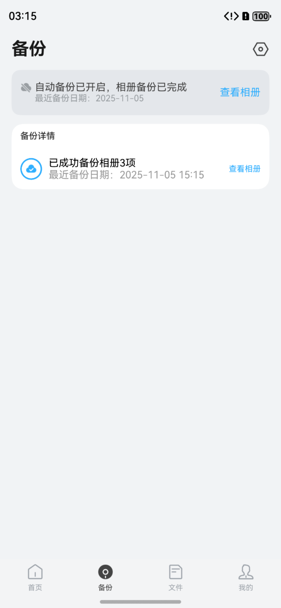

# 网盘备份状态组件快速入门

## 目录
- [简介](#简介)
- [约束与限制](#约束与限制)
- [快速入门](#快速入门)
- [API参考](#API参考)
- [示例代码](#示例代码)

## 简介

本组件提供了网盘备份状态展示的相关功能，支持备份进度显示、备份状态管理（未开始/备份中/已完成）、备份控制（开始/暂停）等能力。组件以卡片形式展示备份详情，包括进度环形图、备份时间、备份项数量等信息，并提供查看相册入口。

支持显示备份进度、控制备份开始/暂停、查看备份详情和相册    

 

## 约束与限制

### 环境

- DevEco Studio版本：DevEco Studio 5.0.5 Release及以上
- HarmonyOS SDK版本：HarmonyOS 5.0.5 Release SDK及以上
- 设备类型：华为手机（包括双折叠和阔折叠）
- 系统版本：HarmonyOS 5.0.1(13) 及以上

## 快速入门

1. 安装组件。  
   如果是在DevEco Studio使用插件集成组件，则无需安装组件，请忽略此步骤。
   如果是从生态市场下载组件，请参考以下步骤安装组件。  
   a. 解压下载的组件包，将包中所有文件夹拷贝至您工程根目录的xxx目录下。  
   b. 在项目根目录build-profile.json5并添加clouddisk_backup_status模块。
   ```typescript
   // 在项目根目录的build-profile.json5填写clouddisk_backup_status路径。其中xxx为组件存在的目录名
   "modules": [
     {
       "name": "clouddisk_backup_status",
       "srcPath": "./xxx/clouddisk_backup_status",
     }
   ]
   ```
   c. 在项目根目录oh-package.json5中添加依赖
   ```typescript
   // xxx为组件存放的目录名称
   "dependencies": {
     "clouddisk_backup_status": "file:./xxx/clouddisk_backup_status"
   }
   ```

2. 引入组件。

   ```typescript
   import { BackStatus } from 'clouddisk_backup_status';
   ```

3. 调用组件，详细参数配置说明参见[API参考](#API参考)。

   ```typescript
   BackStatus({
     backupProgress: 75,
     backupDateTime: '2024-11-05 14:30',
     backupStatus: 1,
     pickAvatarFromAlbum: () => {
       console.info('查看相册');
     },
     beginProgress: () => {
       console.info('开始备份');
     },
     pauseProgress: () => {
       console.info('暂停备份');
     },
     onValueChange: (status: number) => {
       console.info('状态变更:', status);
     }
   })
   ```

## API参考

### 接口

#### BackStatus

BackStatus(options: { backupProgress: number; backupDateTime: string; backupStatus: number; pickAvatarFromAlbum?: () => void; beginProgress?: () => void; pauseProgress?: () => void; onValueChange?: (data: number) => void })

备份状态展示组件，提供备份进度和控制功能。

**参数：**

| 参数名            | 类型                    | 是否必填 | 说明               |
|------------------|-------------------------|------|------------------|
| backupProgress   | number                  | 是    | 备份进度（0-100）      |
| backupDateTime   | string                  | 是    | 最近备份日期时间         |
| backupStatus     | number                  | 是    | [备份状态](#备份状态说明)  |
| pickAvatarFromAlbum | () => void           | 否    | 查看相册回调事件         |
| beginProgress    | () => void              | 否    | 开始备份回调事件         |
| pauseProgress    | () => void              | 否    | 暂停备份回调事件         |
| onValueChange    | (data: number) => void  | 否    | 状态变更回调事件，返回新的状态值 |

### 备份状态说明

| 值 | 名称    | 说明     |
|----|---------|----------|
| 0  | 未开始  | 备份未开始，显示"开始备份"按钮 |
| 1  | 备份中  | 正在备份，显示进度和"暂停备份"按钮 |
| 2  | 已完成  | 备份完成，显示备份详情和"查看相册"按钮 |

### 事件

#### pickAvatarFromAlbum

查看相册事件，当备份完成后点击"查看相册"时触发。

#### beginProgress

开始备份事件，当点击"开始备份"按钮时触发。

#### pauseProgress

暂停备份事件，当点击"暂停备份"按钮时触发。

#### onValueChange

状态变更事件，当备份状态发生变化时触发。

**回调参数：**

| 参数名  | 类型   | 说明     |
|---------|--------|----------|
| data    | number | 新的备份状态值（0或1） |

## 示例代码

```typescript
import { BackStatus } from 'clouddisk_backup_status';

@Entry
@ComponentV2
export struct BackupTestPage {
   @Local backupProgress: number = 0;
   @Local backupStatus: number = 0; 
   @Local backupDateTime: string = '';
   private timer: number = -1;

   // 模拟备份进度
   startBackup() {
      this.backupStatus = 1;
      this.timer = setInterval(() => {
         if (this.backupProgress < 100) {
            this.backupProgress += 10;
         } else {
            this.backupStatus = 2;
            this.backupDateTime = new Date().toLocaleString('zh-CN', {
               year: 'numeric',
               month: '2-digit',
               day: '2-digit',
               hour: '2-digit',
               minute: '2-digit'
            });
            clearInterval(this.timer);
         }
      }, 500);
   }

   pauseBackup() {
      this.backupStatus = 0;
      clearInterval(this.timer);
   }

   aboutToDisappear() {
      if (this.timer !== -1) {
         clearInterval(this.timer);
      }
   }

   build() {
      Column() {
         Text('网盘备份状态示例')
            .fontSize(18)
            .fontWeight(FontWeight.Bold)
            .margin({ bottom: 20 })

         // 备份状态组件
         BackStatus({
            backupProgress: this.backupProgress,
            backupDateTime: this.backupDateTime,
            backupStatus: this.backupStatus,
            pickAvatarFromAlbum: () => {
               console.info('查看相册');
               // 跳转到相册页面
            },
            beginProgress: () => {
               console.info('开始备份');
               this.startBackup();
            },
            pauseProgress: () => {
               console.info('暂停备份');
               this.pauseBackup();
            },
            onValueChange: (status: number) => {
               console.info('状态变更:', status);
               this.backupStatus = status;
            }
         })

         // 状态信息显示
         Column({ space: 10 }) {
            Text(`当前状态: ${this.backupStatus === 0 ? '未开始' : this.backupStatus === 1 ? '备份中' : '已完成'}`)
               .fontSize(14)
            Text(`备份进度: ${this.backupProgress}%`)
               .fontSize(14)
            if (this.backupDateTime) {
               Text(`备份时间: ${this.backupDateTime}`)
                  .fontSize(14)
            }
         }
         .alignItems(HorizontalAlign.Start)
         .width('100%')
         .padding(16)
         .backgroundColor('#F5F5F5')
         .borderRadius(8)
         .margin({ top: 20 })

         // 重置按钮
         Button('重置备份状态')
            .onClick(() => {
               this.backupProgress = 0;
               this.backupStatus = 0;
               this.backupDateTime = '';
               if (this.timer !== -1) {
                  clearInterval(this.timer);
               }
            })
            .margin({ top: 20 })
      }
      .height('100%')
      .width('100%')
      .padding(16)
      .margin({ top: 60 })
      .justifyContent(FlexAlign.Start)
   }
}
```
