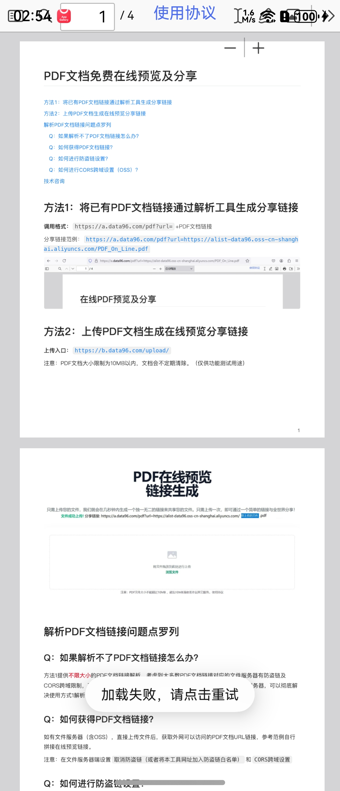

# 网盘文件详情组件快速入门

## 目录
- [简介](#简介)
- [约束与限制](#约束与限制)
- [快速入门](#快速入门)
- [API参考](#API参考)
- [示例代码](#示例代码)

## 简介

本组件提供了网盘文件详情预览的相关功能，支持图片、视频、音频、PDF等多种文件类型的预览与播放。该组件通过页面路由的方式使用，提供完整的文件预览体验。

| 图片详情页 | 视频详情页 | PDF详情页 | 音频详情页 |
|---------|---------|---------|---------|
|  |  |  |  |
## 约束与限制

### 环境

- DevEco Studio版本：DevEco Studio 5.0.5 Release及以上
- HarmonyOS SDK版本：HarmonyOS 5.0.5 Release SDK及以上
- 设备类型：华为手机（包括双折叠和阔折叠）
- 系统版本：HarmonyOS 5.0.1(13) 及以上

## 快速入门

1. 安装组件。  
   如果是在DevEco Studio使用插件集成组件，则无需安装组件，请忽略此步骤。
   如果是从生态市场下载组件，请参考以下步骤安装组件。  
   a. 解压下载的组件包，将包中所有文件夹拷贝至您工程根目录的xxx目录下。  
   b. 在项目根目录build-profile.json5并添加clouddisk_file_detail模块。
   ```typescript
   // 在项目根目录的build-profile.json5填写clouddisk_file_detail路径。其中xxx为组件存在的目录名
   "modules": [
     {
       "name": "clouddisk_file_detail",
       "srcPath": "./xxx/clouddisk_file_detail",
     }
   ]
   ```
   c. 在项目根目录oh-package.json5中添加依赖
   ```typescript
   // xxx为组件存放的目录名称
   "dependencies": {
     "clouddisk_file_detail": "file:./xxx/clouddisk_file_detail",
     "oh_router": "file:./xxx/OHRouter",
     "common": "file:./xxx/common"
   }
   ```

2. 引入组件。

   ```typescript
   import { ImageVideoPageBuilder } from 'clouddisk_file_detail';
   ```

3. 调用组件，详细参数配置说明参见[API参考](#API参考)。

   ```typescript
        phoneRouterControl.jumpPage({
          pageName: RouterMap.IMAGE_VIDEO_PAGE,
          builder: wrapBuilder(ImageVideoPageBuilder),
          param: new FileInfo(
            FileType.Picture, // fileType
            '图片.jpg', // name
            '2024-10-28'// createTime
          )
        })
   ```

## API参考

### 接口

ImageVideoPageBuilder(param: FileInfo)

网盘文件详情预览页面构建器，通过路由跳转使用。

**参数：**

| 参数名 | 类型                          | 是否必填 | 说明       |
|--------|-------------------------------|------|------------|
| param  | [FileInfo](#FileInfo)     | 是    | 文件信息对象 |

### FileInfo

文件信息数据模型，来自 `common` 模块。

**构造函数：**

```typescript
constructor(fileType: FileType = 0, name: string = '', time: string = '')
```

**主要属性：**

| 名称        | 类型                    | 说明                      |
|------------|-----------------------|--------------------------|
| fileId     | number                | 文件唯一标识              |
| name       | string                | 文件名                    |
| fileType   | [FileType](#FileType) | 文件类型  |
| fileSize   | string                | 文件大小（如 "2.5MB"）    |
| createTime | string                | 文件创建时间              |
| updateTime | string                | 文件更新时间              |
| path       | string                | 本地文件路径              |
| downloadUrl| string                | 网络资源地址              |
| thumbnailUrl| string                | 缩略图地址                |
| duration   | string                | 音视频时长（如 "03:25"）  |
| isCollected| boolean               | 是否已收藏                |
| isDeleted  | boolean               | 是否已删除                |
| isPrivate  | boolean               | 是否在隐私空间            |
| contentList| FileInfo[]            | 子文件列表（文件夹）     |

### FileType

| 值 | 名称         | 说明           |
|----|-------------|---------------|
| 0  | All         | 全部类型       |
| 1  | Picture     | 图片预览       |
| 2  | Video       | 视频播放       |
| 3  | File        | PDF/文档       |
| 4  | Audio       | 音频播放       |
| 5  | Other       | 其他类型       |
| 6  | Director    | 文件夹         |
| 7  | PrivateSpace| 隐私空间       |

## 示例代码

```typescript
import { phoneRouterControl } from 'oh_router';
import { ImageVideoPageBuilder } from 'clouddisk_file_detail';
import { FileInfo, FileType, RouterMap } from 'common';

@Entry
@ComponentV2
struct Index {
   build() {
      Column() {
         Button('预览图片').onClick(() => {
            phoneRouterControl.jumpPage({
               pageName: RouterMap.IMAGE_VIDEO_PAGE,
               builder: wrapBuilder(ImageVideoPageBuilder),
               param: new FileInfo(
                  FileType.Picture, // fileType
                  '图片.jpg', // name
                  '2024-10-28'// createTime
               )
            })
         })
            .margin({ bottom: 20 })
      }
      .justifyContent(FlexAlign.Center)
         .height('100%')
         .width('100%')
   }
}
```