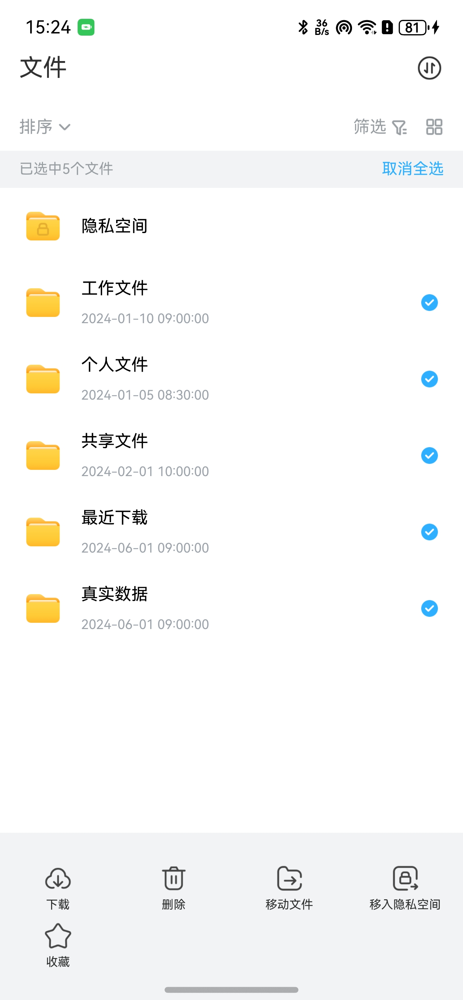

# 网盘文件选择组件快速入门

## 目录

- [简介](#简介)
- [约束与限制](#约束与限制)
- [快速入门](#快速入门)
- [API参考](#API参考)
- [示例代码](#示例代码)

## 简介

本组件提供了网盘文件选择的相关功能，支持文件列表的选择与视图切换能力，包括单选/多选、全选/反选、列表/宫格视图切换，并内置隐私空间项展示。适用于文件批量操作前的选择阶段。

| 文件夹列表视图                                                                             | 文件夹宫格视图                                                                             | 文件列表视图                                                                              | 文件宫格视图                                                                              |
|-------------------------------------------------------------------------------------|-------------------------------------------------------------------------------------|-------------------------------------------------------------------------------------|-------------------------------------------------------------------------------------|
|  |  |  |  |

## 约束与限制

### 环境

- DevEco Studio版本：DevEco Studio 5.0.5 Release及以上
- HarmonyOS SDK版本：HarmonyOS 5.0.5 Release SDK及以上
- 设备类型：华为手机（包括双折叠和阔折叠）
- 系统版本：HarmonyOS 5.0.1(13) 及以上

## 快速入门

1. 安装组件。  
   如果是在DevEco Studio使用插件集成组件，则无需安装组件，请忽略此步骤。
   如果是从生态市场下载组件，请参考以下步骤安装组件。  
   a. 解压下载的组件包，将包中所有文件夹拷贝至您工程根目录的xxx目录下。  
   b. 在项目根目录build-profile.json5并添加coulddisk_file_select模块。
   ```typescript
   // 在项目根目录的build-profile.json5填写coulddisk_file_select路径。其中xxx为组件存在的目录名
   "modules": [
     {
       "name": "coulddisk_file_select",
       "srcPath": "./xxx/coulddisk_file_select",
     }
   ]
   ```
   c. 在项目根目录oh-package.json5中添加依赖
   ```typescript
   // xxx为组件存放的目录名称
   "dependencies": {
     "coulddisk_file_select": "file:./xxx/coulddisk_file_select",
     "common": "file:./xxx/common"
   }
   ```

2. 引入组件。

```typescript
import {
   FileListSelectView,
   FileListSelectViewVM,
   PrivateSpaceCell,
   DirectorUnSelectCell,
} from 'coulddisk_file_select';
import { FileInfo } from 'common';
```

3. 调用组件，详细参数配置说明参见[API参考](#API参考)。

   ```typescript
   // 文件列表选择视图组件
   FileListSelectView({ 
     vm: this.vm,
     selectRowBgColor: Color.White
   })
   
   // 文件信息列表样式组件
   FileInfoCell({
     fileInfo: fileInfo,
     isSelected: true,
     checkAction: () => {
       console.info('选择框被点击');
     }
   })
   
   // 文件信息宫格样式组件
   FileInfoGridItem({
     fileInfo: fileInfo,
     isSelected: false,
     checkAction: () => {
       console.info('宫格选择框被点击');
     }
   })
   
   // 隐私空间组件
   PrivateSpaceCell({
     fileInfo: privateSpaceInfo
   })
   
   // 未选中文件夹组件
   DirectorUnSelectCell({
     fileInfo: folderInfo
   })
   ```

## API参考

### 接口

#### FileListSelectView

FileListSelectView(options: { vm: FileListSelectViewVM; selectRowBgColor?: ResourceColor })

文件列表选择视图组件，提供文件选择和视图切换功能。

**参数：**

| 参数名              | 类型                        | 是否必填 | 说明                    |
|------------------|---------------------------|----|-----------------------|
| vm               | [FileListSelectViewVM](#FileListSelectViewVM) | 是  | 选择视图的状态与事件管理对象        |
| selectRowBgColor | ResourceColor             | 否  | 选中行背景色，默认 Color.White |

#### FileInfoCell

FileInfoCell(options: { fileInfo: FileInfo; isSelected?: boolean; checkAction?: () => void })

文件信息行样式展示组件，用于列表视图。

**参数：**

| 参数名         | 类型                    | 是否必填 | 说明              |
|-------------|-----------------------|----|-----------------|
| fileInfo    | [FileInfo](#FileInfo) | 是  | 文件信息对象          |
| isSelected  | boolean               | 否  | 是否选中状态，默认 false |
| checkAction | () => void            | 否  | 选择框点击事件回调       |

#### FileInfoGridItem

FileInfoGridItem(options: { fileInfo: FileInfo; isSelected?: boolean; checkAction?: () => void })

文件信息宫格项展示组件，用于宫格视图。

**参数：**

| 参数名         | 类型         | 是否必填 | 说明              |
|-------------|------------|----|-----------------|
| fileInfo    | [FileInfo](#FileInfo)   | 是  | 文件信息对象          |
| isSelected  | boolean    | 否  | 是否选中状态，默认 false |
| checkAction | () => void | 否  | 选择框点击事件回调       |

#### PrivateSpaceCell

PrivateSpaceCell(options: { fileInfo: FileInfo })

隐私空间入口展示组件。

**参数：**

| 参数名      | 类型       | 是否必填 | 说明     |
|----------|----------|----|--------|
| fileInfo | [FileInfo](#FileInfo) | 是  | 文件信息对象 |

#### DirectorUnSelectCell

DirectorUnSelectCell(options: { fileInfo: FileInfo })

未选中文件夹行样式组件。

**参数：**

| 参数名      | 类型       | 是否必填 | 说明     |
|----------|----------|----|--------|
| fileInfo | [FileInfo](#FileInfo) | 是  | 文件信息对象 |

### 数据模型

#### FileListSelectViewVM

文件列表选择视图模型，管理文件列表、选中状态与事件回调。

**构造函数：**

```typescript
constructor(
  fileList ? : FileInfo[],
  clickAction ? : (index: number) => void,
  selectAction ? : (index: number) => void,
  changeSelectedAction ? : (isAllSelected: boolean) => void
)
```

**参数：**

| 参数名                  | 类型                               | 是否必填 | 说明        |
|----------------------|----------------------------------|----|-----------|
| fileList             | [FileInfo](#FileInfo)[]                       | 否  | 文件列表数据源   |
| clickAction          | (index: number) => void          | 否  | 点击项事件回调   |
| selectAction         | (index: number) => void          | 否  | 选中项事件回调   |
| changeSelectedAction | (isAllSelected: boolean) => void | 否  | 全选/反选事件回调 |

**主要属性：**

| 名称                    | 类型          | 说明       |
|-----------------------|-------------|----------|
| selectedIndexes       | Set<number> | 选中索引集合   |
| fileList              | [FileInfo](#FileInfo)[]  | 文件列表数据源  |
| isListVisibleGridMode | boolean     | 是否宫格模式展示 |

**主要方法：**

- `switchAllSelected()`: 切换全选/反选状态
- `checkIsAllSelected()`: 判断是否全选

#### FileInfo

文件信息数据模型，来自 `common` 模块。

**构造函数：**

```typescript
constructor(fileType: FileType = 0, name: string = '', time: string = '')
```

**主要属性：**

| 名称        | 类型     | 说明                           |
|------------|----------|-------------------------------|
| fileId     | number   | 文件唯一标识                   |
| name       | string   | 文件名                         |
| fileType   | FileType | 文件类型（Picture/Video/File/Audio/Director/PrivateSpace） |
| fileSize   | string   | 文件大小（如 "2.5MB"）         |
| createTime | string   | 文件创建时间                   |
| updateTime | string   | 文件更新时间                   |
| path       | string   | 本地文件路径                   |
| downloadUrl| string   | 网络资源地址                   |
| thumbnailUrl| string  | 缩略图地址                     |
| isCollected| boolean  | 是否已收藏                     |
| isChecked  | boolean  | 是否被勾选                     |
| contentList| [FileInfo](#FileInfo)[]| 子文件列表（文件夹）          |

## 示例代码

<!-- 注释：示例使用 FileType 枚举与模拟数据；真实项目请接入接口数据 -->

```typescript
import {
  FileListSelectView, FileListSelectViewVM,
} from 'coulddisk_file_select';
import { FileInfo, FileType } from 'common';

@Entry
@ComponentV2
export struct clouddiskTestPage {
  // 切换显示内容：true 显示文件夹，false 显示文件
  @Local
  showFolders: boolean = true;
  // 模拟两份数据：文件夹数据与文件数据
  foldersData: FileInfo[] = [
    new FileInfo(FileType.Director, '文件夹A', '2024-07-20'),
    new FileInfo(FileType.Director, '文件夹B', '2024-07-21'),
    new FileInfo(FileType.Director, '文件夹C', '2024-07-22'),
    new FileInfo(FileType.Director, '文件夹D', '2024-07-23'),
    new FileInfo(FileType.PrivateSpace, '隐私空间', '2024-07-24'),
  ];
  filesData: FileInfo[] = [
    new FileInfo(FileType.Picture, '图片.jpg', '2024-10-28'),
    new FileInfo(FileType.Video, '视频1.mp4', '2024-09-02'),
    new FileInfo(FileType.File, '文档1.pdf', '2024-09-03'),
  ];
  // 独立的两个视图模型：用于分别控制文件夹与文件的视图切换与选中
  folderVm: FileListSelectViewVM = new FileListSelectViewVM(
    this.foldersData,
    (index: number) => {
      console.info('点击文件夹索引:', index);
      console.info('点击文件夹名:', this.foldersData[index].name);
    },
    (index: number) => {
      console.info('选中文件夹索引:', index);
      console.info('当前选中文件夹数量:', this.folderVm.selectedIndexes.size);
    },
    (isAllSelected: boolean) => {
      console.info('文件夹全选状态:', isAllSelected);
    }
  );
  fileVm: FileListSelectViewVM = new FileListSelectViewVM(
    this.filesData,
    (index: number) => {
      console.info('点击文件索引:', index);
      console.info('点击文件名:', this.filesData[index].name);
    },
    (index: number) => {
      console.info('选中文件索引:', index);
      console.info('当前选中文件数量:', this.fileVm.selectedIndexes.size);
    },
    (isAllSelected: boolean) => {
      console.info('文件全选状态:', isAllSelected);
    }
  );
  // 隐私空间与文件夹示例数据
  privateSpaceInfo: FileInfo = new FileInfo(
    FileType.Director, // 使用 Director 类型
    '隐私空间',
    '2024-08-01'
  );
  folderInfo: FileInfo = new FileInfo(
    FileType.Director, // 使用 Director 类型
    '文件夹A',
    '2024-07-20'
  );

  build()
  {
    Column()
    {
      // 内容切换按钮
      Button(this.showFolders ? '切换到文件列表' : '切换到文件夹列表')
        .onClick(() => {
          this.showFolders = !this.showFolders;
        })
        .margin({ bottom: 16 })
        .width('100%')

      // 操作按钮（根据当前显示内容动态显示）
      Row()
      {
        if (this.showFolders) {
          Button('切换文件夹视图')
            .onClick(() => {
              this.folderVm.isListVisibleGridMode = !this.folderVm.isListVisibleGridMode;
            })
            .margin({ right: 10 })

          Button('文件夹全选/反选')
            .onClick(() => {
              this.folderVm.switchAllSelected();
            })
        } else {
          Button('切换文件视图')
            .onClick(() => {
              this.fileVm.isListVisibleGridMode = !this.fileVm.isListVisibleGridMode;
            })
            .margin({ right: 10 })

          Button('文件全选/反选')
            .onClick(() => {
              this.fileVm.switchAllSelected();
            })
        }
      }
      .
      margin({ bottom: 20 })

      // 根据 showFolders 状态显示对应内容
      if (this.showFolders) {
        // 文件夹区：包含隐私空间项（不参与选中反选）与文件夹列表视图
        Text('文件夹')
          .fontSize(16)
          .fontWeight(FontWeight.Medium)
          .margin({ bottom: 8 })

        // 文件夹列表/宫格视图（独立VM控制）
        FileListSelectView({
          vm: this.folderVm,
          selectRowBgColor: '#F1F8E9'
        })

        // 选中状态显示
        Text(`已选中文件夹 ${this.folderVm.selectedIndexes.size} 个`)
          .fontSize(14)
          .margin({ top: 20 })
      } else {
        // 文件区：文件的列表/宫格视图（独立VM控制）
        Text('文件')
          .fontSize(16)
          .fontWeight(FontWeight.Medium)
          .margin({ bottom: 8 })

        FileListSelectView({
          vm: this.fileVm,
          selectRowBgColor: '#E3F2FD'
        })

        // 选中状态显示
        Text(`已选中文件 ${this.fileVm.selectedIndexes.size} 个`)
          .fontSize(14)
          .margin({ top: 20 })
      }
    }
    .
    padding(16)
      .height('100%')
      .width('100%')
      .margin({ top: 60 })
  }
}
```