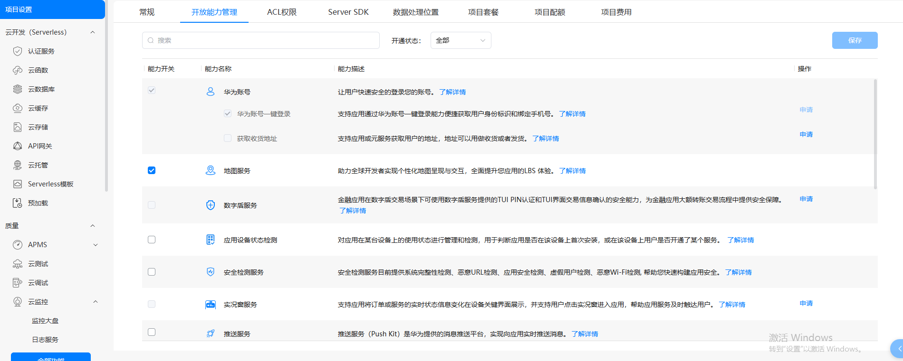
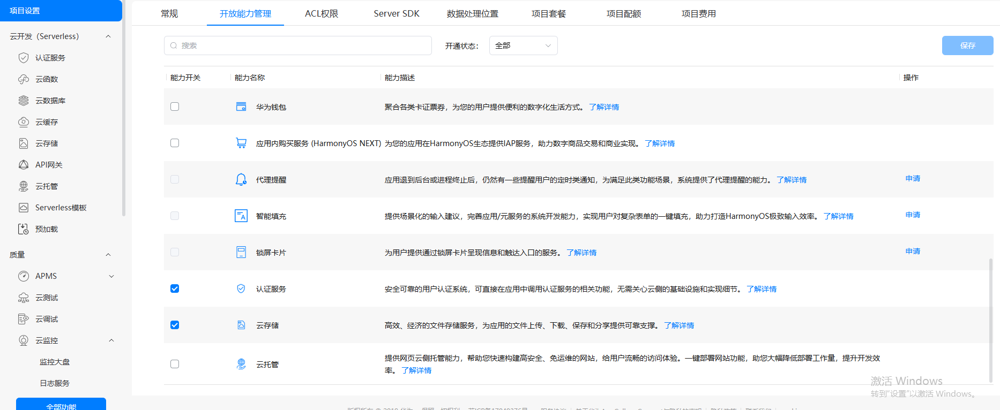
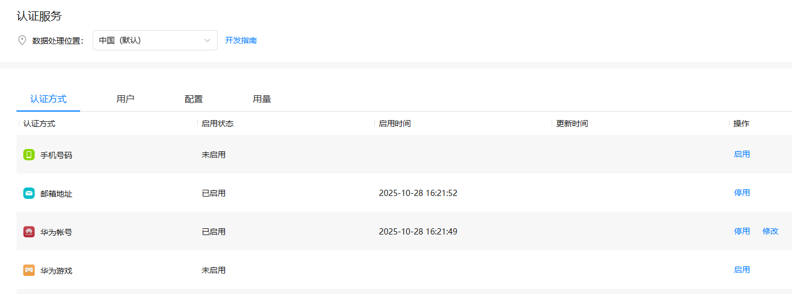
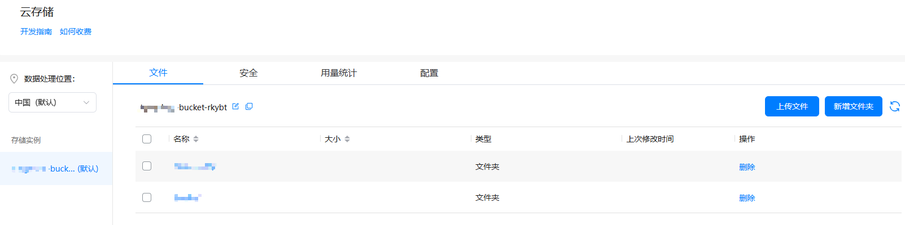
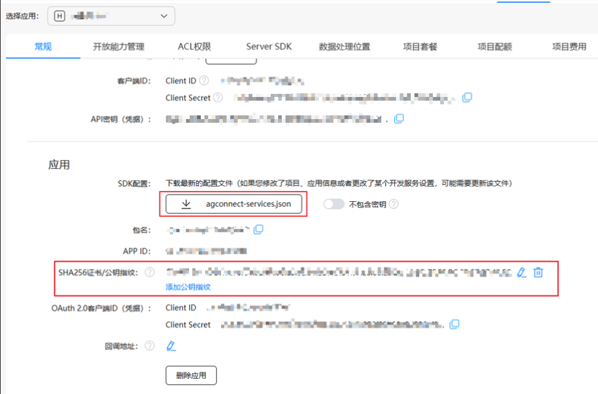

# 云存储上传组件快速入门

## 目录
- [简介](#简介)
- [约束与限制](#约束与限制)
- [快速入门](#快速入门)
- [API参考](#API参考)
- [示例代码](#示例代码)

## 简介

本组件提供了网盘文件上传到华为云存储的相关功能，支持文档文件（PDF、TXT、DOC、DOCX、XLS、XLSX、PPT、PPTX）和媒体文件（图片、视频）的上传、删除、列表查询等操作。组件集成了华为AGC认证服务和云存储服务，提供完整的文件管理能力。

## 约束与限制

### 环境

- DevEco Studio版本：DevEco Studio 5.0.5 Release及以上
- HarmonyOS SDK版本：HarmonyOS 5.0.5 Release SDK及以上
- 设备类型：华为手机（包括双折叠和阔折叠）
- 系统版本：HarmonyOS 5.0.1(13) 及以上

### 权限

- 网络权限：ohos.permission.INTERNET
- 文件访问权限：根据实际需求配置


## 快速入门

### 华为开发者官网配置

1. 使用华为企业级账号（不能使用华为个人账号）登录华为开发者官网。

   a. 在华为开发者联盟网站上注册成为开发者，具体参考[注册账号](https://developer.huawei.com/consumer/cn/doc/start/registration-and-verification-0000001053628148)。
   b. 完成[企业开发者实名认证](https://developer.huawei.com/consumer/cn/doc/start/edrna-0000001062678489) 。

2. 在AppGallery Connect（简称AGC）[创建项目](https://developer.huawei.com/consumer/cn/doc/app/agc-help-create-project-0000002242804048)和[创建应用](https://developer.huawei.com/consumer/cn/doc/app/agc-help-create-app-0000002247955506)。

3. 开通服务。

   a. 开放能力管理（华为账号一键登录需要先设置APP标签）
   
   

   b. 开通认证服务，并启用华为账号和邮箱认证，详细参考：[启用认证方式](https://developer.huawei.com/consumer/cn/doc/app/agc-help-auth-enable-authentication-method-0000002383148278)

   

   c.  开通云存储服务，并创建存储实例，详细参考：[开通云存储服务](https://developer.huawei.com/consumer/cn/doc/harmonyos-guides/cloudfoundation-enable-storage)

   

### 手动签名和配置公钥

1. 对应用进行[手工签名](https://developer.huawei.com/consumer/cn/doc/harmonyos-guides/ide-signing#section297715173233)。

2. 添加手工签名所用证书对应的公钥指纹，详细参考[配置公钥指纹](https://developer.huawei.com/consumer/cn/doc/app/agc-help-cert-fingerprint-0000002278002933)。

### 模块开发和项目集成

1. 安装组件

   请参考以下步骤安装组件。

   a. 解压下载的组件包，将包中所有文件夹拷贝至您工程根目录的xxx目录下。

   b. 在项目根目录build-profile.json5并添加module_cloud_upload模块。

   ```
   // 在项目根目录的build-profile.json5填写module_cloud_upload路径。其中xxx为组件存在的目录名
   "modules": [
     {
       "name": "module_cloud_upload",
       "srcPath": "./xxx/module_cloud_upload",
     }
   ]
   ```

   c. 在项目根目录oh-package.json5中添加依赖。

   ```
   // xxx为组件存放的目录名称
   "dependencies": {
     "module_cloud_upload": "file:./xxx/module_cloud_upload"
   }
   ```

   d. 在entry主模块下的module.json5文件中配置网络权限（INTERNET）

   ```
         {
           "name": "ohos.permission.INTERNET",
         }
   ```

   如果您在开通服务中修改了安全规则可直接执行步骤 j，修改bucket名称即可。

   若未修改安全规则需要将components/module_cloud_upload/src/main/ets/constant/Constants.ets文件中的MODIFY_SAFETY_RULE属性修改为true。

   e. 在entry主模块下的obfuscation-rules.txt文件中添加配置。

   ```
   -keep
   ./oh_modules/@hw-agconnect/auth
   ```

   f. 在entry主模块下的module.json5文件中配置client_id（OAuth 2.0的client_id）。

   ```
   "metadata": [
   {
   "name": "client_id",
   "value": "xxx"
   }
   ],
   ```

   g. 复制agconnect-services.json到项目中（下载好的文件放到项目根目录下AppScope/resources/rawfile/下），并添加公钥指纹。

   

   h. 在entry主模块的oh-package.json5中添加auth依赖。

   ```
     "dependencies": {
       "@hw-agconnect/auth": "^1.0.5"
     }
   ```

   i. 在entry主模块的EntryAbility中onCreate方法中初始化auth库。

   ```
   onCreate(want: Want, launchParam: AbilityConstant.LaunchParam): void {
        ......
        // 初始化auth库
        let file = this.context.resourceManager.getRawFileContentSync('agconnect-services.json');
        let json: string = buffer.from(file.buffer).toString();
        auth.init(this.context, json);
    }
   ```

   j. 配置云存储bucket名称。

   在使用组件前，需要将 `FileOperationUtil` 的 `storageBucket` 修改为您在华为AGC创建的bucket名称。

   ```typescript
     private storageBucket: cloudStorage.StorageBucket = cloudStorage.bucket('your-bucket-name');
   ```

   **重要提示：** 请将下面示例代码中的 `'your-bucket-name'` 替换为您在华为AGC云存储服务中创建的实际bucket名称。

   ```typescript
     // 在使用前初始化
     // 初始化云存储，替换为你在华为AGC创建的bucket名称
     this.uploadUtil.init('your-bucket-name').then((success: boolean) => {
       this.initSuccess = success;
       console.info('云存储初始化:', success ? '成功' : '失败');
     });
   ```

2. 引入组件。

   ```typescript
   import { UploadFileToComponent, DocumentType, FileOperationUtil, UploadFileStatus } from 'module_cloud_upload';
   ```

3. 调用组件，详细参数配置说明参见[API参考](#API参考)。

   ```typescript
   UploadFileToComponent({
      documentTypeArray: [
       DocumentType.PDF,
       DocumentType.TXT,
       DocumentType.DOCX,
       DocumentType.PPTX,
       DocumentType.XLSX,
       DocumentType.DOC,
       DocumentType.XLS,
       DocumentType.PPT
     ]
   })
   ```


## API参考

### 接口

#### UploadFileToComponent

UploadFileToComponent(options: { documentTypeArray: Array<DocumentType> })

云存储文件上传组件，提供文档和媒体文件上传功能。

**参数：**

| 参数名              | 类型                                   | 是否必填 | 说明                                               |
|--------------------|--------------------------------------|------|---------------------------------------------------|
| documentTypeArray  | Array<[DocumentType](#DocumentType)> | 是    | 支持上传的文档类型数组                              |

#### FileOperationUtil

文件操作工具类，提供云存储文件的上传、删除、查询等功能。

**主要方法：**

| 方法名              | 参数                                          | 返回值                                            | 说明                     |
|--------------------|----------------------------------------------|------------------------------------------------|-------------------------|
| init               | bucketName: string                           | Promise<boolean>                               | 初始化云存储实例          |
| uploadFile         | localPath: string, cloudPath: string, originPath: string | Promise<[UploadFileStatus](#UploadFileStatus)> | 上传文件到云存储         |
| deleteFile         | fileName: string                             | Promise<void>                                  | 删除云端文件             |
| getDirList         | -                                            | Promise<string[]>                              | 获取云端目录列表          |
| getFileList        | directory: string                            | Promise<string[]>                              | 获取指定目录的文件列表     |
| copyFile           | srcPath: string, destPath: string            | Promise<boolean>                               | 复制文件                 |
| isFileExist        | filePath: string                             | Promise<boolean>                               | 判断文件是否存在          |

### 数据模型

#### DocumentType

文档类型枚举。

| 值 | 名称  | 说明           |
|----|------|---------------|
| 0  | PDF  | PDF文档        |
| 1  | TXT  | 文本文档       |
| 2  | DOC  | Word文档(旧版) |
| 3  | DOCX | Word文档       |
| 4  | XLS  | Excel表格(旧版)|
| 5  | XLSX | Excel表格      |
| 6  | PPT  | PPT演示文稿(旧版)|
| 7  | PPTX | PPT演示文稿    |

#### UploadFileStatus

上传文件状态对象。

| 名称          | 类型                                            | 说明           |
|--------------|-----------------------------------------------|---------------|
| fileName     | string                                        | 文件名称       |
| filePath     | string                                        | 文件原路径     |
| fileSuffix   | FileType                                      | 文件后缀类型   |
| fileSize     | number                                        | 文件大小(字节) |
| createTime   | string                                        | 创建时间       |
| code         | [UploadFileStatusCode](#UploadFileStatusCode) | 状态码         |
| progress     | number                                        | 传输进度(0-100)|
| startTime    | number                                        | 开始时间戳     |
| progressTime | number                                        | 传输耗时(毫秒) |
| vipStatus    | boolean                                       | VIP状态        |

#### UploadFileStatusCode

上传状态码枚举。

| 值      | 名称         | 说明       |
|---------|-------------|-----------|
| 000200  | SUCCESS     | 上传成功   |
| 000401  | FAILED      | 上传失败   |
| 000100  | PROGRESSING | 上传中     |

## 示例代码

```typescript
import { UploadFileToComponent, DocumentType, FileOperationUtil, UploadFileStatus } from 'module_cloud_upload';
import { BusinessError } from '@kit.BasicServicesKit';

@Entry
@ComponentV2
export struct UploadTestPage {
  @Local uploadUtil: FileOperationUtil = new FileOperationUtil();
  @Local fileList: string[] = [];
  @Local initSuccess: boolean = false;

  aboutToAppear() {
    // 初始化云存储，替换为你在华为AGC创建的bucket名称
    this.uploadUtil.init('your-bucket-name').then((success: boolean) => {
      this.initSuccess = success;
      console.info('云存储初始化:', success ? '成功' : '失败');
    });
  }

  build() {
    Column({ space: 20 }) {
      Text('云存储上传示例')
        .fontSize(18)
        .fontWeight(FontWeight.Bold)

      // 使用上传组件
      UploadFileToComponent({
        documentTypeArray: [
          DocumentType.PDF,
          DocumentType.TXT,
          DocumentType.DOCX,
          DocumentType.PPTX,
          DocumentType.XLSX,
          DocumentType.DOC,
          DocumentType.XLS,
          DocumentType.PPT
        ]
      })

      Divider()

      // 获取云端文件列表
      Button('获取云端文件列表')
        .onClick(() => {
          this.getCloudFileList();
        })

      // 文件列表展示
      if (this.fileList.length > 0) {
        Text('云端文件列表:')
          .fontSize(16)
          .fontWeight(FontWeight.Bold)

        List() {
          ForEach(this.fileList, (fileName: string, index: number) => {
            ListItem() {
              Row() {
                Text(fileName)
                  .fontSize(14)
                  .layoutWeight(1)

                Button('删除')
                  .fontSize(12)
                  .backgroundColor(Color.Red)
                  .onClick(() => {
                    this.deleteCloudFile(fileName);
                  })
              }
              .width('100%')
                .padding(10)
                .backgroundColor('#F5F5F5')
                .borderRadius(8)
            }
            .margin({ bottom: 5 })
          })
        }
        .height(300)
      } else {
        Text('暂无云端文件')
          .fontSize(14)
          .fontColor('#999999')
      }
    }
    .height('100%')
      .width('100%')
      .padding(16)
      .margin({ top: 60 })
  }

  // 获取云端文件列表
  getCloudFileList() {
    this.uploadUtil.getDirList().then((directories: string[]) => {
      console.info('目录列表:', JSON.stringify(directories));
      this.fileList = [];

      directories.forEach((directory: string) => {
        this.uploadUtil.getFileList(directory).then((files: string[]) => {
          console.info(`${directory} 文件列表:`, JSON.stringify(files));
          this.fileList.push(...files);
        });
      });
    });
  }

  // 删除云端文件
  deleteCloudFile(fileName: string) {
    this.uploadUtil.deleteFile(fileName).then((success: boolean) => {
      if (success) {
        console.info('删除文件成功:', fileName);
        this.fileList = this.fileList.filter(name => name !== fileName);
      } else {
        console.error('删除文件失败:', fileName);
      }
    });
  }
}
```