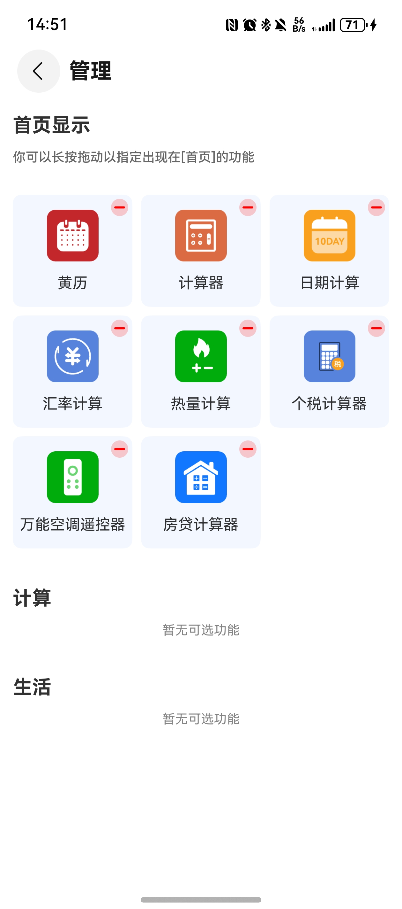

# 工具（综合工具）应用模板快速入门

## 目录

- [功能介绍](#功能介绍)
- [约束与限制](#约束与限制)
- [快速入门](#快速入门)
- [示例效果](#示例效果)
- [开源许可协议](#开源许可协议)

## 功能介绍

您可以基于此模板直接定制应用，也可以挑选此模板中提供的多种组件使用，从而降低您的开发难度，提高您的开发效率。

此模板提供如下组件，所有组件存放在工程根目录的components下，如果您仅需使用组件，可参考对应组件的指导链接；如果您使用此模板，请参考本文档。

| 组件                         | 描述                                       | 使用指导                                               |
|----------------------------|------------------------------------------| ------------------------------------------------------ |
| 黄历（almanac）                | 提供了查看黄历和白话文的功能。                          | [使用指导](./components/almanac/README.md)             |
| 基础计算器（basic_calculator）    | 提供了基础计算的功能。                              | [使用指导](./components/basic_calculator/README.md)    |
| 热量计算（calories_calculate）   | 提供了按日和按周根据摄入计算热量的功能。                     | [使用指导](./components/calories_calculate/README.md)  |
| 日期计算（date_calculate）       | 提供了日期计算和日期间隔计算的功能。                       | [使用指导](./components/date_calculate/README.md)      |
| 汇率计算器（exchange_calculator） | 提供了多种币种之间实时汇率计算的功能。                      | [使用指导](./components/exchange_calculator/README.md) |
| 个税计算器（income_calculator）   | 提供了工资、劳动报酬等收入个税计算的功能。                    | [使用指导](./components/income_calculator/README.md)   |
| 房贷计算器（mortgage_calculator） | 提供了商业贷款、公积金贷款和组合贷款的还款计划计算功能。             | [使用指导](./components/mortgage_calculator/README.md) |
| 万能空调遥控器（remote_control）    | 提供了空调遥控器创建，删除及以发射红外信号控制对应空调等功能。          | [使用指导](./components/remote_control/README.md)      |
| 科学计算器（science_calculator）  | 提供了多种科学计算方法的计算的功能。                       | [使用指导](./components/science_calculator/README.md)  |
| 日程提醒（calendar_events）      | 提供了新增以及编辑日历、生日、纪念日、待办，并将日程添加到系统日历提醒中的功能。 | [使用指导](./components/calendar_events/README.md)     |
| 敲木鱼（decompression_tool）    | 提供了敲木鱼解压的功能。                             | [使用指导](./components/decompression_tool/README.md)  |
| 记账（money_track）            | 提供了记账、查看账单列表和统计图表的功能。                    | [使用指导](./components/money_track/README.md)         |
| 隐私笔记（personal_notes）       | 提供了写笔记、编辑笔记、删除笔记、笔记分类，搜索，多选，排序，分享、复制功能。  | [使用指导](./components/personal_notes/README.md)      |
| 图片水印（picture_watermark）    | 提供了图片添加水印、下载保存相册、历史添加缓存等功能。              | [使用指导](./components/picture_watermark/README.md)   |
| 手机NFC（mobile_nfc）          | 提供了门禁卡、公交卡和银行卡的读取和克隆功能。                  | [使用指导](./components/mobile_nfc/README.md)          |
| 罗盘（compass）                | 提供了罗盘方向的指引功能。                            | [使用指导](./components/compass/README.md)             |
| 日记（diary）                  | 提供写日记的功能                                 | [使用指导](./components/diary/README.md)               |
| 网络测速（internet_speed_measure） | 提供了网络实时测速的功能。                            | [使用指导](./components/internet_speed_measure/README.md)               |
| 修图神器（photo_editing）        | 提供了滤镜相机、图片拼接、图片编辑的功能。                    | [使用指导](./components/photo_editing/README.md)               |
| BMI计算（bmi_calculator）      | 提供了BMI指标计算的功能。                           | [使用指导](./components/bmi_calculator/README.md)               |
| 绘画（draw_board）             | 提供了自由绘画的功能。                              | [使用指导](./components/draw_board/README.md)               |
| 录音专家（simple_recorder）       | 提供了录音、音频格式转换、音频转文字、音频编辑等功能。              | [使用指导](./components/simple_recorder/README.md)               |
| 解压缩（zip_tool）       | 提供了解压、压缩等功能。                             | [使用指导](./components/zip_tool/README.md)               |

本模板为工具类应用提供了常用功能的开发样例，模板主要分首页、我的两大模块：

* 首页：提供计算器、黄历、汇率计算、热量计算等工具功能。
* 我的：支持问题反馈、用户协议、隐私政策查看。

本模板只需做少量配置和定制即可快速实现数字计算、日期查询、空调遥控、个税计算等功能。

| 首页                                                      | 我的                                                      |
|---------------------------------------------------------|---------------------------------------------------------|
|  |  |


本模板主要页面及核心功能如下所示：

```ts
综合工具
 |-- 首页
 |    |-- 顶部操作区
 |    |    |    └-- 工具管理
 |    |-- 计算器
 |    |    └-- 数字计算
 |    |-- 个税计算器
 |    |    └-- 个税计算
 |    |-- 汇率计算器
 |    |    |-- 汇率计算
 |    |-- 热量计算
 |    |    |-- 饮食计划
 |    |    |    └-- 食物搜索
 |    |    |    └-- 食物添加
 |    |-- 日期计算
 |    |    |-- 日期间隔
 |    |    |-- 日期计算
 |    |-- 黄历
 |    |    |-- 黄历查看
 |    |-- 万能空调遥控器
 |    |    |-- 遥控器列表
 |    |-- 房贷计算器
 |    |    |-- 房贷计算
 |    |-- 科学计算器
 |    |    └-- 科学计算
 |    |-- 日程提醒
 |    |    └-- 日程提醒列表
 |    |-- 记账
 |    |    └-- 账单统计
 |    |-- 隐私笔记
 |    |    └-- 添加笔记
 |    |-- 图片水印
 |    |    └-- 编辑水印
 |    |    └-- 历史记录
 |    |-- 手机NFC
 |    |    └-- 读取门禁卡
 |    |    └-- 读取公交卡
 |    |    └-- 读取银行卡
 |    |    └-- 克隆卡片
 |    |-- 敲木鱼
 |    |-- 罗盘
 |    |-- 日记
 |    |    └-- 新增日记
 |    |-- 网络测速
 |    |-- 修图神器
 |    |    └-- 修图 
 |    |    └-- 拍照
 |    |    └-- 拼图 
 |    |    └-- 相框 
 |    |-- BMI计算
 |    |-- 绘图
 |    |-- 解压缩
 |    |-- 录音专家
 |    |    └-- 录音  
 |    |    └-- 音频编辑  
 |    |    └-- 格式转换  
 |    |    └-- 音频转文字  
 └-- 我的
      |-- 问题反馈
      |    └-- 提交反馈
      |-- 用户协议
      └-- 隐私政策
```

本模板工程代码结构如下所示：

```ts
ComprehensiveTool
  |- feature                                               // 基础特性层
  |   |- home/src/main/ets                                 // 我的(har)
  |   |    |- constant                                     // 模块常量
  |   |    |- components                                   // 组件
  |   |    |- model                                        // 模型定义 
  |   |    └- pages                                        // 页面
  |   |    └- viewmodel                                    // 与页面一一对应的vm层
  |   |- mine/src/main/ets                                 // 首页(har)
  |   |    |- apis                                         // 模块接口
  |   |    |- constants                                    // 模块常量     
  |   |    |- components                                   // 公共组件
  |   |    |- model                                        // 模型定义  
  |   |    |- pages                                        // 页面
  |   |    |- style                                        // 模块样式
  |   |    |- utils                                        // 模块工具
  |   |    |- viewmodel                                    // 与页面一一对应的vm层           
  |   |    
  |- components                                            // 可分可合组件层
  |   |- almanac/src/main/ets                              // 黄历(har)
  |   |- basic_calculator/src/main/ets                     // 计算器(har)
  |   |- calories_calculate/src/main/ets                   // 热量计算(har)
  |   |- compass/src/main/ets                              // 罗盘(har)
  |   |- date_calculate/src/main/ets                       // 日期计算(har)    
  |   |- exchange_calculator/src/main/ets                  // 汇率计算器(har)
  |   |- income_calculator/src/main/ets                    // 个税计算器(har)
  |   |- remote_control/src/main/ets                       // 空调遥控器(har)
  |   |- mortgage_calculator/src/main/ets                  // 房贷计算器(har)     
  |   |- science_calculator/src/main/ets                   // 科学计算器(har)
  |   |- calendar_events/src/main/ets                      // 日程提醒(har)
  |   |- money_track/src/main/ets                          // 记账(har)
  |   |- decompression_tool/src/main/ets                   // 敲木鱼(har)
  |   |- personal_notes/src/main/ets                       // 隐私笔记(har)
  |   |- picture_watermark/src/main/ets                    // 图片水印(har)
  |   |- mobile_nfc/src/main/ets                           // 手机NFC(har)
  |   |- compass/src/main/ets                              // 罗盘(har)
  |   |- internet_speed_measure/src/main/ets               // 网络测速(har)
  |   |- photo_editing/src/main/ets                        // 修图神器(har)
  |   |- bmi_calculator/src/main/ets                       // BMI计算(har)
  |   |- draw_board/src/main/ets                           // 绘画(har)      
  |   |- zip_tool/src/main/ets                             // 解压缩(har)   
  |   |- diary/src/main/ets                                // 日记(har)
  |   |- simple_recorder/src/main/ets                      // 录音专家(har)
  |
  |   |- entry/src/main/ets    
  |   |    |- apis                                         // 模块接口  
  |   |    |- constant                                     // 主页常量  
  |   |    |- components                                   // UIAbility实例                                                 
  |   |    |- utils                                        // 工具类
  |   |    |- entryability                                 // UIAbility实例
  |   |    |- entrybackupability                           // 备份实例                                                                                                             
  |   |    |- pages                                        // 页面  
  |   |    |- mocks                                        // mock数据   
  |   |    |- model                                        // 模型定义  
  |   |    |- viewmodel                                    // 与页面一一对应的vm层         
```

## 约束与限制

### 环境
* DevEco Studio版本：DevEco Studio 5.0.5 Release及以上
* HarmonyOS SDK版本：HarmonyOS 5.0.5 Release SDK及以上
* 设备类型：华为手机（包括双折叠和阔折叠）
* HarmonyOS版本：HarmonyOS 5.0.5(17)及以上

### 权限

* 红外发射权限权限：ohos.permission.MANAGE_INPUT_INFRARED_EMITTER
* NFC权限：ohos.permission.NFC_TAG

## 快速入门

###  配置工程
在运行此模板前，需要完成以下配置：

1. 在AppGallery Connect创建应用，将包名配置到模板中。

   a. 参考[创建应用](https://developer.huawei.com/consumer/cn/doc/app/agc-help-create-app-0000002247955506)为应用创建APP ID，并将APP ID与应用进行关联。

   b. 返回应用列表页面，查看应用的包名。

   c. 将模板工程根目录下AppScope/app.json5文件中的bundleName替换为创建应用的包名。

###  运行调试工程
1. 连接调试手机和PC。

2. 对应用进行[手工签名](https://developer.huawei.com/consumer/cn/doc/harmonyos-guides/ide-signing#section297715173233)。

3. 点击"Run"，运行模板工程。

## 示例效果

* 工具管理

  

## 开源许可协议

该代码经过[Apache 2.0 授权许可](http://www.apache.org/licenses/LICENSE-2.0)。

