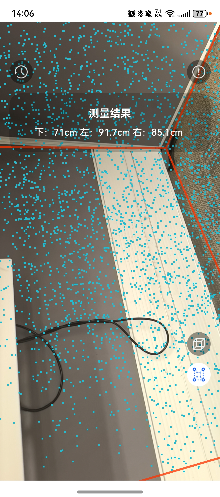

# AR测量组件快速入门

## 目录

- [简介](#简介)
- [约束与限制](#约束与限制)
- [使用](#使用)
- [示例代码](#示例代码)

## 简介

本组件提供了识别空间立方体和嵌入式立方体空间的长、宽、高的能力，可用于测量立方体体积和嵌入式空间的大小。

| 体积测量                                                     | 空间测量                                                    | 
|----------------------------------------------------------|---------------------------------------------------------|
|  |  |

本组件工程代码结构如下所示：
```ts
|- ar_measure/src/main/cpp                           // AR测量能力库
|- ar_measure/src/main/ets                           // AR测量(har)
     |- constant                                     // 模块常量定义   
     |- component                                    // 模块组件
     |- model                                        // 模型定义  
     |- util                                         // 模块工具类 
     |- pages                                        // 页面
     |- viewmodel                                    // 与页面一一对应的vm层  
```

## 约束与限制

### 环境

* DevEco Studio版本：DevEco Studio 6.0.0 Release及以上
* HarmonyOS SDK版本：HarmonyOS 6.0.0 Release SDK及以上
* 设备类型：华为手机（包括双折叠和阔折叠）
* HarmonyOS版本：HarmonyOS 6.0.0(20)及以上

### 权限

* 相机权限：ohos.permission.CAMERA
* 陀螺仪传感器权限：ohos.permission.GYROSCOPE
* 加速度传感器权限：ohos.permission.ACCELEROMETER

### 限制
* 本组件中的AR测量功能不支持模拟器
* 本组件使用的AR Engine能力具有一定技术局限性，具体请参见[AR Engine功能技术局限性](https://developer.huawei.com/consumer/cn/doc/harmonyos-guides/arengine-appendix#section68356131976)。

## 使用
1. 安装组件。

   如果是在DevEco Studio使用插件集成组件，则无需安装组件，请忽略此步骤。

   如果是从生态市场下载组件，请参考以下步骤安装组件。

   a. 解压下载的组件包，将包中所有文件夹拷贝至您工程根目录的xxx目录下。

   b. 在项目根目录build-profile.json5添加ar_measure模块。
   ```
   "modules": [
      {
      "name": "ar_measure",
      "srcPath": "./xxx/ar_measure",
      },
   ]
   ```
   c. 在项目根目录oh-package.json5中添加依赖
   ```
   "dependencies": {
      "ar_measure": "file:./xxx/ar_measure",
   }
   ```
2. 调用如下代码允许应用使用相机权限，获取相机权限后跳转到AR测量页面。
   ```typescript
   async requestPermissionsFn(): Promise<void> {
      let atManager = abilityAccessCtrl.createAtManager();
      if (this.context) {
        let res = await atManager.requestPermissionsFromUser(this.context, ['ohos.permission.CAMERA']);
        for (let i = 0; i < res.permissions.length; i++) {
          if ('ohos.permission.CAMERA' === res.permissions[i] && res.authResults[i] === 0) {
            this.pageInfo.clear();
            // ARMeasure为AR测量路由入口页面名称
            this.pageInfo.pushPathByName('ARMeasure', null);
          }
        }
      }
    }
   ```

## 示例代码

```typescript
import { abilityAccessCtrl } from '@kit.AbilityKit';


@Entry
@ComponentV2
struct Index {
   @Local context: Context = this.getUIContext().getHostContext() as Context;
   pageInfo: NavPathStack = new NavPathStack();

   async requestPermissionsFn(): Promise<void> {
      let atManager = abilityAccessCtrl.createAtManager();
      if (this.context) {
        let res = await atManager.requestPermissionsFromUser(this.context, ['ohos.permission.CAMERA']);
        for (let i = 0; i < res.permissions.length; i++) {
          if ('ohos.permission.CAMERA' === res.permissions[i] && res.authResults[i] === 0) {
          this.pageInfo.clear();
          // ARMeasure为AR测量路由入口页面名称
          this.pageInfo.pushPathByName('ARMeasure', null);
      }
    }
  }
}

build() {
   Navigation(this.pageInfo) {
      Button('跳转').onClick(() => {
         this.requestPermissionsFn();
      });
   }
   .hideTitleBar(true).mode(NavigationMode.Stack);
}
}
```


