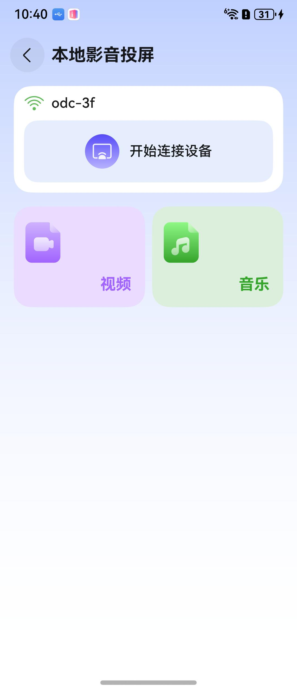

# 本地影音投屏组件快速入门

## 目录

- [简介](#简介)
- [约束与限制](#约束与限制)
- [使用](#使用)
- [API参考](#API参考)
- [示例代码](#示例代码)

## 简介

本组件提供了音频投屏、视频投屏等功能。



本组件工程代码结构如下所示：
```ts
cast_tool/src/main/ets                            // 本地影音投屏(har)  
  |- components                                   // 模块组件
  |- constant                                     // 常量  
  |- controller                                   // 控制器  
  |- model                                        // 模型定义  
  |- pages                                        // 页面
  |- service                                      // 服务
  |- util                                         // 模块类
  |- viewModels                                   // 与页面一一对应的vm层
```

## 约束与限制

### 环境

* DevEco Studio版本：DevEco Studio 5.0.5 Release及以上
* HarmonyOS SDK版本：HarmonyOS 5.0.5 Release SDK及以上
* 设备类型：华为手机（包括双折叠和阔折叠）
* HarmonyOS版本：HarmonyOS 5.0.5(17)及以上

### 权限

* 读取图片视频权限：ohos.permission.READ_IMAGEVIDEO

### 调试
本组件的投屏功能不支持使用模拟器调试，请使用真机调试。远端设备需为HarmonyOS 5.0.0及以上版本的2in1设备、HarmonyOS 3.1及以上版本的华为智慧屏、支持标准DLNA协议的设备。

## 使用
1. 安装组件。

   如果是在DevEco Studio使用插件集成组件，则无需安装组件，请忽略此步骤。

   如果是从生态市场下载组件，请参考以下步骤安装组件。

   a. 解压下载的组件包，将包中所有文件夹拷贝至您工程根目录的xxx目录下。

   b. 在项目根目录build-profile.json5添加cast_tool模块。
   ```
   "modules": [
      {
      "name": "cast_tool",
      "srcPath": "./xxx/cast_tool",
      },
   ]
   ```
   c. 在项目根目录oh-package.json5中添加依赖
   ```
   "dependencies": {
      "cast_tool": "file:./xxx/cast_tool",
   }
   ```
   
2. 本组件使用ohos.permission.READ_IMAGEVIDEO权限，该权限为受限权限，请[申请使用受限权限](https://developer.huawei.com/consumer/cn/doc/harmonyos-guides/declare-permissions-in-acl)。

## API参考

无

## 示例代码

```typescript
@Entry
@ComponentV2
export struct Index {
   @Local pageStack: NavPathStack = new NavPathStack();

   build() {
      Navigation(this.pageStack) {
         Button('跳转').onClick(() => {
            // CastPage为组件路由入口页面名称
            this.pageStack.pushPathByName('CastPage', null);
         });
      }.hideTitleBar(true).mode(NavigationMode.Stack);
   }
}
```


