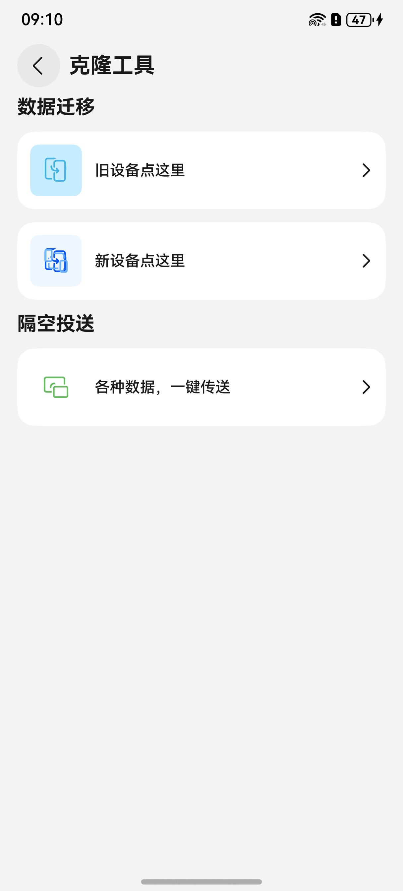

# 克隆工具组件快速入门

## 目录

- [简介](#简介)
- [约束与限制](#约束与限制)
- [使用](#使用)
- [示例代码](#示例代码)

## 简介

本组件提供了通讯录、图片、视频的克隆和隔空投送等功能。



本组件工程代码结构如下所示：
```ts
clone/src/main/ets                                // 克隆工具(har)
  |- common                                       // 模块常量   
  |- components                                   // 模块组件
  |- model                                        // 模型定义  
  |- pages                                        // 页面
  |- service                                      // 服务类
  |- utils                                        // 模块工具类
  |- viewmodel                                    // 与页面一一对应的vm层
  |- workers                                      // 进程
```

## 约束与限制

### 环境

* DevEco Studio版本：DevEco Studio 5.0.5 Release及以上
* HarmonyOS SDK版本：HarmonyOS 5.0.5 Release SDK及以上
* 设备类型：华为手机（包括双折叠和阔折叠）
* HarmonyOS版本：HarmonyOS 5.0.5(17)及以上

### 权限

* 获取网络权限：ohos.permission.INTERNET
* 读取联系人权限：ohos.permission.READ_CONTACTS
* 写入联系人权限：ohos.permission.WRITE_CONTACTS
* 读取图片视频权限：ohos.permission.READ_IMAGEVIDEO
* 写入图片视频权限：ohos.permission.WRITE_IMAGEVIDEO

### 限制
ohos.permission.READ_CONTACTS、ohos.permission.WRITE_CONTACTS、ohos.permission.READ_IMAGEVIDEO、ohos.permission.WRITE_IMAGEVIDEO权限均为受限权限，参考[申请使用受限权限](https://developer.huawei.com/consumer/cn/doc/harmonyos-guides-V14/declare-permissions-in-acl-V14)，否则会导致工具运行失败。

## 使用
1. 安装组件。

   如果是在DevEco Studio使用插件集成组件，则无需安装组件，请忽略此步骤。

   如果是从生态市场下载组件，请参考以下步骤安装组件。

   a. 解压下载的组件包，将包中所有文件夹拷贝至您工程根目录的xxx目录下。

   b. 在项目根目录build-profile.json5添加clone模块。
   ```
   "modules": [
      {
      "name": "clone",
      "srcPath": "./xxx/clone",
      },
   ]
   ```
   c. 在项目根目录oh-package.json5中添加依赖
   ```
   "dependencies": {
      "clone": "file:./xxx/clone",
   }
   ```

## 示例代码

```typescript
@Entry
@ComponentV2
export struct Index {
   @Local pageStack: NavPathStack = new NavPathStack();

   build() {
      Navigation(this.pageStack) {
         Button('跳转').onClick(() => {
            // ClonePage为克隆工具路由入口页面名称
            this.pageStack.pushPathByName('ClonePage', null);
         });
      }.hideTitleBar(true);
   }
}
```


