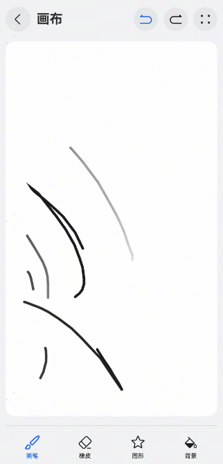

# 绘画组件快速入门

## 目录

- [简介](#简介)
- [约束与限制](#约束与限制)
- [使用](#使用)
- [API参考](#API参考)
- [示例代码](#示例代码)

## 简介

本组件支持画笔，橡皮擦，图形绘制



本组件工程代码结构如下所示：

```ts
draw_board/src/main/ets                           // 画板(har)
  |- constants                                    // 模块常量定义
  |- components                                   // 模块组件  
  |- model                                        // 模型定义
  |- utils                                        // 模块工具类
  |- tools                                        // 工具类
  |- viewmodel                                    // 与页面一一对应的vm层 
  |- views                                        // 模块页面 
```

## 约束与限制

### 环境

- DevEco Studio版本：DevEco Studio 5.0.5 Release及以上
- HarmonyOS SDK版本：HarmonyOS 5.0.5 Release SDK及以上
- 设备类型：华为手机（包括双折叠和阔折叠）
- HarmonyOS版本：HarmonyOS 5.0.5(17)及以上

## 使用

1. 安装组件。

   如果是在DevEco Studio使用插件集成组件，则无需安装组件，请忽略此步骤。

   如果是从生态市场下载组件，请参考以下步骤安装组件。

   a. 解压下载的组件包，将包中所有文件夹拷贝至您工程根目录的XXX目录下。

   b. 在项目根目录build-profile.json5添加draw_board模块。

   ```typescript
   // 在项目根目录build-profile.json5填写draw_board。其中XXX为组件存放的目录名
   "modules": [
       {
       "name": "draw_board",
       "srcPath": "./XXX/draw_board",
       }
   ]
   ```

   c. 在项目根目录oh-package.json5中添加依赖。

   ```typescript
   // XXX为组件存放的目录名称
   "dependencies": {
     "draw_board": "file:./XXX/draw_board"
   }
   ```

2. 引入组件。

   ```typescript
    import { DrawBoard } from 'draw_board';
   ```

3. 调用组件，详细参数配置说明参见[API参考](#API参考)。

   ```typescript
   // 引入组件
   import { DrawBoard } from 'draw_board';

   @Entry
   @ComponentV2
   struct Index {
     pageInfo: NavPathStack = new NavPathStack()
   
     build() {
       Navigation(this.pageInfo) {
         DrawBoard({
           pageInfo: this.pageInfo,
           isHideBack:true 
         })
       }
       .hideTitleBar(true)
     }
   }
   ```

## API参考

### 子组件

无

### 接口

DrawBoard(options?: DrawBoardOptions)

支持绘画板常用功能

**参数：**

| 参数名  | 类型                                                         | 是否必填 | 说明             |
| ------- | ------------------------------------------------------------ | -------- | ---------------- |
| options | [DrawBoardOptions](#DrawBoardOptions对象说明) | 否       | 画板组件的参数。 |

### DrawBoardOptions对象说明

| 参数名      | 类型                                                                                                                              | 是否必填 | 说明          |
| --------- |---------------------------------------------------------------------------------------------------------------------------------|------|-------------|
| pageInfo | [NavPathStack](https://developer.huawei.com/consumer/cn/doc/harmonyos-references/ts-basic-components-navigation#navpathstack10) | 否    | 传入当前组件所在路由栈 |
| isHideBack | boolean                                                                                                                             | 否    | 是否显示返回按钮    |

## 示例代码

```typescript
// 引入组件
import { DrawBoard } from 'draw_board';

@Entry
@ComponentV2
struct Index {
  pageInfo: NavPathStack = new NavPathStack()

  build() {
    Navigation(this.pageInfo) {
      DrawBoard({
        pageInfo: this.pageInfo,
        isHideBack:true 
      })
    }
    .hideTitleBar(true)
  }
}
```

