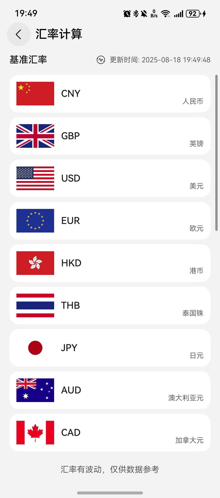

# 汇率计算器组件快速入门

## 目录

- [简介](#简介)
- [约束与限制](#约束与限制)
- [快速入门](#快速入门)
- [示例代码](#示例代码)

## 简介

本组件提供了多种币种之间实时汇率计算的功能。



## 约束与限制

### 环境

* DevEco Studio版本：DevEco Studio 5.0.5 Release及以上
* HarmonyOS SDK版本：HarmonyOS 5.0.5 Release SDK及以上
* 设备类型：华为手机（包括双折叠和阔折叠）
* HarmonyOS版本：HarmonyOS 5.0.5(17)及以上

### 权限

* 无

## 快速入门
1. 安装组件。

   如果是在DevEvo Studio使用插件集成组件，则无需安装组件，请忽略此步骤。

   如果是从生态市场下载组件，请参考以下步骤安装组件。

   a. 解压下载的组件包，将包中所有文件夹拷贝至您工程根目录的xxx目录下。

   b. 在项目根目录build-profile.json5添加exchange_calculator模块。
   ```
   "modules": [
      {
      "name": "exchange_calculator",
      "srcPath": "./xxx/exchange_calculator",
      },
   ]
   ```
   c. 在项目根目录oh-package.json5中添加依赖
   ```
   "dependencies": {
      "exchange_calculator": "file:./xxx/exchange_calculator",
   }
   ```

## 示例代码

```typescript
@Entry
@ComponentV2
export struct Index {
   @Local pageStack: NavPathStack = new NavPathStack();

   build() {
      Navigation(this.pageStack) {
         Button('跳转').onClick(() => {
            // ExchangeRateCalculatorPage为汇率计算路由入口页面名称
            this.pageStack.pushPathByName('ExchangeRateCalculatorPage', null);
         });
      }.hideTitleBar(true);
   }
}
```


