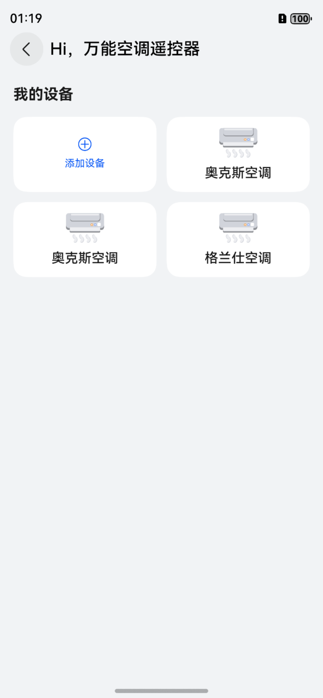

# 万能空调遥控器组件快速入门

## 目录

- [简介](#简介)
- [约束与限制](#约束与限制)
- [快速入门](#快速入门)
- [示例代码](#示例代码)

## 简介

本组件提供了空调遥控器创建，删除及以发射红外信号控制对应空调等功能。



## 约束与限制

### 环境

* DevEco Studio版本：DevEco Studio 5.0.5 Release及以上
* HarmonyOS SDK版本：HarmonyOS 5.0.5 Release SDK及以上
* 设备类型：华为手机（包括双折叠和阔折叠）
* HarmonyOS版本：HarmonyOS 5.0.5(17)及以上

### 权限

* 红外发射权限权限：ohos.permission.MANAGE_INPUT_INFRARED_EMITTER

### 调试
* 空调遥控器不能使用模拟器调试，请使用真机调试

## 快速入门
1. 安装组件。

   如果是在DevEvo Studio使用插件集成组件，则无需安装组件，请忽略此步骤。

   如果是从生态市场下载组件，请参考以下步骤安装组件。

   a. 解压下载的组件包，将包中所有文件夹拷贝至您工程根目录的xxx目录下。

   b. 在项目根目录build-profile.json5添加remote_control模块。
   ```
   "modules": [
      {
      "name": "remote_control",
      "srcPath": "./xxx/remote_control",
      },
   ]
   ```
   c. 在项目根目录oh-package.json5中添加依赖
   ```
   "dependencies": {
      "remote_control": "file:./xxx/remote_control",
   }
   ```
2. 替换红外编解码api。本模块红外编解码api为mock模拟数据仅用开发范例，开发者接入该模块时需于本模块src/main/ets/http/Api.ets文件中进行红外编码库数据来源替换，所需红外数据格式可参考该文件下的示例主要包括红外频率和红外电平信号，以及根据空调遥控器信息获取红外信号api的替换。
3. 常见问题解答：

   a. 万能空调遥控器基于[@ohos.multimodalInput.infraredEmitter (红外管理)](https://developer.huawei.com/consumer/cn/doc/harmonyos-references/js-apis-infraredemitter#infraredemittertransmitinfrared15)实现红外信号的发送。

   b. 当万能空调遥控器的一个按钮按下时，所发送的红外电平信号，需包含当前遥控器所有设置信息。例如：按下开关按钮时，红外电平信号中包含“on，送风，26摄氏度，制冷”等信息。


## 示例代码

```typescript
@Entry
@ComponentV2
export struct Index {
   @Local pageStack: NavPathStack = new NavPathStack();

   build() {
      Navigation(this.pageStack) {
         Button('跳转').onClick(() => {
            // RemotePage为空调遥控器路由入口页面名称
            this.pageStack.pushPathByName('RemotePage', null);
         });
      }.hideTitleBar(true);
   }
}
```


