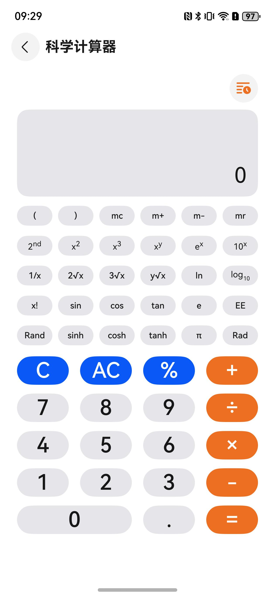

# 科学计算器组件快速入门

## 目录

- [简介](#简介)
- [约束与限制](#约束与限制)
- [使用](#使用)
- [示例代码](#示例代码)

## 简介

提供了多种科学计算方法的计算的功能。



本组件工程代码结构如下所示：
```ts
science_calculator/src/main/ets                   // 科学计算器(har)
  |- common                                       // 模块常量定义   
  |- components                                   // 模块组件
  |- model                                        // 模型定义  
  |- pages                                        // 页面
  |- utils                                        // 模块工具类
  |- viewmodel                                    // 与页面一一对应的vm层
```

## 约束与限制

### 环境

* DevEco Studio版本：DevEco Studio 5.0.5 Release及以上
* HarmonyOS SDK版本：HarmonyOS 5.0.5 Release SDK及以上
* 设备类型：华为手机（包括双折叠和阔折叠）
* 系统版本：HarmonyOS 5.0.5(17)及以上

### 权限

* 无

## 使用
1. 安装组件。

   如果是在DevEco Studio使用插件集成组件，则无需安装组件，请忽略此步骤。

   如果是从生态市场下载组件，请参考以下步骤安装组件。

   a. 解压下载的组件包，将包中所有文件夹拷贝至您工程根目录的xxx目录下。

   b. 在项目根目录build-profile.json5添加science_calculator模块。
   ```
   "modules": [
      {
      "name": "science_calculator",
      "srcPath": "./xxx/science_calculator",
      },
   ]
   ```
   c. 在项目根目录oh-package.json5中添加依赖
   ```
   "dependencies": {
      "science_calculator": "file:./xxx/science_calculator",
   }
   ```

2. 在主工程的EntryAbility.ets文件中onWindowStageCreate的生命周期函数中增加监听窗口尺寸大小的变化。
   ```typescript
   let windowClass: window.Window | undefined = undefined;
   try {
      window.getLastWindow(this.context, (err: BusinessError, data) => {
        const errCode: number = err.code;
        if (errCode) {
          return;
        }
        windowClass = data;
        try {
          // 对窗口尺寸大小变化的监听
          windowClass.on('windowSizeChange', (data) => {
            AppStorage.setOrCreate('height', px2vp(data.height));
          });
        } catch (exception) {
          hilog.error(DOMAIN, 'testTag', 'Failed to listen windowSizeChange. Cause: %{public}s', JSON.stringify(exception));
        }
      });
    } catch (exception) {
      hilog.error(DOMAIN, 'testTag', 'Failed to getLastWindow. Cause: %{public}s', JSON.stringify(exception));
    }
   ```

## 示例代码

```typescript
// EntryAbility.ets
import { AbilityConstant, ConfigurationConstant, UIAbility, Want } from '@kit.AbilityKit';
import { hilog } from '@kit.PerformanceAnalysisKit';
import { window } from '@kit.ArkUI';
import { BusinessError } from '@kit.BasicServicesKit';

const DOMAIN = 0x0000;

export default class EntryAbility extends UIAbility {
   onCreate(want: Want, launchParam: AbilityConstant.LaunchParam): void {
      try {
         this.context.getApplicationContext().setColorMode(ConfigurationConstant.ColorMode.COLOR_MODE_NOT_SET);
      } catch (err) {
         hilog.error(DOMAIN, 'testTag', 'Failed to set colorMode. Cause: %{public}s', JSON.stringify(err));
      }
      hilog.info(DOMAIN, 'testTag', '%{public}s', 'Ability onCreate');
   }

   onDestroy(): void {
      hilog.info(DOMAIN, 'testTag', '%{public}s', 'Ability onDestroy');
   }

   async onWindowStageCreate(windowStage: window.WindowStage): Promise<void> {
      // ...此处省略上下文
      let windowClass: window.Window | undefined = undefined;
      try {
         window.getLastWindow(this.context, (err: BusinessError, data) => {
            const errCode: number = err.code;
            if (errCode) {
               return;
            }
            windowClass = data;
            try {
               // 对窗口尺寸大小变化的监听
               windowClass.on('windowSizeChange', (data) => {
                  AppStorage.setOrCreate('height', px2vp(data.height));
               });
            } catch (exception) {
               hilog.error(DOMAIN, 'testTag', 'Failed to listen windowSizeChange. Cause: %{public}s',
                  JSON.stringify(exception));
            }
         });
      } catch (exception) {
         hilog.error(DOMAIN, 'testTag', 'Failed to getLastWindow. Cause: %{public}s', JSON.stringify(exception));
      }
      windowStage.loadContent('pages/Index', (err) => {
         if (err.code) {
            hilog.error(DOMAIN, 'testTag', 'Failed to load the content. Cause: %{public}s', JSON.stringify(err));
            return;
         }
         hilog.info(DOMAIN, 'testTag', 'Succeeded in loading the content.');
      });
   }
   // ...此处省略上下文
};

// Index.ets
@Entry
@ComponentV2
export struct Index {
   @Local pageStack: NavPathStack = new NavPathStack();

   build() {
      Navigation(this.pageStack) {
         Button('跳转').onClick(() => {
            // ScienceCalcHomePage为科学计算器路由入口页面名称
            this.pageStack.pushPathByName('ScienceCalcHomePage', null);
         });
      }.hideTitleBar(true);
   }
}
```


