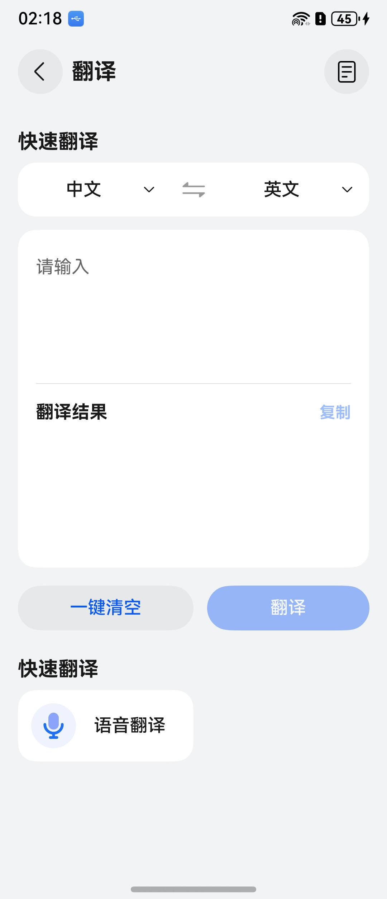
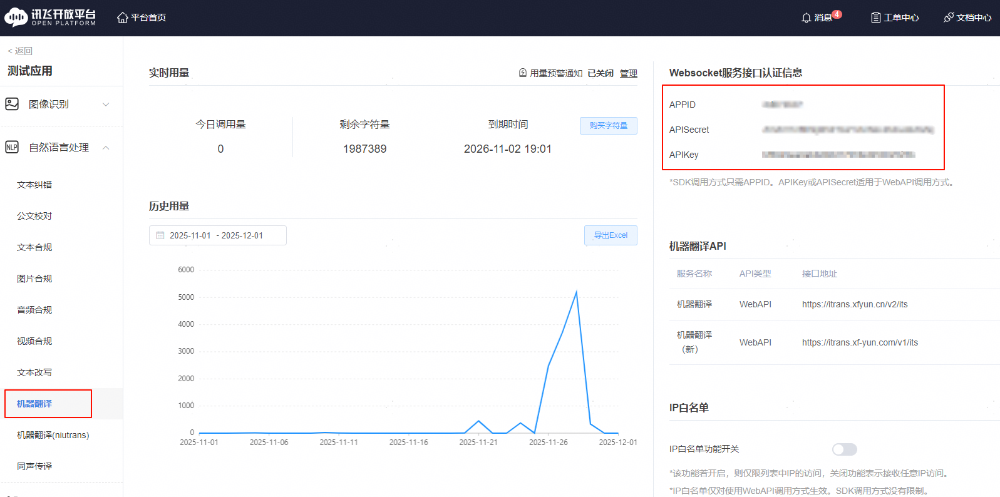
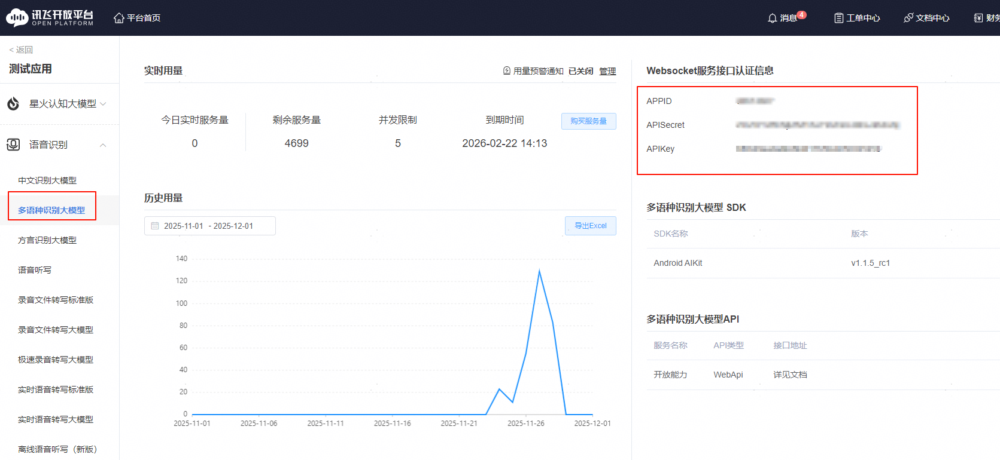

# 翻译组件快速入门

## 目录

- [简介](#简介)
- [约束与限制](#约束与限制)
- [使用](#使用)
- [API参考](#API参考)
- [示例代码](#示例代码)

## 简介

本组件提供了文本翻译、语音识别的功能。支持配置文本翻译和语音翻译的服务接口认证信息，从而实现多语言翻译。支持的语言类型以配置接口为准。



本组件工程代码结构如下所示：
```ts
translator/src/main/ets                           // 翻译(har)
  |- common                                       // 模块常量   
  |- components                                   // 模块组件
  |- model                                        // 模型定义  
  |- pages                                        // 页面
  |- service                                      // 服务
  |- util                                         // 模块类
  |- viewmodel                                    // 与页面一一对应的vm层
```

## 约束与限制

### 环境

* DevEco Studio版本：DevEco Studio 5.0.5 Release及以上
* HarmonyOS SDK版本：HarmonyOS 5.0.5 Release SDK及以上
* 设备类型：华为手机（包括双折叠和阔折叠）
* HarmonyOS版本：HarmonyOS 5.0.5(17)及以上

### 权限

* 获取网络权限：ohos.permission.INTERNET
* 麦克风权限：ohos.permission.MICROPHONE

## 使用
1. 安装组件。

   如果是在DevEco Studio使用插件集成组件，则无需安装组件，请忽略此步骤。

   如果是从生态市场下载组件，请参考以下步骤安装组件。

   a. 解压下载的组件包，将包中所有文件夹拷贝至您工程根目录的xxx目录下。

   b. 在项目根目录build-profile.json5添加translator模块。
   ```
   "modules": [
      {
      "name": "translator",
      "srcPath": "./xxx/translator",
      },
   ]
   ```
   c. 在项目根目录oh-package.json5中添加依赖
   ```
   "dependencies": {
      "translator": "file:./xxx/translator",
   }
   ```
2. 在src/main/ets/service/TranslatorService.ets文件中配置文本翻译对应的Websocket服务接口认证信息。

   hostUrl、host、uri不需要进行修改，appid、apiSecret、apiKey请登录讯飞开放平台，进入控制台，点击我的应用，选择“自然语言处理 > 机器翻译”，在“Websocket服务接口认证信息”区域查询相应的信息。

   

3. 在src/main/ets/util/WSUtils.ets文件中配置语音识别对应的Websocket服务接口认证信息。

   appid、apiSecret、apiKey请登录讯飞开放平台，进入控制台，点击我的应用，选择“语音识别 > 多语种识别大模型”，在“Websocket服务接口认证信息”区域查询相应的信息。

   

## API参考

* 无

## 示例代码

```typescript
@Entry
@ComponentV2
export struct Index {
   @Local pageStack: NavPathStack = new NavPathStack();

   build() {
      Navigation(this.pageStack) {
         Button('跳转').onClick(() => {
            // TranslatorPage为翻译路由入口页面名称
            this.pageStack.pushPathByName('TranslatorPage', null);
         });
      }.hideTitleBar(true).mode(NavigationMode.Stack)
   }
}
```


