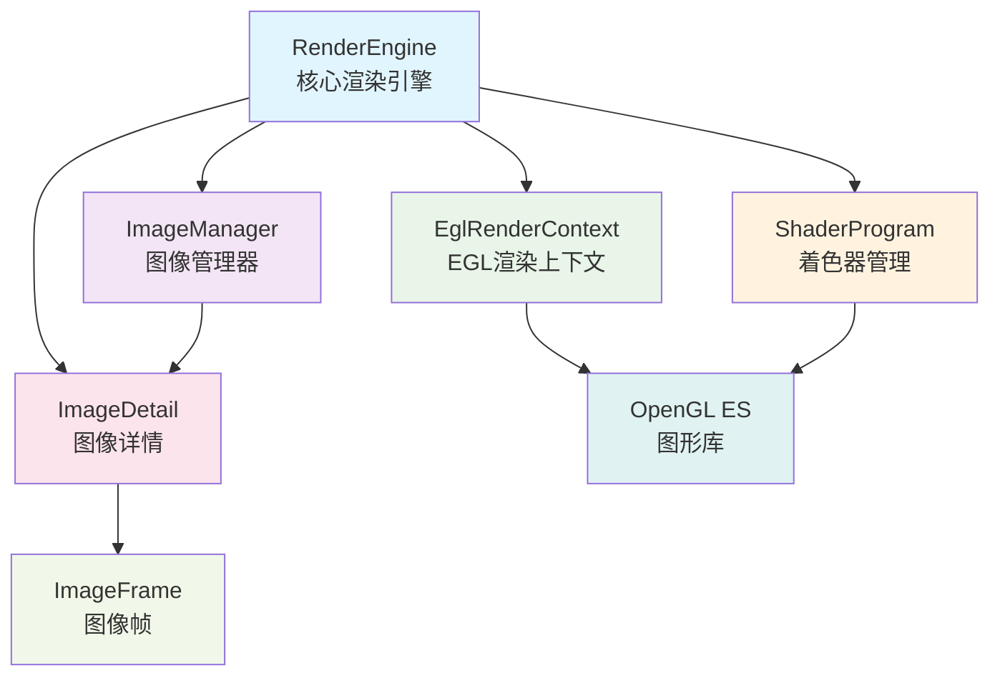
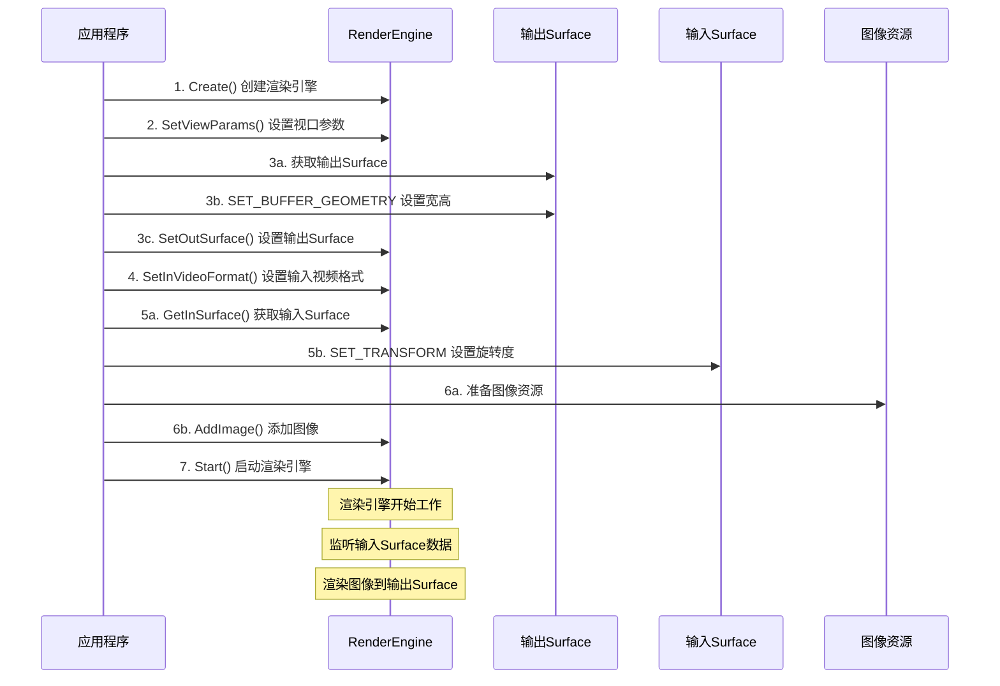

# Render 模块使用指导文档

## 1. 目录结构说明

```
render/
├── include/                          # 头文件目录
│   ├── i_gl_render_engine.h         # 渲染引擎接口定义
│   ├── render_engine.h              # 渲染引擎实现头文件
│   ├── image_manager.h              # 图像管理器头文件
│   ├── egl_render_context.h         # EGL渲染上下文头文件
│   ├── shader_program.h             # Shader管理头文件
│   ├── image_render_shaders.h       # 图像渲染着色器定义
│   ├── UniqueIDGenerator.h          # 唯一ID生成器
│   └── glm/                         # glm依赖，用于gl相关计算
├── common/                          # 公共组件目录
│   ├── constants.h                  # 常量定义
│   └── UniqueIDGenerator.h          # 唯一ID生成器实现
├── render_engine.cpp                # 渲染引擎实现
├── image_manager.cpp                # 图像管理器实现
├── egl_render_context.cpp           # EGL渲染上下文实现
└── shader_program.cpp               # Shader管理实现
```

### 核心组件说明

- **RenderEngine**: 主要的渲染引擎，负责视频帧处理和图像叠加渲染
- **ImageManager**: 图像管理器，处理静态和动态图像的添加、加载、变换、删除等操作
- **EglRenderContext**: EGL上下文管理，处理OpenGL ES的初始化和上下文切换
- **ShaderProgram**: 着色器程序管理，处理顶点和片段着色器的编译和链接

### 组件依赖关系图



#### 依赖关系说明

- **RenderEngine** 是核心组件，依赖所有其他组件
- **ImageManager** 管理 ImageDetail 和 ImageFrame 对象
- **ImageDetail** 包含 ImageFrame，两者都属于数据模型层
- **RenderEngine** 和 **ImageManager** 都依赖 ImageDetail 模型
- **EglRenderContext** 和 **ShaderProgram** 都依赖 OpenGL ES 图形库

## 2. 接口说明

### 2.1 渲染引擎接口 (IGLRenderEngine)

#### 主要方法

```cpp
/**
 * 创建渲染引擎实例
 * 
 * @return 渲染引擎智能指针
 */
static std::shared_ptr<IGLRenderEngine> Create();

/**
 * 添加静态图像
 * 
 * @param staticImageInfo 静态图像信息
 * @return 图像ID，失败返回负数
 */
virtual int32_t AddStaticImage(std::shared_ptr<StaticImageInfo> staticImageInfo) = 0;

/**
 * 添加动态图像（如GIF）
 * 
 * @param dynamicImageInfo 动态图像信息
 * @return 图像ID，失败返回负数
 */
virtual int32_t AddDynamicImage(std::shared_ptr<DynamicImageInfo> dynamicImageInfo) = 0;

/**
 * 获取InSurface
 * 
 * 提供给解码器或者相机，通过OHNativeWindow来写入数据
 * 
 * 注意：需要通过OH_NativeWindow_NativeWindowHandleOpt(inNativeWindow_, SET_TRANSFORM, &transForm)
 * 设置旋转度，以正确处理输入视频的旋转信息，旋转度设置的操作需要在RenderEngine收到首帧数据之前完成，后续设置不生效
 * @return OHNativeWindow*
 */
virtual OHNativeWindow* GetInSurface() = 0;

/**
 * 设置OutSurface
 * 用于渲染画面的输出，可以是编码器或者窗口
 * 必须在Start之前调用
 * 
 * 注意：必须通过OH_NativeWindow_NativeWindowHandleOpt(outSurface, SET_BUFFER_GEOMETRY, width, height)
 * 设置输出surface的宽高，以此来指定输出视频的宽高
 * 
 * @param outSurface 
 * @return 成功返回0，失败返回负数
 */
virtual int32_t SetOutSurface(OHNativeWindow* outSurface) = 0;

/**
 * 设置输入视频格式
 * 通过此方法传递输入视频的ColorSpace,RangeFlag,Frame等关键信息
 * 该方法建议在Start之前调用传入，否则可能会影响渲染结果
 * 
 * @param avFormat 视频格式信息
 * @return 成功返回0，失败返回负数
 */
virtual int32_t SetInVideoFormat(OH_AVFormat* avFormat) = 0;

/**
 * 启动渲染引擎
 * 该方法会创建gl surface,初始化gl资源,并开启输入监听
 * 该方法调用之前必须保证outSurface存在
 * @return 成功返回0，失败返回负数
 */
virtual int32_t Start() = 0;

/**
 * 设置视口参数
 * 用来设置View的宽高.该参数仅用于用于图像的位置、缩放计算,不影响视频渲染，仅影响图片Transform的计算。
 * @param viewParams 视口参数
 */
virtual void SetViewParams(ViewParams viewParams) = 0;

/**
 * 移除图像
 * 
 * @param imageId 图像ID
 * @return 成功返回true，失败返回false
 */
virtual bool RemoveImage(int32_t imageId) = 0;

/**
 * 清除所有图像
 */
virtual void ClearImages() = 0;
```


### 2.2 图像信息结构

#### ImageInfoBase (基础图像信息)
```cpp
/**
 * 基础图像信息结构
 * 
 * 所有图像信息结构的基类，包含图像的基本变换参数
 */
struct ImageInfoBase {
    /**
     * 缩放因子
     * 
     * 图像的缩放比例，1.0表示原始大小
     */
    double_t scale = 0;
    
    /**
     * X坐标（基于视口大小计算）
     * 
     * 图像在视口中的X轴位置,左上角是坐标原点
     */
    double_t pos_x = 0;
    
    /**
     * Y坐标（基于视口大小计算）
     * 
     * 图像在视口中的Y轴位置,左上角是坐标原点
     */
    double_t pos_y = 0;
    
    /**
     * 旋转角度（角度）
     * 
     * 图像的旋转角度，以角度为单位
     */
    float rotate = 0;
    
    /**
     * 图像序列中的帧数
     * 
     * 对于动态图像，表示总帧数；对于静态图像为1
     */
    uint32_t frames = 0;
};
```

#### StaticImageInfo (静态图像)
```cpp
/**
 * 静态图像信息结构
 * 
 * 用于描述单帧图像的基本信息，继承自ImageInfoBase
 */
struct StaticImageInfo : public ImageInfoBase {
    /**
     * 单帧图像缓冲区
     * 
     * 存储图像数据的原生缓冲区指针
     * Render引擎会自己控制引用计数，不要进行额外的释放Buffer操作
     */
    OH_NativeBuffer* nativeBuffer = nullptr;
};
```

#### DynamicImageInfo (动态图像)
```cpp
/**
 * 动态图像信息结构
 * 
 * 用于描述多帧图像（如GIF）的基本信息，继承自ImageInfoBase
 */
struct DynamicImageInfo : public ImageInfoBase {
    /**
     * 是否为GIF动画
     * 标识当前图像是否为动态图像,引擎会根据isGif对gif图片的存储做相关优化
     * 默认动图都当做gif处理，其他动图需要手动设置为true
     */
    bool isGif = true;
    
    /**
     * 多帧图像缓冲区数组
     * 存储多帧图像数据的原生缓冲区指针数组
     * Render引擎会自己控制引用计数，不要进行额外的释放Buffer操作
     */
    std::vector<OH_NativeBuffer*> nativeBufferArray;
    
    /**
     * 帧延迟时间数组（毫秒）
     * 每帧之间的延迟时间，用于控制动动图放速度
     */
    std::vector<uint32_t> frameDelayArray;
};
```


## 3. 调用建议

### 3.1 输入输出格式支持说明

#### 3.1.1 视频输入格式
Render模块支持以下四种色彩空间的视频输入：
- **BT.601 Full Range**: 标准清晰度视频，全范围色彩空间
- **BT.601 Limited Range**: 标准清晰度视频，有限范围色彩空间
- **BT.709 Full Range**: 高清视频，全范围色彩空间
- **BT.709 Limited Range**: 高清视频，有限范围色彩空间

#### 3.1.2 视频输出格式
- **统一输出格式**: 所有视频,色彩空间统一输出为 **BT.709 Limited Range**
- **自动转换**: 渲染引擎会自动将输入格式转换为标准输出格式

#### 3.1.3 图像输入格式
- **支持格式**: 支持P3和SRGB色彩空间的图像直接使用，其它格式需要手动转换

#### 3.1.4 图像输出格式
- **统一输出**: 图像输出会统一转换到与视频颜色格式保持一致
### 3.2 图片坐标系统说明

在使用渲染引擎时，需要特别注意坐标系统的设置和使用：

#### 坐标系统规则
- **坐标原点**：左上角为坐标原点 (0, 0)
- **坐标范围**：基于 `SetViewParams` 设置的视口宽高进行计算
- **坐标单位**：使用像素单位，与视口大小对应
- **缩放计算**：图像的缩放、位置等变换参数都需要基于视口大小进行归一化计算

#### 坐标计算示例
```cpp
// 假设视口设置为 1080x1920
ViewParams viewParams{1080, 1920};
renderEngine->SetViewParams(viewParams);

// 图像位置计算示例
auto staticImageInfo = std::make_shared<StaticImageInfo>();
// 将图像放置在屏幕中心
staticImageInfo->pos_x = viewParams.width / 2.0;   // 540
staticImageInfo->pos_y = viewParams.height / 2.0;  // 960

// 图像缩放计算示例
// 如果要将图像缩放到视口宽度的1/4
double imageWidth = 200; // 图像原始宽度
double targetWidth = viewParams.width / 4.0; // 目标宽度 270
staticImageInfo->scale = targetWidth / imageWidth;
```

#### 注意事项
- **必须设置视口参数**：在使用任何图像变换功能前，必须先调用 `SetViewParams`
- **坐标对齐**：传入的图像坐标必须基于视口参数进行计算，否则会出现坐标不对齐的问题

### 3.3 图片支持说明

#### 支持的图片格式
- **色彩空间**: 仅支持 ColorSpace 为 P3 或者 SRGB 非线性编码的图片
- **其他色彩空间**: 不支持其他 ColorSpace 的图片

#### P3 图片要求
- **NativeBuffer 信息**: P3 图片需要保证 NativeBuffer 中携带对应的 ColorSpace 信息
- **色彩空间设置**: 即 `OH_NativeBuffer_GetColorSpace` 要为 `OH_NativeBuffer_ColorSpace::OH_COLORSPACE_DISPLAY_P3_SRGB`

#### 使用示例
```cpp
// 检查图片色彩空间
OH_NativeBuffer_ColorSpace colorSpace = OH_NativeBuffer_GetColorSpace(nativeBuffer);
if (colorSpace != OH_COLORSPACE_SRGB && colorSpace != OH_COLORSPACE_DISPLAY_P3_SRGB) {
    // 不支持的色彩空间，需要转换或跳过
    return ERROR_UNSUPPORTED_COLORSPACE;
}

// 创建静态图像信息
auto staticImageInfo = std::make_shared<StaticImageInfo>();
staticImageInfo->nativeBuffer = nativeBuffer;
// ... 其他设置
```

### 3.4 基本使用流程

#### 常规调用时序图



#### 详细步骤说明
```cpp
// 1. 创建渲染引擎实例
auto renderEngine = IGLRenderEngine::Create();

// 2. 设置视口参数（用于坐标计算）
ViewParams viewParams{1080, 1920};  // 宽度和高度
renderEngine->SetViewParams(viewParams);

// 3. 设置输出surface
OHNativeWindow* outSurface = /* 获取输出surface */;
// 注意：必须设置输出surface的宽高
(void)OH_NativeWindow_NativeWindowHandleOpt(outSurface, SET_BUFFER_GEOMETRY,
                                        static_cast<int>(1080),
                                        static_cast<int>(1920));
renderEngine->SetOutSurface(outSurface);

// 4. 设置输入视频格式
OH_AVFormat* avFormat = /* 获取视频格式 */;
renderEngine->SetInVideoFormat(avFormat);

// 5. 获取输入surface并设置旋转度
OHNativeWindow* inSurface = renderEngine->GetInSurface();
// 注意：需要设置输入surface的旋转度
OH_NativeWindow_NativeWindowHandleOpt(inSurface, SET_TRANSFORM, &transForm);

// 6. 添加静态图像
auto staticImageInfo = std::make_shared<StaticImageInfo>();
staticImageInfo->nativeBuffer = /* 图像缓冲区 */;
staticImageInfo->scale = 1.0;
staticImageInfo->pos_x = 0.0;
staticImageInfo->pos_y = 0.0;
staticImageInfo->rotate = 0.0;
int32_t imageId = renderEngine->AddStaticImage(staticImageInfo);

// 7. 启动渲染引擎
renderEngine->Start();
```

#### 时序说明

1. **初始化阶段** (步骤1-2)
   - 创建渲染引擎实例
   - 设置视口参数，用于后续坐标计算

2. **输出配置阶段** (步骤3)
   - 获取输出Surface（编码器或窗口）
   - 设置输出Surface的宽高
   - 将输出Surface绑定到渲染引擎

3. **输入配置阶段** (步骤4-5)
   - 设置输入视频格式信息
   - 获取输入Surface
   - 设置输入Surface的旋转度

4. **资源准备阶段** (步骤6)
   - 准备图像资源（NativeBuffer）
   - 配置图像变换参数
   - 添加图像到渲染引擎

5. **启动阶段** (步骤7)
   - 启动渲染引擎
   - 开始监听输入Surface数据
   - 开始渲染到输出Surface

### 3.5 动态图像（GIF）使用

```cpp
// 创建动态图像信息
auto dynamicImageInfo = std::make_shared<DynamicImageInfo>();
dynamicImageInfo->isGif = true;
dynamicImageInfo->nativeBufferArray = /* 多帧图像缓冲区数组 */;
dynamicImageInfo->frameDelayArray = /* 帧延迟时间数组 */;
dynamicImageInfo->scale = 1.0;
dynamicImageInfo->pos_x = 100.0;
dynamicImageInfo->pos_y = 100.0;

// 添加动态图像
int32_t gifId = renderEngine->AddDynamicImage(dynamicImageInfo);
```

### 3.6 图像变换操作

```cpp
// 获取图像管理器
auto& imageManager = renderEngine->GetImageManager();

// 移动图像
imageManager.Move(imageId, 50.0, 30.0);

// 缩放图像
imageManager.Scale(imageId, 1.5);

// 旋转图像
imageManager.Rotate(imageId, 45.0);

// 综合变换
imageManager.Transform(imageId, 100.0, 200.0, 2.0, 90.0);
```

### 3.7 错误处理

```cpp
// 检查渲染引擎创建是否成功
if (!renderEngine) {
    // 处理创建失败
    return ERROR_CREATE_FAILED;
}

// 检查图像添加是否成功
int32_t imageId = renderEngine->AddStaticImage(staticImageInfo);
if (imageId < 0) {
    // 处理添加失败
    return ERROR_ADD_IMAGE_FAILED;
}

// 检查启动是否成功
int32_t result = renderEngine->Start();
if (result != 0) {
    // 处理启动失败
    return ERROR_START_FAILED;
}
```

## 4. 注意事项

### 4.1 图片坐标系统

- 所有位置坐标、都基于SetViewParams设置的视口大小进行计算.左上角为坐标原点,单位为px.

### 4.2 图像格式

- P3图片需要保证NativeBuffer包含正确的 ColorSpace 信息（OH_COLORSPACE_DISPLAY_P3_SRGB）
- SRGB图片无需额外处理

### 4.3 视频旋转

- 输出视频需通过NativeWindow携带旋转度
- 输出视频不要携带任何旋转度,即旋转度为0

### 4.4 生命周期管理

- **初始化顺序**: 必须先设置视口参数和输出surface，再添加图像
- **启动时机**: 只有在添加完所有初始图像后才启动渲染引擎
- **清理顺序**: 停止渲染引擎后，再清理图像资源
- **输出surface设置**: 必须通过SET_BUFFER_GEOMETRY设置输出surface的宽高，否则可能导致渲染异常
- **输入surface设置**: 必须通过SET_TRANSFORM设置输入surface的旋转度，以正确处理输入视频的旋转信息

### 4.5 兼容性

- **OpenGL ES**: 基于 OpenGL ES 3.0 实现，需要设备支持
- **EGL**: 使用 EGL 进行上下文管理，支持多窗口渲染
- **鸿蒙系统**: 专为鸿蒙系统设计，使用鸿蒙原生 API
