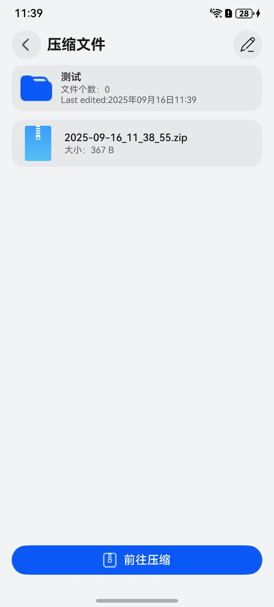

# 解压缩组件快速入门

## 目录

- [简介](#简介)
- [约束与限制](#约束与限制)
- [使用](#使用)
- [示例代码](#示例代码)

## 简介

本组件提供了解压、压缩等功能。



本组件工程代码结构如下所示：
```ts
zip_tool/src/main/ets                             // 解压缩工具(har)
  |- common                                       // 模块常量   
  |- components                                   // 模块组件
  |- model                                        // 模型定义  
  |- pages                                        // 页面
  |- utils                                        // 模块工具类
  |- viewmodel                                    // 与页面一一对应的vm层
```

## 约束与限制

### 环境

* DevEco Studio版本：DevEco Studio 5.0.5 Release及以上
* HarmonyOS SDK版本：HarmonyOS 5.0.5 Release SDK及以上
* 设备类型：华为手机（包括双折叠和阔折叠）
* HarmonyOS版本：HarmonyOS 5.0.5(17)及以上

### 权限

* 无

### 限制
* 解压缩工具支持手机软件的zip、rar、war格式解压，若希望支持rar和war的压缩，可将@ohos/oh7zip替换为OpenHarmony三方库中心仓的@dove/p7zip，并做相应适配开发。
* 解压缩工具不支持模拟器使用

## 使用
1. 安装组件。

   如果是在DevEco Studio使用插件集成组件，则无需安装组件，请忽略此步骤。

   如果是从生态市场下载组件，请参考以下步骤安装组件。

   a. 解压下载的组件包，将包中所有文件夹拷贝至您工程根目录的xxx目录下。

   b. 在项目根目录build-profile.json5添加zip_tool模块。
   ```
   "modules": [
      {
      "name": "zip_tool",
      "srcPath": "./xxx/zip_tool",
      },
   ]
   ```
   c. 在项目根目录oh-package.json5中添加依赖
   ```
   "dependencies": {
      "zip_tool": "file:./xxx/zip_tool",
   }
   ```

## 示例代码

```typescript
@Entry
@ComponentV2
export struct Index {
   @Local pageStack: NavPathStack = new NavPathStack();

   build() {
      Navigation(this.pageStack) {
         Button('跳转').onClick(() => {
            // ZipPage为解压缩工具路由入口页面名称
            this.pageStack.pushPathByName('ZipPage', null);
         });
      }.hideTitleBar(true);
   }
}
```


