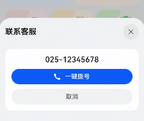

# 拨号组件快速入门

## 目录

- [简介](#简介)
- [约束与限制](#约束与限制)
- [快速入门](#快速入门)
- [API参考](#API参考)
- [示例代码](#示例代码)


## 简介

本组件为拨号组件，可根据传入的电话号码拉起拨号弹窗，并在确认后自动拉起拨号面板。




## 约束与限制

### 环境

* DevEco Studio版本：DevEco Studio5.0.4 Release及以上
* HarmonyOS SDK版本：HarmonyOS5.0.4 Release SDK及以上
* 设备类型：华为手机（包括双折叠和阔折叠）
* 系统版本：HarmonyOS 5.0.4(16)及以上


## 快速入门

1. 安装组件。

   如果是在DevEvo Studio使用插件集成组件，则无需安装组件，请忽略此步骤。

   如果是从生态市场下载组件，请参考以下步骤安装组件。

   a. 解压下载的组件包，将包中所有文件夹拷贝至您工程根目录的XXX目录下。

   b. 在项目根目录build-profile.json5添加module_ui_base和module_call_dialog模块。

   ```ts
   // 项目根目录下build-profile.json5填写module_module_ui_base和module_call_dialog路径。其中XXX为组件存放的目录名
   "modules": [
     {
       "name": "module_ui_base",
       "srcPath": "./XXX/module_ui_base"
     },
     {
       "name": "module_call_dialog",
       "srcPath": "./XXX/module_call_dialog"  
     }
   ]
   ```

   c. 在项目根目录oh-package.json5中添加依赖。

   ```ts
   // 在项目根目录oh-package.json5中添加依赖
   "dependencies": {
     "module_call_dialog": "file:./XXX/module_call_dialog",
   }
   ```

2. 引入组件。

   ```ts
   import { CallDialog } from 'module_call_dialog';
   ```

3. 调用组件，详见[示例代码](#示例代码)。详细参数配置说明参见[API参考](#API参考)。


## API参考

CallDialog(options: CallDialogOptions)

#### CallDialogOptions对象说明

| 名称        | 类型                                                         | 是否必填 | 说明                                                         |
| ----------- | ------------------------------------------------------------ | -------- | ------------------------------------------------------------ |
| customUI    | [CustomBuilder](https://developer.huawei.com/consumer/cn/doc/harmonyos-references/ts-types#custombuilder8) | 是       | 关联半模态拨号弹窗的自定义UI，点击可拉起弹窗展示待呼叫的号码，默认为一个按钮。 |
| phoneNumber | string                                                       | 是       | 拨号号码，默认为`''`                                         |
| themeColor  | [ResourceColor](https://developer.huawei.com/consumer/cn/doc/harmonyos-references/ts-types#resourcecolor) | 是       | 半模态弹框主题色，默认为`#0A59F7`。                          |


## 示例代码

```ts
import { CallDialog } from 'module_call_dialog'

@Entry
@ComponentV2
struct CallDialogPreview {
  build() {
    Column() {
      CallDialog({
        phoneNumber: '123456',
        themeColor: '#008c8c',
      }) {
        Button('这是一个拨号按钮')
      }
    }
    .width('100%')
    .height('100%')
    .alignItems(HorizontalAlign.Center)
    .justifyContent(FlexAlign.Center)
  }
}
```


