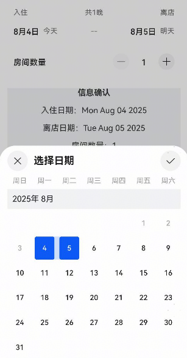

# 酒店日期选择组件快速入门

## 目录

- [简介](#简介)
- [约束与限制](#约束与限制)
- [快速入门](#快速入门)
- [API参考](#API参考)
- [示例代码](#示例代码)


## 简介

本组件为酒店预订时需要使用的日期选择器组件，支持选择入住时间范围和房间个数。




## 约束与限制

### 环境

* DevEco Studio版本：DevEco Studio5.0.4 Release及以上
* HarmonyOS SDK版本：HarmonyOS5.0.4 Release SDK及以上
* 设备类型：华为手机（包括双折叠和阔折叠）
* 系统版本：HarmonyOS 5.0.4(16)及以上


## 快速入门

1. 安装组件。

   如果是在DevEco Studio使用插件集成组件，则无需安装组件，请忽略此步骤。

   如果是从生态市场下载组件，请参考以下步骤安装组件。

   a. 解压下载的组件包，将包中所有文件夹拷贝至您工程根目录的XXX目录下。

   b. 在项目根目录build-profile.json5添加module_ui_base和module_date_selector模块。

   ```ts
   // 项目根目录下build-profile.json5填写module_module_ui_base和module_date_selector路径。其中XXX为组件存放的目录名
   "modules": [
     {
       "name": "module_ui_base",
       "srcPath": "./XXX/module_ui_base"
     },
     {
       "name": "module_date_selector",
       "srcPath": "./XXX/module_date_selector"  
     }
   ]
   ```

   c. 在项目根目录oh-package.json5中添加依赖。

   ```ts
   // 在项目根目录oh-package.json5中添加依赖
   "dependencies": {
     "module_date_selector": "file:./XXX/module_date_selector",
   }
   ```

   d. 在项目的入口模块oh-package.json5中添加依赖`@hw-agconnect/ui-base`并在EntryAbility文件中进行初始化

   ```ts
   // 入口模块的oh-package.json5，例如entry/oh-package.json5
   "dependencies": {
     "@hw-agconnect/ui-base": "^1.0.1"
   }
   ```

   ```ts
   // entry/src/main/ets/entryability/EntryAbility.ets
   import { UIBase } from '@hw-agconnect/ui-base';
   import { UIAbility } from '@kit.AbilityKit';
   import { window } from '@kit.ArkUI';
   
   export default class EntryAbility extends UIAbility {
     public onWindowStageCreate(windowStage: window.WindowStage): void {
       // 进行UIBase的初始化
       UIBase.init(windowStage);
       windowStage.loadContent('pages/Index', (err) => {
         // ...
       });
     }
     //...
   }
   ```

2. 引入组件句柄。

   ```ts
   import { HotelDateSelector } from 'module_date_selector';
   ```

3. 调用组件，详见[示例代码](#示例代码)。详细参数配置说明参见[API参考](#API参考)。


## API参考

HotelDateSelector(options: HotelDateSelectorOptions)

### HotelDateSelectorOptions对象说明

| 名称                | 类型                                                       | 是否必填 | 说明                                   |
| ------------------- | ---------------------------------------------------------- | -------- | -------------------------------------- |
| showTopLabel        | boolean                                                    | 否       | 是否展示顶部的入住离店标签，默认为true |
| paramChangeCallback | (data: [HotelDateModel](#HotelDateModel 对象说明)) => void | 否       | 日期房间信息更改时的回调事件           |


### HotelDateModel 对象说明

| 名称         | 类型   | 是否必填 | 说明                                       |
| ------------ | ------ |------| ------------------------------------------ |
| roomCount    | number | 否    | 房间个数，默认为1                          |
| checkInDate  | Date   | 否    | 入住日期，默认为使用该组件时的当天日期     |
| checkOutDate | Date   | 否    | 离店日期，默认为使用该组件时的当天日期+1天 |
| today        | Date   | 否    | 当前日期，默认为使用该组件时的当天日期     |
| maxRoomCount | number | 否    | 最大可选的房间个数，默认为99               |
| minRoomCount | number | 否    | 最小可选的房间个数，默认为1                |


## 示例代码

```ts
import { HotelDateModel, HotelDateSelector } from 'module_date_selector';

@Entry
@ComponentV2
struct DateSelectorPreview {
  @Local checkInDate: Date | undefined = undefined
  @Local checkoutDate: Date | undefined = undefined
  @Local roomCount: number = 1
  hotelDateModel: HotelDateModel = HotelDateModel.instance;

  aboutToAppear(): void {
    this.updateData(this.hotelDateModel)
  }

  build() {
    Column() {
      HotelDateSelector({
        paramChangeCallback: (data) => {
          this.updateData(data)
        },
      })
        .margin({ bottom: 24 })
      Column({ space: 16 }) {
        Text('信息确认').fontWeight(FontWeight.Bold)
        Text(`入住日期：${this.checkInDate?.toDateString() ?? ''}`)
        Text(`离店日期：${this.checkoutDate?.toDateString() ?? ''}`)
        Text(`房间数量：${this.roomCount}`)
      }
      .width('100%')
      .backgroundColor($r('sys.color.comp_background_focus'))
    }
    .padding(16)
  }

  updateData(data: HotelDateModel) {
    this.checkInDate = data.checkInDate
    this.checkoutDate = data.checkOutDate
    this.roomCount = data.roomCount
  }
}
```


