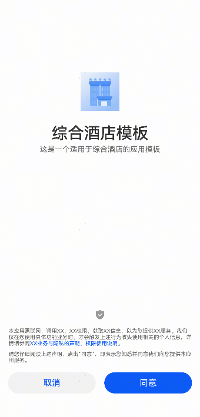
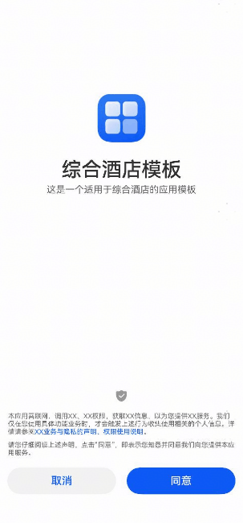

# 申请权限许可组件快速入门

## 目录

- [简介](#简介)
- [约束与限制](#约束与限制)
- [快速入门](#快速入门)
- [API参考](#API参考)
- [示例代码](#示例代码)


## 简介

本组件为申请权限许可组件，可在应用首启需要用户同意隐私政策和其他协议时使用。




## 约束与限制

### 环境

* DevEco Studio版本：DevEco Studio5.0.4 Release及以上
* HarmonyOS SDK版本：HarmonyOS5.0.4 Release SDK及以上
* 设备类型：华为手机（包括双折叠和阔折叠）
* 系统版本：HarmonyOS 5.0.4(16)及以上


## 快速入门

1. 安装组件。

   如果是在DevEvo Studio使用插件集成组件，则无需安装组件，请忽略此步骤。

   如果是从生态市场下载组件，请参考以下步骤安装组件。

   a. 解压下载的组件包，将包中所有文件夹拷贝至您工程根目录的XXX目录下。

   b. 在项目根目录build-profile.json5添加module_ui_base和module_privacy_agreement模块。

   ```ts
   // 项目根目录下build-profile.json5填写module_module_ui_base和module_privacy_agreement路径。其中XXX为组件存放的目录名
   "modules": [
     {
       "name": "module_ui_base",
       "srcPath": "./XXX/module_ui_base"
     },
     {
       "name": "module_privacy_agreement",
       "srcPath": "./XXX/module_privacy_agreement"  
     }
   ]
   ```

   c. 在项目根目录oh-package.json5中添加依赖。

   ```ts
   // 在项目根目录oh-package.json5中添加依赖
   "dependencies": {
     "module_privacy_agreement": "file:./XXX/module_privacy_agreement",
   }
   ```

2. 引入组件。

   ```ts
   import { PrivacyAgreementView } from 'module_privacy_agreement';
   ```

3. 调用组件，详见[示例代码](#示例代码)。详细参数配置说明参见[API参考](#API参考)。


## API参考

PrivacyAgreementView(options: PrivacyAgreementViewOptions)

### PrivacyAgreementViewOptions对象说明

| 名称            | 类型                                                         | 是否必填 | 说明                                                         |
| --------------- | ------------------------------------------------------------ | -------- | ------------------------------------------------------------ |
| stack           | [NavPathStack](https://developer.huawei.com/consumer/cn/doc/harmonyos-references/ts-basic-components-navigation#navpathstack10) | 否       | 使用评价组件的页面的路由栈，不传参可能会导致路由跳转异常     |
| appIcon         | [ResourceStr](https://developer.huawei.com/consumer/cn/doc/harmonyos-references/ts-types#resourcestr) | 否       | 应用图标，默认为空                                           |
| appName         | [ResourceStr](https://developer.huawei.com/consumer/cn/doc/harmonyos-references/ts-types#resourcestr) | 否       | 应用名称，默认为空                                           |
| appDesc         | [ResourceStr](https://developer.huawei.com/consumer/cn/doc/harmonyos-references/ts-types#resourcestr) | 否       | 应用描述，默认为空                                           |
| themeColor      | [ResourceColor](https://developer.huawei.com/consumer/cn/doc/harmonyos-references/ts-types#resourcecolor) | 否       | 主题颜色， 按钮使用的主题色，默认为`#0A59F7`                 |
| privacySummary  | [ResourceStr](https://developer.huawei.com/consumer/cn/doc/harmonyos-references/ts-types#resourcestr) | 否       | 提醒用户同意业务与隐私声明的文案，默认文案：`'本应用需联网，调用XX、XX权限，获取XX信息，以为您提供XX服务。我们仅在您使用具体功能业务时，才会触发上述行为收集使用相关的个人信息。详情请参阅'` |
| privacyLinkDesc | [ResourceStr](https://developer.huawei.com/consumer/cn/doc/harmonyos-references/ts-types#resourcestr) | 否       | 可打开业务与隐私声明的链接文案，默认文案：`'XX业务与隐私的声明、权限使用说明'` |
| privacyLink     | [ResourceStr](https://developer.huawei.com/consumer/cn/doc/harmonyos-references/ts-types#resourcestr) | 否       | 业务与隐私声明的链接，默认链接：`$rawfile('privacy-statement.html')` |
| handleConfirm   | () => void                                                   | 否       | 用户确认同意后的回调事件                                     |


## 示例代码

```ts
import { PrivacyAgreementView } from 'module_privacy_agreement'
import { preferences } from '@kit.ArkData'

@Entry
@ComponentV2
struct PrivacyAgreementPreview {
  @Local
  stack: NavPathStack = new NavPathStack()

  aboutToAppear(): void {
    this.stack.pushPath({ name: 'PrivacyPage' })
  }

  @Builder
  pageMap(name: string) {
    if (name === 'PrivacyPage') {
      PrivacyPage()
    } else if (name === 'EntryPage') {
      EntryPage()
    }
  }

  build() {
    Navigation(this.stack) {
    }
    .backgroundColor($r('app.color.background_color_grey'))
    .hideBackButton(true)
    .hideNavBar(true)
    .mode(NavigationMode.Stack)
    .navDestination(this.pageMap)
  }
}

@ComponentV2
struct PrivacyPage {
  @Local
  stack: NavPathStack = new NavPathStack()

  build() {
    NavDestination() {
      PrivacyAgreementView({
        appIcon: $r('app.media.startIcon'), // 使用时替换为应用图标
        appName: '综合酒店模板',
        appDesc: '这是一个适用于综合酒店的应用模板',
        stack: this.stack,
        handleConfirm: () => {
          this.stack.replacePath({
            name: 'EntryPage',
          })
        },
      })
    }
    .hideTitleBar(true)
    .onReady((context) => {
      this.stack = context.pathStack
    })
  }
}

@ComponentV2
struct EntryPage {
  @Local
  stack: NavPathStack = new NavPathStack()

  build() {
    NavDestination() {
      Column({ space: 16 }) {
        Text('这是应用的主页面').fontSize(28).fontWeight(FontWeight.Bold)
        Text('本组件使用用户首选项存储用户同意结果，如需重复调试请卸载重装, 或使用下方按钮手动触发')
        Button('重置同意结果')
          .onClick(() => {
            try {
              const pre = preferences.getPreferencesSync(this.getUIContext().getHostContext(), { name: 'default' })
              pre.putSync('isAgreePrivacy', false)
              this.stack.clear()
              this.stack.replacePath({ name: 'PrivacyPage' })
            } catch (err) {
              this.getUIContext().getPromptAction().showToast({ message: '重置失败: ' + JSON.stringify(err) })
            }
          })
      }
      .padding(16)
      .height('100%')
      .justifyContent(FlexAlign.Center)
    }
    .onReady((context) => {
      this.stack = context.pathStack
    })
  }
}
```


