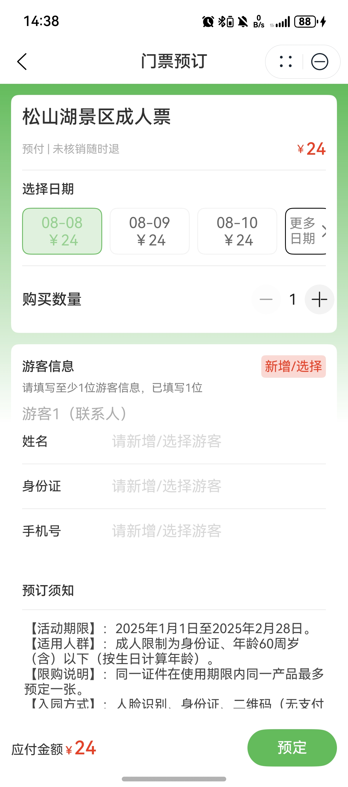
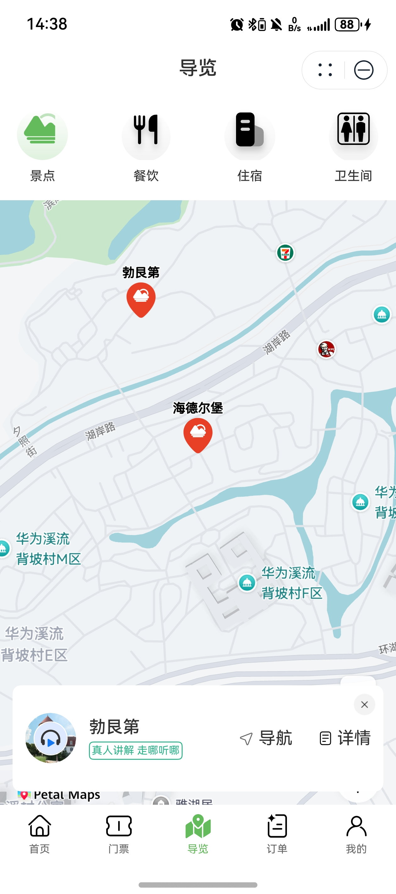
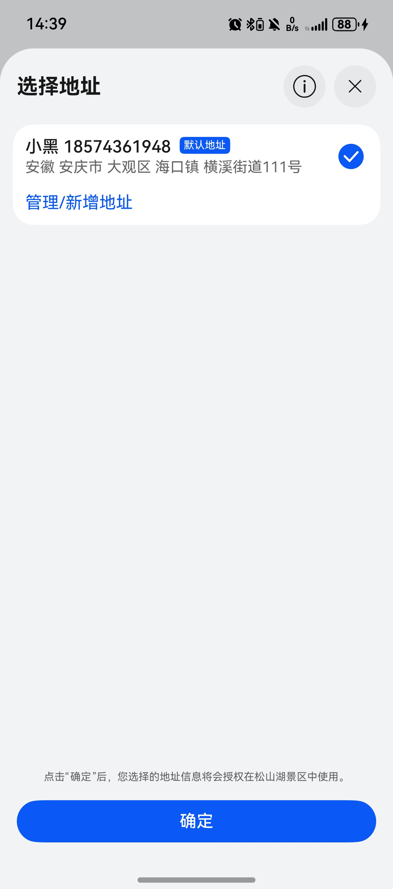

# 旅游（景区服务）应用模板快速入门

## 目录

- [功能介绍](#功能介绍)
- [约束与限制](#约束与限制)
- [快速入门](#快速入门)
- [示例效果](#示例效果)
- [开源许可协议](#开源许可协议)

## 功能介绍

您可以基于此模板直接定制应用，也可以挑选此模板中提供的多种组件使用，从而降低您的开发难度，提高您的开发效率。

此模板提供如下组件，所有组件存放在工程根目录的components下，如果您仅需使用组件，可参考对应组件的指导链接；如果您使用此模板，请参考本文档。

| 组件                               | 描述                              | 使用指导 |
|----------------------------------|---------------------------------| -------- |
| 景点播报组件（attraction_announcement）  | 提供景点介绍语音播报功能。                   |  [使用指导](components/attraction_announcement/README.md)        |
| 景区导览组件（attraction_guide）         | 提供景区景点及配套设施导览功能。                |  [使用指导](components/attraction_guide/README.md)        |
| 景点实况组件（attraction_live）          | 提供景点实况情况介绍功能。                   |  [使用指导](components/attraction_live/README.md)        |
| 周边餐饮住宿组件（catering_accommodation） | 提供景区周边餐饮住宿浏览功能。                 |  [使用指导](components/catering_accommodation/README.md)        |
| 服务热线组件（service_hotline）          | 提供景区服务热线查询与拨打功能。                |  [使用指导](components/service_hotline/README.md)        |
| 常用游客管理组件（tourist_management）     | 提供常用游客查看与管理功能。                  |  [使用指导](components/tourist_management/README.md)        |
| 游记组件（attraction_note）         | 提供景区游记浏览搜索、详情查看、游记评论、推荐线路查看等功能。 |  [使用指导](components/attraction_note/README.md)        |

本模板为景区旅游类元服务提供了常用功能的开发样例，模板主要分首页、门票、导览、订单和我的五大模块：
* 首页：提供景区轮播展示、公告信息、主要服务导航、热门景点推荐、攻略游记推荐。
* 门票：展示门票列表，支持门票的预订。
* 导览：提供景点、餐饮、住宿、卫生间的位置导航。
* 订单：支持对所有订单的管理。
* 我的：支持账号登录，提供订单入口，支持旅客信息、地址的管理。

本模板已集成华为账号、通话、地图、音频等服务，只需做少量配置和定制即可快速实现华为账号的登录、一键拨打服务电话、景点位置定位导航、景点信息讲解和购买门票和商品等功能。

| 首页                                      | 门票                                        | 导览                                       | 订单                                       | 我的                                      |
|-----------------------------------------|-------------------------------------------|------------------------------------------|------------------------------------------|-----------------------------------------|
|  |  |  |  |  |


本模板主要页面及核心功能如下所示：

```ts
景区旅游
 |-- 首页
 |    |-- 顶部轮播
 |    |-- 查看公告
 |    |    └-- 公告详情
 |    |-- 服务导航
 |    |    |-- 文旅商城
 |    |         └-- 文创商品列表
 |    |              └-- 文创商品详情
 |    |                   └-- 文创商品下单
 |    |         └-- 特色商品列表
 |    |              └-- 特色商品详情
 |    |                   └-- 特色商品下单
 |    |    |-- 票务预订
 |    |         └-- 门票列表
 |    |              └-- 门票分类详情
 |    |                   └-- 门票预订下单
 |    |    └-- 餐饮住宿
 |    |         └-- 餐饮列表
 |    |              └-- 餐饮详情
 |    |         └-- 住宿列表
 |    |              └-- 住宿详情
 |    |    └-- 游览线路
 |    |         └-- 线路列表
 |    |         └-- 线路详情
 |    |-- 热门景点
 |    |    |-- 景点列表
 |    |    |-- 景点详情
 |    |-- 攻略游记
 |    |    |-- 攻略列表
 |    |    |-- 攻略详情
 |-- 门票
 |    └-- 门票列表
 |         └-- 门票分类详情
 |              └-- 门票预订下单
 |-- 导览
 |    └-- 导览卡片
 |-- 订单
 |    └-- 门票订单
 |         └-- 门票订单详情
 |              └-- 取消订单    
 |              └-- 支付订单 
 |    └-- 购物订单
 |         └-- 购物订单详情
 |              └-- 取消订单    
 |              └-- 支付订单 
 └-- 我的
      |-- 用户信息
      |    └-- 修改信息
      |-- 我的订单
      |    └-- 购物订单
      |    └-- 门票订单
      |-- 常用旅客
      |    └-- 新增游客
      |    └-- 修改游客
      |    └-- 删除游客
      |-- 我的地址
      |    └-- 新增地址
      |    └-- 修改地址
      |    └-- 删除地址
      └-- 服务热线
```

本模板工程代码结构如下所示：

```ts
TrousitAttraction
  |- commons                                      // 公共层
  |  |- common/src/main/ets                       // 公共工具模块(har)
  |  |    |- constants 
  |  |    |     Contants.ets                      // 公共常量
  |  |    |- controller 
  |  |    |     DialogController.ets              // 公共弹窗controller类
  |  |    └- utils 
  |  |          └- AppStorageV2Util 
  |  |             AttractionUtil.ets             // 景点数据缓存工具类
  |  |             HotlineUtil.ets                // 热线缓存工具类
  |  |             LocationUtil.ets               // 景区位置缓存工具类
  |  |             PageUtil.ets                   // 卡片索引缓存工具类
  |  |             TouristUtil.ets                // 游客缓存工具类
  |  |          └- LazyDataUtil 
  |  |             LazyDataSource.ets             // 懒加载工具类
  |  |             ObservedArray.ets              // 懒加载监听工具类
  |  |          AccountUtil.ets                   // 账号信息工具
  |  |          CommonUtil.ets                    // 通用工具
  |  |          Logger.ets                        // 日志工具
  |  |          SystemUtil.ets                    // 系统工具
  |  |  
  |  |- uicomponents/src/main/ets                 // 公共组件模块(har)
  |  |     └- component 
  |  |          AddressCardComponent.ets          // 地址卡片             
  |  |          ConfirmDialogComponent.ets        // 删除弹窗       
  |  |          FullLoadingComponent.ets          // 加载组件          
  |  |          NickNameDialogComponent.ets       // 昵称修改弹窗        
  |  |          OrderTypeDialog.ets               // 订单类型弹窗         
  |  |          SwiperComponent.ets               // 轮播图组件 
  |  |          TitleBar.ets                      // 公共标题栏 
  |  |          TouristCardComponent.ets          // 游客信息卡片
  |  |          ViewDetailComponent.ets           // 查看更多组件 
  |  |   
  |  └- network/src/main/ets                      // 网络模块(har)
  |        |- apis                                // 网络接口  
  |        |- mocks                               // 数据mock 
  |        |- mapper                              // 数据映射方法
  |        |- constants                           // 接口常量  
  |        |- models                              // 网络库封装    
  |        └- types                               // 请求和响应类型 
  |  └- types/src/main/ets                        // 数据类型 
  |
  |- product                                      // 应用层  
  |  └- phone/src/main/ets                        // 主包(hap)                                                     
  |        |- entryability                                                                     
  |        |- entryformability                                                        
  |        |- pages                              
  |        |    Main.ets                          // 主页面
  |        |- model                               // 类型定义
  |        |- viewmodel                           // 与页面一一对应的vm层          
  |        └- widget                              // 卡片页面 
  |- components                                   // 应用层  
  |  └- attraction_announcement/src/main/ets      // 景区播报组件                                                                                                        
  |        |- components                          // ui组件                              
  |        |- utils                               // 工具类          
  |  └- attraction_guide/src/main/ets             // 景区导览组件                                                                                                       
  |        |- components                          // ui组件                              
  |        |- constants                           // 常量定义    
  |        |- model                               // 类型定义
  |        |- mapper                              // 数据映射方法          
  |        └- viewmodel                           // 与页面一一对应的vm层
  |  └- attraction_live/src/main/ets              // 景点实况组件                                                                                                        
  |        |- components                          // ui组件                               
  |        |- model                               // 类型定义
  |        |- mapper                              // 数据映射方法          
  |        └- viewmodel                           // 与页面一一对应的vm层      
  |  └- catering_accommodation/src/main/ets       // 周边餐饮住宿组件     
  |        |- constant                            // 常量定义                                                                                                    
  |        |- components                          // ui组件                               
  |        |- model                               // 类型定义
  |        |- mapper                              // 数据映射方法      
  |        |- pages                               // 数据映射方法
  |        |    AccommodationDetail.ets           // 住宿详情  
  |        |    CateringAndAccommodation.ets      // 餐饮及住宿列表 
  |        |    CateringDetail.ets                // 餐饮详情    
  |        └- viewmodel                           // 与页面一一对应的vm层  
  |  └- attraction_note/src/main/ets              // 游记组件                                                                                                        
  |        |- components                          // ui组件                               
  |        |- constant                            // 常量定义
  |        |- model                               // 模型定义      
  |        |- pages                               // 数据映射方法
  |        |    PageDetail.ets                    // 游记详情页面  
  |        |    PageSearch.ets                    // 游记搜索页面 
  |        |    PageWaterFlow.ets                 // 游记瀑布流
  |        |    RoutePageDetail.ets               // 推荐线路详情     
  |        └- utils                               // 游记组件工具类 
  |  └- module_base/src/main/ets                                                                                                                         
  |        |- common                              // 常量定义                               
  |        |- http                                // 模拟请求
  |        |- model                               // 类型定义      
  |        |- uicomponent                         // ui组件
  |        |    TitleBar.ets                      // 公共标题组件    
  |        └- util                                // 工具类
  |  └- service_hotline/src/main/ets              // 服务热线组件                                                                                                             
  |        |- component                           // ui组件
  |        |    Hotline.ets                       // 服务热线组件    
  |  └- tourist_management/src/main/ets           // 常用游客管理组件                                                                                                           
  |        |- components                          // 组件
  |        |    ComfirmDialogComponent.ets        // 删除确认弹窗  
  |        |    Tourist.ets                       // 游客编辑页面 
  |        |    TouristCardComponent.ets          // 游客卡片组件 
  |        |    Tourists.ets                      // 游客列表页面 
  |        └- mapper                              // 数据映射方法 
  |        └- viewmodel                           // 与页面一一对应的vm层
  |                                               
  |- features                                     // 特性层
  |   |- guide/src/main/ets                       // 导览模块(hsp)
  |   |    |- pages                              
  |   |    |    GuideView.ets                     // 导览详情页
  |   |    └- viewmodel                           // 与页面一一对应的vm层
  |   |- home/src/main/ets                        // 首页模块(hsp)
  |   |    |- components                          // 抽离组件
  |   |    |    HotAttractions.ets                // 热门景点组件
  |   |    |    HotNotes.ets                      // 热门游记组件
  |   |    |- mapper                              // 接口数据到页面数据类型映射
  |   |    |- model                               // class类型定义 
  |   |    |- pages                              
  |   |    |    AttractionDetail.ets              // 景点详情页
  |   |    |    Attractions.ets                   // 景点列表页
  |   |    |    BulletinDetail.ets                // 公告详情页
  |   |    |    Bulletins.ets                     // 公告列表页
  |   |    |    CommodityDetail.ets               // 商品详情页
  |   |    |    CommodityReserve.ets              // 商品预定页
  |   |    |    MallView.ets                      // 商城列表页
  |   |    |    NoteDetail.ets                    // 游记详情页
  |   |    |    Notes.ets                         // 游记列表页
  |   |    |    Route.ets                         // 路线列表页  
  |   |    |    RouteDetail.ets                   // 路线详情页 
  |   |    |    HomeView.ets                      // 首页
  |   |    └- viewmodel                           // 与页面一一对应的vm层   
  |   |- mine/src/main/ets                        // 我的模块(hsp)
  |   |    |- model                               // class类型定义 
  |   |    |- pages                              
  |   |    |    EditPersonalInfo.ets              // 个人信息编辑页
  |   |    |    Hotlines.ets                      // 热线页
  |   |    |    MineView.ets                      // 我的页
  |   |    |    Address.ets                       // 地址管理页面
  |   |    |    Addresses.ets                     // 地址列表页面
  |   |    |    TouristsPage.ets                  // 地址列表页
  |   |    |    TouristPage.ets                   // 地址管理页
  |   |    └- viewmodel                           // 与页面一一对应的vm层 
  |   |- order/src/main/ets                       // 订单模块(hsp)
  |   |    |- components                          // 抽离组件 
  |   |    |- model                               // class类型定义 
  |   |    |- mapper                              // 接口数据到页面数据类型映射
  |   |    |- pages                              
  |   |    |    CommodityOrderDetail.ets          // 购物订单详情页
  |   |    |    OrderView.ets                     // 订单列表页
  |   |    |    TicketOrderDetail.ets             // 门票订单详情页
  |   |    └- utils                               // 工具类 
  |   |    └- viewmodel                           // 与页面一一对应的vm层    
  |   |- ticket/src/main/ets                      // 门票模块(hsp)
  |   |    |- components                          // 抽离组件 
  |   |    |- model                               // class类型定义 
  |   |    |- mapper                              // 接口数据到页面数据类型映射
  |   |    |- pages                              
  |   |    |    TicketDetail.ets                  // 门票详情页
  |   |    |    TicketReserve.ets                 // 门票预订页
  |   |    |    Tickets.ets                       // 门票列表页
  |   |    └- viewmodel                           // 与页面一一对应的vm层           
```


## 约束与限制

### 环境
* DevEco Studio版本：DevEco Studio 5.0.3 Release及以上
* HarmonyOS SDK版本：HarmonyOS 5.0.3 Release SDK及以上
* 设备类型：华为手机（包括双折叠和阔折叠）
* HarmonyOS版本：HarmonyOS 5.0.3(15)及以上

### 权限
* 获取位置权限：ohos.permission.APPROXIMATELY_LOCATION、ohos.permission.LOCATION。
* 网络权限：ohos.permission.INTERNET

## 快速入门

###  配置工程
在运行此模板前，需要完成以下配置：

1. 在AppGallery Connect创建元服务，将包名配置到模板中。

   a. 参考[创建元服务](https://developer.huawei.com/consumer/cn/doc/app/agc-help-create-atomic-service-0000002247795706)为元服务创建APP ID，并将APP ID与应用进行关联。

   b. 返回应用列表页面，查看元服务的包名。

   c. 将模板工程根目录下AppScope/app.json5文件中的bundleName替换为创建元服务的包名。

2. 配置华为账号服务。

   将元服务的client ID配置到products/phone/src/main下的module.json5文件，详细参考：[配置Client ID](https://developer.huawei.com/consumer/cn/doc/harmonyos-guides/account-client-id)。
   
3. 配置地图服务。

   a. 将元服务的client ID配置到products/phone/src/main模块的module.json5文件，如果华为账号服务已配置，可跳过此步骤。

   b. [开通地图服务](https://developer.huawei.com/consumer/cn/doc/harmonyos-guides/map-config-agc)。

4. 配置支付服务。

   华为支付当前仅支持商户接入，在使用服务前，需要完成商户入网、开发服务等相关配置，本模板仅提供了端侧集成的示例。详细参考：[支付服务接入准备](https://developer.huawei.com/consumer/cn/doc/harmonyos-guides/payment-preparations)。

5. 对应用进行[手工签名](https://developer.huawei.com/consumer/cn/doc/harmonyos-guides/ide-signing#section297715173233)。

6. 添加手工签名所用证书对应的公钥指纹。详细参考：[配置应用签名证书指纹](https://developer.huawei.com/consumer/cn/doc/app/agc-help-cert-fingerprint-0000002278002933)。

7. 获取收货地址需要申请相应权限，详细参考：[获取收货地址](https://developer.huawei.com/consumer/cn/doc/harmonyos-guides/account-choose-address-dev)。

###  运行调试工程
1. 连接调试手机和PC。

2. 配置多模块调试：由于本模板存在多个模块，运行时需确保所有模块安装至调试设备。
   
   a. 在DevEco Studio菜单选择“Run > Edit Configurations”，进入“Run/Debug Configurations”界面。
   
   b. 左侧导航选择“phone”模块，选择“Deploy Multi Hap”页签，勾选上模板中所有模块。
   
   c. 点击"Run"，运行模板工程。


## 示例效果

1. 门票预订

   

2. 导览讲解

   

3. 导入地址

   

## 开源许可协议

该代码经过[Apache 2.0 授权许可](http://www.apache.org/licenses/LICENSE-2.0)。

