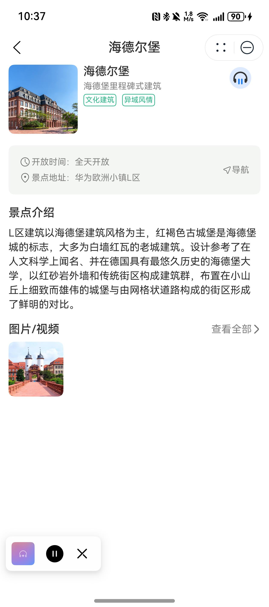

# 景点播报组件快速入门

## 目录

- [简介](#简介)
- [约束与限制](#约束与限制)
- [使用](#使用)
- [API参考](#API参考)
- [示例代码](#示例代码)

## 简介

本组件提供景点介绍语音播报功能。



## 约束与限制
### 环境

* DevEco Studio版本：DevEco Studio 5.0.3 Release及以上
* HarmonyOS SDK版本：HarmonyOS 5.0.3 Release SDK及以上
* 设备类型：华为手机（包括双折叠和阔折叠）
* HarmonyOS版本：HarmonyOS 5.0.3(15)及以上

### 权限

* 获取网络权限：ohos.permission.INTERNET、ohos.permission.GET_NETWORK_INFO。

## 使用
1. 安装组件。
   如果是在DevEco Studio使用插件集成组件，则无需安装组件，请忽略此步骤。

   如果是从生态市场下载组件，请参考以下步骤安装组件。

   a. 解压下载的组件包，将包中所有文件夹拷贝至您工程根目录的xxx目录下。

   b. 在项目根目录build-profile.json5并添加attraction_announcement和module_base模块
   ```typescript
   "modules": [
      {
      "name": "attraction_announcement",
      "srcPath": "./xxx/attraction_announcement",
      },
      {
         "name": "module_base",
         "srcPath": "./xxx/module_base",
      }
   ]
   ```
   c. 在项目根目录oh-package.json5中添加依赖
   ```typescript
   "dependencies": {
      "attraction_announcement": "file:./xxx/attraction_announcement",
      "module_base": "file:./xxx/module_base"
   }
   ```

2. 引入组件。

   ```typescript
   import { VoiceComponent } from 'attraction_announcement';
   ```

## API参考

### 接口
VoiceComponent(playInfo: PlayInfo)

景区播报组件

#### 参数说明

| 参数名              | 类型                                | 是否必填 | 说明   |
|:-----------------|:----------------------------------|:-----|:-----|
| playInfo       | [PlayInfo](#PlayInfo对象说明) | 是    | 播报信息 |

#### PlayInfo对象说明

| 参数名          | 类型     | 是否必填 | 说明     |
|:-------------|:-------|:-----|:-------|
| panelIcon    | ResourceStr | 是    | 面板图标   |
| panelName    | string | 是    | 面板名称   |
| playId       | string | 是    | 音频id   |
| introduction | string | 是    | 音频内容   |
| title        | string | 是    | 音频标题   |
| imageUrl     | string | 是    | 音频图片地址 |

## 示例代码

```typescript
import { VoiceComponent } from 'attraction_announcement';
import { PlayInfo } from 'module_base';

@Entry
@ComponentV2
struct Index {
  build() {
    Column() {
      VoiceComponent({
         playInfo: {
            playId: '1', 
            introduction: 'L区建筑以海德堡建筑风格为主，红褐色古城堡是海德堡城的标志，大多为白墙红瓦的老城建筑。设计参考了在人文科学上闻名、并在德国具有最悠久历史的海德堡大学，以红砂岩外墙和传统街区构成建筑群，布置在小山丘上细致而雄伟的城堡与由网格状道路构成的街区形成了鲜明的对比。',
            title: '松山湖景区',
            imageUrl: 'https://agc-storage-drcn.platform.dbankcloud.cn/v0/scenic-i0v1l/common%2FHeidelberg_B.png?token=66ceba4d-be1d-4c87-a01b-98ed7002c2de',
            panelName: '松山湖景区',
            panelIcon: $r('app.media.startIcon')
         } as PlayInfo,
      });
    }.width('100%').alignItems(HorizontalAlign.Center);
  }
}
```
