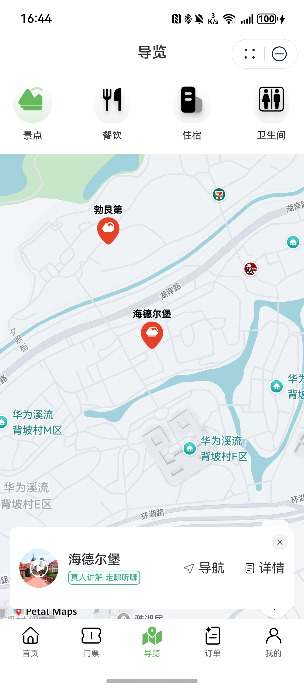

# 景区导览组件快速入门

## 目录

- [简介](#简介)
- [约束与限制](#约束与限制)
- [使用](#使用)
- [API参考](#API参考)
- [示例代码](#示例代码)

## 简介

提供景区景点及配套设施导览功能。



## 约束与限制
### 环境
* DevEco Studio版本：DevEco Studio 5.0.3 Release及以上
* HarmonyOS SDK版本：HarmonyOS 5.0.3 Release SDK及以上
* 设备类型：华为手机（包括双折叠和阔折叠）
* HarmonyOS版本：HarmonyOS 5.0.3(15)及以上

### 权限
* 网络权限：ohos.permission.INTERNET
* 获取位置权限：ohos.permission.APPROXIMATELY_LOCATION、ohos.permission.LOCATION。

## 使用
1. 安装组件。
   如果是在DevEco Studio使用插件集成组件，则无需安装组件，请忽略此步骤。

   如果是从生态市场下载组件，请参考以下步骤安装组件。

   a. 解压下载的组件包，将包中所有文件夹拷贝至您工程根目录的xxx目录下。

   b. 在项目根目录build-profile.json5并添加attraction_guide、attraction_announcement和module_base模块
   ```typescript
   "modules": [
      {
      "name": "attraction_guide",
      "srcPath": "./xxx/attraction_guide",
      },
      {
         "name": "module_base",
         "srcPath": "./xxx/module_base",
      },
      {
         "name": "attraction_announcement",
         "srcPath": "./xxx/attraction_announcement",
      },
   ]
   ```
   c. 在项目根目录oh-package.json5中添加依赖
   ```typescript
   "dependencies": {
      "attraction_guide": "file:./xxx/attraction_guide",
      "attraction_announcement": "file:./xxx/attraction_announcement",
      "module_base": "file:./xxx/module_base"
   }
   ```
2. 在主工程的src/main路径下的module.json5文件中配置如下信息：

   a. 配置应用的client ID，详细参考：[配置Client ID](https://developer.huawei.com/consumer/cn/doc/harmonyos-guides/account-client-id)。

   b. 在requestPermissions字段中添加如下权限。
   ```typescript
   "requestPermissions": [
   ...
   {
     "name": "ohos.permission.INTERNET",
     "reason": "$string:app_name",
     "usedScene": {
        "abilities": [
          "EntryAbility"
        ],
     "when": "inuse"
     }
   },
   {
     "name": "ohos.permission.APPROXIMATELY_LOCATION",
     "reason": "$string:app_name",
     "usedScene": {
        "abilities": [
          "EntryAbility"
        ],
     "when": "inuse"
     }
   },
   {
     "name": "ohos.permission.LOCATION",
     "reason": "$string:app_name",
     "usedScene": {
        "abilities": [
          "EntryAbility"
        ],
     "when": "inuse"
     }
   },
   ...
   ],
   ```

3. 引入组件。

   ```typescript
   import { AttractionGuide } from 'attraction_guide';
   ```

## API参考

### 接口
AttractionGuide(location: number[], initAttractionInfo: AttractionsInfo)
景区导览组件。

#### 参数说明

| 参数名              | 类型                   | 是否必填 | 说明       |
|:-----------------|:---------------------|:---|:---------|
| location       | number[]             | 是  | 经纬度信息    |
| initAttractionInfo       | [AttractionsInfo](#AttractionsInfo对象说明) | 是  | 初始景区导览信息 |

#### AttractionsInfo对象说明
| 参数名              | 类型                    | 是否必填 | 说明     |
|:-----------------|:----------------------|:---|:-------|
| banners       | ResourceStr[]         | 是  | 封面图    |
| attractions       | [AttractionInfo](#AttractionsInfo对象说明)[] | 是  | 景点信息列表 |

#### AttractionsInfo对象说明
| 参数名              | 类型               | 是否必填 | 说明       |
|:-----------------|:-----------------|:---|:---------|
| labels       | string[]         | 是  | 景点标签     |
| detailImages       | ResourceStr[]    | 是  | 景点详情图片   |
| attractionId       | number           | 是  | 景点id     |
| brief       | string | 是  | 景点简介     |
| name       | string           | 是  | 景点名称     |
| location       | string           | 是  | 景点详细地址   |
| longitude       | number           | 是  | 景点经度     |
| latitude       | number           | 是  | 景点纬度     |
| banner       | ResourceStr      | 是  | 景点banner |
| icon       | ResourceStr      | 是  | 景点图标     |
| introduction       | string           | 是  | 景点介绍     |
| consultPhone       | string           | 是  | 景点咨询电话   |
| audio       | string           | 是  | 景点音频     |
| isHot       | number           | 是  | 是否热门景点   |

## 示例代码

```typescript
import { AttractionGuide } from 'attraction_guide';
import { AttractionsInfo } from 'module_base';

@Entry
@ComponentV2
struct Index {
   @Provider('mainPathStack') mainPathStack: NavPathStack = new NavPathStack();
   @Local attractionsInfo: AttractionsInfo = {
      banners: [],
      attractions: [
         {
            labels: ['文化建筑', '异域风情'],
            detailImages: ['https://agc-storage-drcn.platform.dbankcloud.cn/v0/scenic-i0v1l/common%2FHeidelberg.png?token=99ed2760-b4e9-4e46-87ed-8c99af510410'],
            attractionId: 0,
            name: '海德尔堡',
            banner: 'https://agc-storage-drcn.platform.dbankcloud.cn/v0/scenic-i0v1l/common%2FHeidelberg_B.png?token=66ceba4d-be1d-4c87-a01b-98ed7002c2de',
            icon: 'https://agc-storage-drcn.platform.dbankcloud.cn/v0/scenic-i0v1l/common%2FHeidelberg_I.png?token=75fb65ee-9519-40aa-8ac5-4681c1e4a278',
            isHot: 1,
            latitude: 22.878538,
            longitude: 113.886642,
            audio: 'https://agc-storage-drcn.platform.dbankcloud.cn/v0/scenic-i0v1l/phone%2FDelacey%20-%20Dream%20It%20Possible.flac?token=0252b0cb-b617-4708-86dc-5b0d052529ab',
            location: '松山湖欧洲小镇L区',
            brief: '',
            introduction: '',
            consultPhone: ''
         }
      ],
   }

   build() {
      Navigation(this.mainPathStack) {
         AttractionGuide({
            location: [22.92, 113.86],
            initAttractionInfo: this.attractionsInfo,
         }).height('90%');
      }.title('景区导览').mode(NavigationMode.Stack);
   }
}
```
