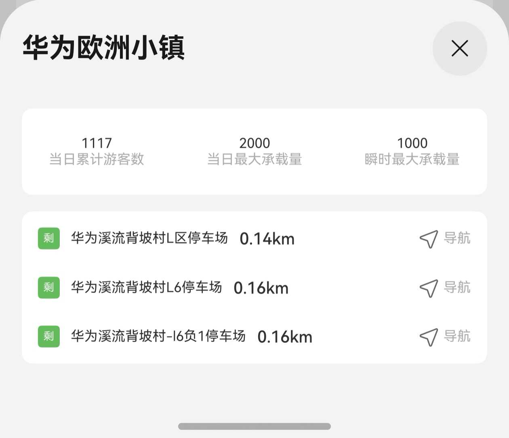

# 景点实况组件快速入门

## 目录

- [简介](#简介)
- [约束与限制](#约束与限制)
- [使用](#使用)
- [API参考](#API参考)
- [示例代码](#示例代码)

## 简介

本组件提供景区实况情况介绍功能。



## 约束与限制
### 环境
* DevEco Studio版本：DevEco Studio 5.0.3 Release及以上
* HarmonyOS SDK版本：HarmonyOS 5.0.3 Release SDK及以上
* 设备类型：华为手机（包括双折叠和阔折叠）
* HarmonyOS版本：HarmonyOS 5.0.3(15)及以上

### 权限
* 网络权限：ohos.permission.INTERNET

## 使用
1. 安装组件。
   如果是在DevEco Studio使用插件集成组件，则无需安装组件，请忽略此步骤。

   如果是从生态市场下载组件，请参考以下步骤安装组件。

   a. 解压下载的组件包，将包中所有文件夹拷贝至您工程根目录的xxx目录下。

   b. 在项目根目录build-profile.json5并添加attraction_live和module_base模块
   ```typescript
   "modules": [
      {
      "name": "attraction_live",
      "srcPath": "./xxx/attraction_live",
      },
      {
         "name": "module_base",
         "srcPath": "./xxx/module_base",
      }
   ]
   ```
   c. 在项目根目录oh-package.json5中添加依赖
   ```typescript
   "dependencies": {
      "attraction_live": "file:./xxx/attraction_live",
      "module_base": "file:./xxx/module_base",
   }
   ```
2. 在主工程的src/main路径下的module.json5文件中配置如下信息：

   a. 配置应用的client ID，详细参考：[配置Client ID](https://developer.huawei.com/consumer/cn/doc/harmonyos-guides/account-client-id)。

   b. 在requestPermissions字段中添加如下权限。
   ```typescript
   "requestPermissions": [
   ...
   {
     "name": "ohos.permission.INTERNET",
     "reason": "$string:app_name",
     "usedScene": {
        "abilities": [
          "EntryAbility"
        ],
     "when": "inuse"
     }
   },
   ...
   ],
   ```

3. 引入组件。

   ```typescript
   import { AttractionLive } from 'attraction_live';
   ```

## API参考

### 接口
AttractionLive(attractionLiveInfo: AttractionLiveInfo)
景区实况组件。

**参数：**

| 参数名           | 类型                                                                                                                       | 是否必填 | 说明     |
|:--------------|:-------------------------------------------------------------------------------------------------------------------------|:---|:-------|
| attractionLiveInfo   | [AttractionLiveInfo](#AttractionLiveInfo对象说明)[]             | 是  | 景区实况信息 |

#### AttractionLiveInfo对象说明

| 参数名              | 类型                | 是否必填 | 说明      |
|:-----------------|:------------------|:---|:--------|
| longitude       | number            | 是  | 经度      |
| latitude       | number            | 是  | 纬度      |
| currentDate       | Date              | 是  | 当前日期    |
| temperature       | number            | 是  | 温度      |
| currentDayVisitors       | number            | 是  | 今日游客数   |
| maxVisitors       | number            | 是  | 最大游客数   |
| maxInstantVisitors       | string            | 是  | 最大瞬时游客数 |
| weatherId       | string            | 是  | 天气Id    |
| atmosphereId       | string            | 是  | 空气质量Id  |
| name       | string            | 是  | 景区名称    |
| realTimeInfos       | [RealTimeInfo](#RealTimeInfo对象说明) | 是  | 音频地址    |
| openTime       | string            | 是  | 音频地址    |
| ticketTime       | string            | 是  | 音频地址    |


#### RealTimeInfo对象说明

| 参数名   | 类型     | 是否必填 | 说明     |
|:------|:-------|:---|:-------|
| icon  | ResourceStr | 是  | 实时信息图标 |
| item  | string | 是  | 实时信息条目 |
| count | number | 是  | 实时人数   |

## 示例代码

```typescript
import { BusinessError } from '@kit.BasicServicesKit';
import { hilog } from '@kit.PerformanceAnalysisKit';
import { AttractionLive, mapperParkingSlot, ParkingSlotInfo } from 'attraction_live';
import { AttractionLiveInfo, SystemUtil } from 'module_base';

@Entry
@ComponentV2
struct Index {
  @Local attractionLiveInfo: AttractionLiveInfo = {
    longitude: 118,
    latitude: 32,
    currentDate: new Date(),
    temperature: 24,
    currentDayVisitors: 100,
    maxVisitors: 200,
    maxInstantVisitors: 100,
    weatherId: '晴',
    atmosphereId: '良好',
    name: '松山湖景区',
    openTime: '09:00-18:00',
    ticketTime: '09:00-18:00',
  }
  @Local parkingSlotList: ParkingSlotInfo[] = [];
  @Local longitude: number = 0;
  @Local latitude: number = 0;

  aboutToAppear(): void {
    this.longitude = this.attractionLiveInfo.longitude;
    this.latitude = this.attractionLiveInfo.latitude;
    this.getParkingSlot();
  }

  getParkingSlot() {
    SystemUtil.getPoiListByText(this.latitude, this.longitude, '停车场', 1000,).then((res) => {
      let parkingSlotList = mapperParkingSlot(res.sites ?? [], this.latitude, this.longitude);
      this.parkingSlotList.push(...parkingSlotList.slice(0, 3));
    }).catch((e: BusinessError) => {
      hilog.error(0x0000, 'AttractionLiveVM', 'get parking fail ' + JSON.stringify(e));
    });
  }

  build() {
    Column() {
      AttractionLive({ attractionLiveInfo: this.attractionLiveInfo });
    }.height('100%').justifyContent(FlexAlign.Center);
  }
}
```
