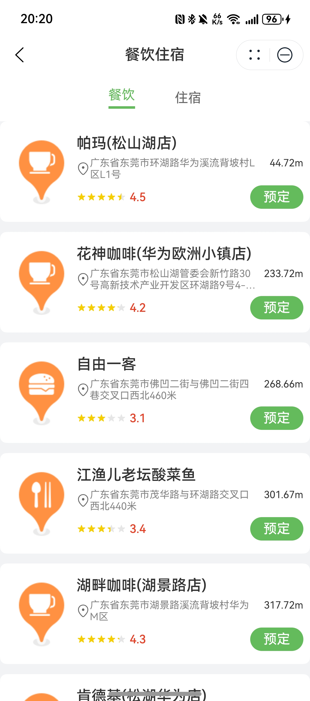

# 周边餐饮住宿组件快速入门

## 目录

- [简介](#简介)
- [约束与限制](#约束与限制)
- [使用](#使用)
- [API参考](#API参考)
- [示例代码](#示例代码)

## 简介

本组件提供景区周边餐饮住宿浏览功能。



## 约束与限制
### 环境
* DevEco Studio版本：DevEco Studio 5.0.3 Release及以上
* HarmonyOS SDK版本：HarmonyOS 5.0.3 Release SDK及以上
* 设备类型：华为手机（包括双折叠和阔折叠）
* HarmonyOS版本：HarmonyOS 5.0.3(15)及以上

### 权限
* 网络权限：ohos.permission.INTERNET

## 使用
1. 安装组件。
   如果是在DevEco Studio使用插件集成组件，则无需安装组件，请忽略此步骤。

   如果是从生态市场下载组件，请参考以下步骤安装组件。

   a. 解压下载的组件包，将包中所有文件夹拷贝至您工程根目录的xxx目录下。

   b. 在项目根目录build-profile.json5并添加catering_accommodation和module_base模块
   ```typescript
   "modules": [
      {
      "name": "catering_accommodation",
      "srcPath": "./xxx/catering_accommodation",
      },
      {
         "name": "module_base",
         "srcPath": "./xxx/module_base",
      }
   ]
   ```
   c. 在项目根目录oh-package.json5中添加依赖
   ```typescript
   "dependencies": {
      "catering_accommodation": "file:./xxx/catering_accommodation",
      "module_base": "file:./xxx/module_base",
   }
   ```
2. 在主工程的src/main路径下的module.json5文件中配置如下信息：

   a. 配置应用的client ID，详细参考：[配置Client ID](https://developer.huawei.com/consumer/cn/doc/harmonyos-guides/account-client-id)。

   b. 在requestPermissions字段中添加如下权限。
   ```typescript
   "requestPermissions": [
   ...
   {
     "name": "ohos.permission.INTERNET",
     "reason": "$string:app_name",
     "usedScene": {
        "abilities": [
          "EntryAbility"
        ],
     "when": "inuse"
     }
   },
   ...
   ],
   ```

3. 引入组件。

   ```typescript
   import { AttractionLive } from 'attraction_live';
   ```
4. 初始化景区的经纬度：
   ```typescript
   this.locationInfo.latitude = 22.92;
   this.locationInfo.longitude = 113.86;
   ```

## API参考
* 无

## 示例代码

```typescript
import { PersistenceV2 } from '@kit.ArkUI';
import { LocationInfo } from 'module_base';

@Entry
@ComponentV2
struct Index {
   @Provider('mainPathStack') mainPathStack: NavPathStack = new NavPathStack();
   locationInfo: LocationInfo =
      PersistenceV2.connect(LocationInfo, 'locationInfo', () => new LocationInfo())!;

   aboutToAppear(): void {
      this.locationInfo.latitude = 22.92;
      this.locationInfo.longitude = 113.86;
   }

   build() {
      Navigation(this.mainPathStack) {
         Column() {
            Button('餐饮与住宿').onClick(() => {
               this.mainPathStack.pushPathByName('CateringAndAccommodation', null);
            });
         };
      }.title('餐饮住宿');
   }
}
```
