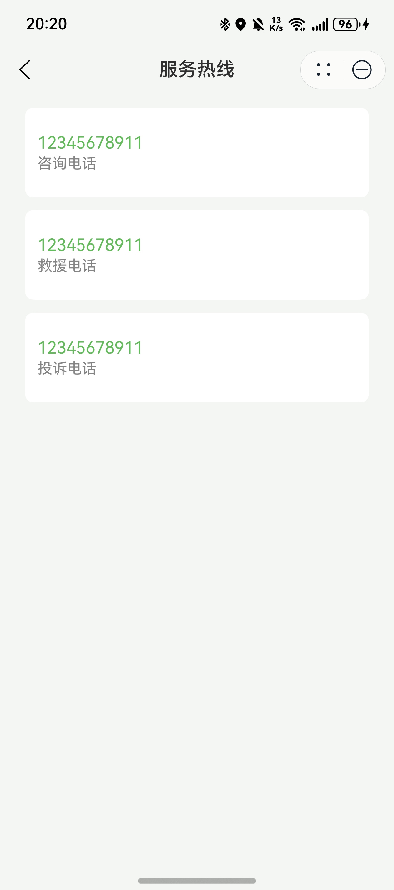

# 服务热线组件快速入门

## 目录

- [简介](#简介)
- [约束与限制](#约束与限制)
- [快速入门](#快速入门)
- [API参考](#API参考)
- [示例代码](#示例代码)

## 简介

本组件提供景区服务热线查询与拨打功能。



## 约束与限制
### 环境
* DevEco Studio版本：DevEco Studio 5.0.3 Release及以上
* HarmonyOS SDK版本：HarmonyOS 5.0.3 Release SDK及以上
* 设备类型：华为手机（包括双折叠和阔折叠）
* HarmonyOS版本：HarmonyOS 5.0.3(15)及以上

## 快速入门
1. 安装组件。
   如果是在DevEco Studio使用插件集成组件，则无需安装组件，请忽略此步骤。

   如果是从生态市场下载组件，请参考以下步骤安装组件。

   a. 解压下载的组件包，将包中所有文件夹拷贝至您工程根目录的xxx目录下。

   b. 在项目根目录build-profile.json5并添加service_hotline和module_base模块
   ```typescript
   "modules": [
      {
      "name": "service_hotline",
      "srcPath": "./xxx/service_hotline",
      },
      {
         "name": "module_base",
         "srcPath": "./xxx/module_base",
      }
   ]
   ```
   c. 在项目根目录oh-package.json5中添加依赖
   ```typescript
   "dependencies": {
      "service_hotline": "file:./xxx/service_hotline",
      "module_base": "file:./xxx/module_base",
   }
   ```
2. 引入组件。

   ```typescript
   import { Hotline } from 'service_hotline';
   ```
   
## API参考

### 接口
Hotline(hotlines: HotlineInfo[])
景区热线组件

#### 参数说明
| 参数名              | 类型                                | 是否必填 | 说明   |
|:-----------------|:----------------------------------|:---|:-----|
| hotlines       | [HotlineInfo](#HotlineInfo对象说明)[] | 是  | 热线id |

#### HotlineInfo对象说明

| 参数名              | 类型                              | 是否必填 | 说明   |
|:-----------------|:--------------------------------|:---|:-----|
| id       | [HotlineType](#HotlineType枚举说明) | 是  | 热线id |
| title       | ResourceStr                          | 是  | 热线名称 |
| phone       | string                          | 是  | 热线电话 |

#### HotlineType枚举说明
| 名称        | 值 | 说明   |
|:----------|:--|:-----|
| COUNSELING | 0 | 咨询热线 |
| RESCUE | 1 | 救援热线 |
| COMPLAINTS | 2 | 投诉热线 |


## 示例代码

```
import { HotlineInfo, HotlineType } from 'module_base';
import { Hotline } from 'service_hotline';

@Entry
@ComponentV2
struct Index {
  hotlines: HotlineInfo[] = [
    {
      id: HotlineType.COUNSELING,
      title: '咨询电话',
      phone: '1234567890',
    },
    {
      id: HotlineType.RESCUE,
      title: '救援电话',
      phone: '1234567890',
    },
    {
      id: HotlineType.COUNSELING,
      title: '投诉电话',
      phone: '1234567890',
    }];

  build() {
    Column() {
      Hotline({ hotlines: this.hotlines });
    }
  }
}
```
