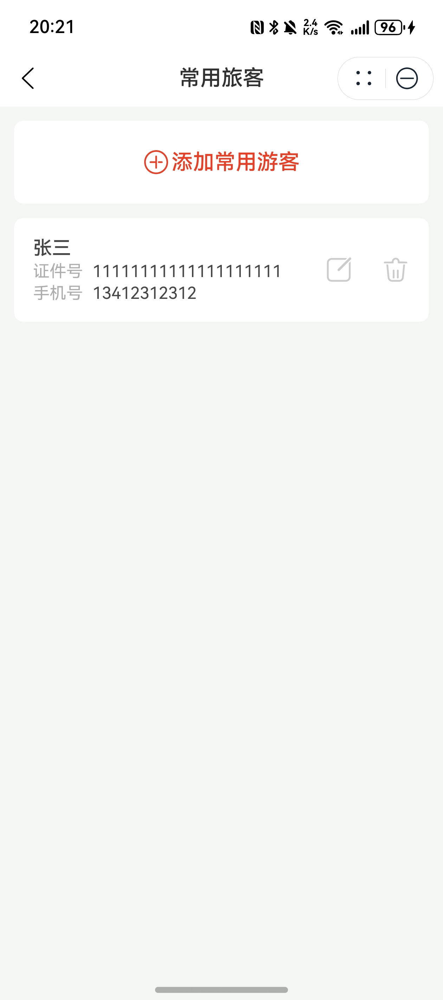
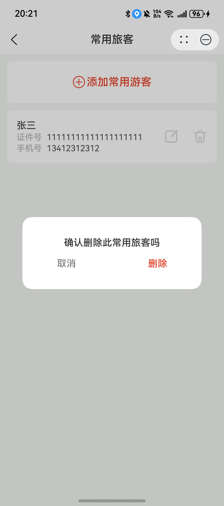

# 常用游客管理组件快速入门

## 目录

- [简介](#简介)
- [约束与限制](#约束与限制)
- [快速入门](#快速入门)
- [API参考](#API参考)
- [示例代码](#示例代码)

## 简介

本组件提供常用游客查看与管理，并且支持多选进行表单填充等功能。

| 游客列表                                           | 游客删除                                             |
|------------------------------------------------|--------------------------------------------------|
|  |  |

## 约束与限制
### 环境
* DevEco Studio版本：DevEco Studio 5.0.3 Release及以上
* HarmonyOS SDK版本：HarmonyOS 5.0.3 Release SDK及以上
* 设备类型：华为手机（包括双折叠和阔折叠）
* HarmonyOS版本：HarmonyOS 5.0.3(15)及以上

## 快速入门
1. 安装组件。

   如果是在DevEco Studio使用插件集成组件，则无需安装组件，请忽略此步骤。

   如果是从生态市场下载组件，请参考以下步骤安装组件。

   a. 解压下载的组件包，将包中所有文件夹拷贝至您工程根目录的xxx目录下。

   b. 在项目根目录build-profile.json5并添加tourist_management和module_base模块
   ```typescript
   "modules": [
      {
      "name": "tourist_management",
      "srcPath": "./xxx/tourist_management",
      },
      {
         "name": "module_base",
         "srcPath": "./xxx/module_base",
      }
   ]
   ```
   c. 在项目根目录oh-package.json5中添加依赖
   ```typescript
   "dependencies": {
      "tourist_management": "file:./xxx/tourist_management",
      "module_base": "file:./xxx/module_base",
   }
   ```
2. 引入组件。

   ```typescript
   import { Tourists } from 'tourist_management';
   ```

3. 新增游客管理页面。

   a. 在src/main/ets/pages下新增TouristPage.ets文件，文件内容见[示例代码](#示例代码)。

   b. 在src/main下的module.json文件中添加路由配置。
   ```typescript
   ...
   "routerMap": "$profile:router_map",
   ...
   ```
   c.src/main/resources/base/profile下新增router_map.json路由配置文件。
   ```typescript
   {
     "routerMap": [
       {
         "name": "TouristPage",
         "pageSourceFile": "src/main/ets/pages/TouristPage.ets",
         "buildFunction": "TouristPageBuilder",
         "data": {
             "description": "this is TouristPage"
         }
       }
     ]
   }
   ```
   
## API参考

### 接口
Tourists(touristList: TouristInfo[],isInReserve: boolean,changeSelectedStatus: (isChecked: boolean, touristId: string) => void,setSelectedTourist: () => void,changeSheetContent: (isInitialPage: boolean, tourist: TouristInfo) => void,closeSheet: () => void,deleteTourist: (touristId: string) => void,addOrEditTourist: (tourist: TouristInfo, isEdit: boolean) => void)

常用游客管理组件。

#### 参数说明

| 参数名              | 类型                              | 是否必填 | 说明           |
|:-----------------|:--------------------------------|:-----|:-------------|
| touristList      | [TouristInfo](#TouristInfo对象说明) | 是    | 常用游客列表       |
| isInReserve       | boolean                         | 是    | 是否展示checkbox |
| changeSelectedStatus       | (isChecked: boolean, touristId: string)=>void                        | 否    | 改变选择状态       |
| setSelectedTourist       | ()=>void                        | 否    | 设置已选游客       |
| changeSheetContent       | (isInitialPage: boolean, tourist: TouristInfo)=>void                        | 否    | 改变半模态窗口内容    |
| closeSheet       | ()=>void                        | 否    | 关闭半模态窗口      |
| deleteTourist       | (touristId: string)=>void                        | 否    | 删除游客         |
| addOrEditTourist       | (tourist: TouristInfo, isEdit: boolean)=>void                        | 否    | 新增或编辑游客      |

#### TouristInfo对象说明
| 参数名              | 类型          | 是否必填 | 说明     |
|:-----------------|:------------|:---|:-------|
| id       | string      | 是  | 游客id   |
| name       | ResourceStr | 是  | 游客名称   |
| phone       | string      | 是  | 游客联系方式 |
| cardType       | number      | 是  | 证件类型   |
| cardNo       | string      | 是  | 证件号码   |
| isChecked       | boolean      | 是  | 是否勾选   |

## 示例代码

### 游客列表页面

```
import { TouristInfo } from 'module_base';
import { DeleteConfirmDialog, Tourists } from 'tourist_management';

@Entry
@ComponentV2
struct Index {
  @Provider('mainPathStack') mainPathStack: NavPathStack = new NavPathStack();
  @Local touristId: string = '';
  @Local touristList: TouristInfo[] = [{
    id: 'tourist1',
    name: '游客1',
    phone: '1234567890',
    cardType: 1,
    cardNo: '1234567890',
    isChecked: false,
  } as ESObject];
  dialogController: CustomDialogController | null = new CustomDialogController({
    builder: DeleteConfirmDialog({
      delete: () => {
        this.touristList = this.touristList.filter(item => item.id !== this.touristId);
      },
      type: 0,
    }),
    customStyle: true,
    autoCancel: true,
  });

  build() {
    Navigation(this.mainPathStack) {
      Tourists({
        touristList: this.touristList, deleteTourist: (id: string) => {
          this.touristId = id;
          if (this.dialogController != null) {
            this.dialogController.open();
          }
        },
      });
    }.title('游客列表');
  }
}
```

### 游客管理页面

```
import { promptAction } from '@kit.ArkUI';
import { TouristInfo } from 'module_base';
import { Tourist } from 'tourist_management';

@Builder
export function TouristPageBuilder() {
  TouristPage();
}

@Entry
@ComponentV2
struct TouristPage {
  @Local touristInfo: TouristInfo = new TouristInfo();
  @Consumer('mainPathStack') mainPathStack: NavPathStack = new NavPathStack();

  build() {
    NavDestination() {
      Tourist({
        touristInfo: this.touristInfo,
        isEdit: false,
        addOrEditTourist: () => {
          promptAction.showToast({ message: '模拟新增或编辑', duration: 1000 });
        },
      });
    }.title('游客管理');
  }
}
```
