# 旅游（旅游攻略）应用模板快速入门

## 目录

- [功能介绍](#功能介绍)
- [约束与限制](#约束与限制)
- [快速入门](#快速入门)
- [示例效果](#示例效果)
- [开源许可协议](#开源许可协议)

## 功能介绍

您可以基于此模板直接定制旅游攻略应用，也可以挑选此模板中提供的多种组件使用，从而降低您的开发难度，提高您的开发效率。

此模板提供如下组件，所有组件存放在工程根目录的components下，如果您仅需使用组件，可参考对应组件的指导链接；如果您使用此模板，请参考本文档。

| 组件                                      | 描述                                                | 使用指导                                               |
| :---------------------------------------- |:--------------------------------------------------|:---------------------------------------------------|
| 旅行足迹组件（travel_footprint）          | 提供展示用户旅行足迹的功能，支持列表按年份分组展示城市足迹卡片，并在地图上高亮可视化去过的城市区域 | [使用指导](components/travel_footprint/README.md)      |
| 路线规划组件（travel_planning）           | 提供旅游路线规划功能，支持用户选择出发地、目的地和游玩天数，并根据选择智能推荐旅游路线       | [使用指导](components/travel_planning/README.md)       |
| 发票编辑组件（travel_invoice）            | 提供发票管理的相关功能，支持发票列表展示、添加新发票、编辑现有发票、删除发票等能力         | [使用指导](components/travel_invoice/README.md)        |
| 通用登录组件（aggregated_login）          | 提供华为账号一键登录及其他方式登录（微信、手机号登录），开发者可以根据业务需要快速实现应用登录   | [使用指导](components/aggregated_login/README.md)      |
| 通用支付组件（aggregated_payment）        | 提供多方的支付能力。                                        | [使用指导](components/aggregated_payment/README.md)           |
| 通用分享组件（aggregated_share）          | 提供分享到微信好友、朋友圈、QQ、微博等，支持碰一碰分享、生成海报、系统分享等功能。        | [使用指导](components/aggregated_share/README.md)      |
| 通用分类列表组件（category_list）         | 提供了以宫格或者列表形式分类展示信息的功能。                            | [使用指导](components/category_list/README.md)         |
| 实名认证组件（module_auth）               | 提供实名认证的功能。                                        | [使用指导](components/module_auth/README.md)           |
| 列表筛选组件（module_filter_list）        | 提供列表筛选组件，支持条件筛选和列表展示                              | [使用指导](components/module_filter_list/README.md)      |
| 检测应用更新组件（check_app_update）      | 提供检测应用是否存在新版本功能                                   | [使用指导](components/check_app_update/README.md)      |
| 通用个人信息组件（collect_personal_info） | 支持编辑头像、昵称、姓名、性别、手机号、生日、个人简介等                      | [使用指导](components/collect_personal_info/README.md) |
| 通用城市选择组件（city_select）           | 选择城市的功能，长按城市按钮将显示城市全称                             | [使用指导](components/city_select/README.md)           |
| 看广告领奖励组件（look_ad）               | 提供看广告领奖励的功能                                       | [使用指导](components/look_ad/README.md)               |
| 地图（定位选点）组件（travel_map）               | 提供地图展示能力，并支持地图定位和选点定制功能                           | [使用指导](components/travel_map/README.md)            |


本模板为旅游类应用提供了常用功能的开发样例，模板主要分首页、行程、消息和个人中心四大模块：

- 首页：支持旅游攻略搜索、分类导航、热点展示、帖子瀑布流浏览。
- 行程：提供行程列表展示、详情查看、旅行足迹入口功能。
- 消息：提供订单出行的消息列表展示、系统通知、开启推送服务等功能。
- 个人中心：提供用户信息管理、登录/注册、订单管理、收藏管理、发布帖子、VIP服务、意见反馈、设置等功能。

本模板已集成华为账号、微信登录、消息管理、应用更新检查、意见反馈、实名认证等服务，采用模块化架构设计，支持多设备适配，只需做少量配置和定制即可快速实现旅游攻略应用的核心功能。

|                            首页                             |                            行程                            |                            消息                            |                           个人中心                           |
| :---------------------------------------------------------: | :--------------------------------------------------------: | :--------------------------------------------------------: | :----------------------------------------------------------: |
| 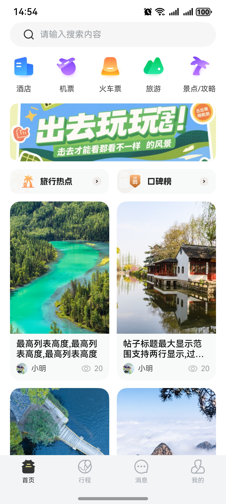 | 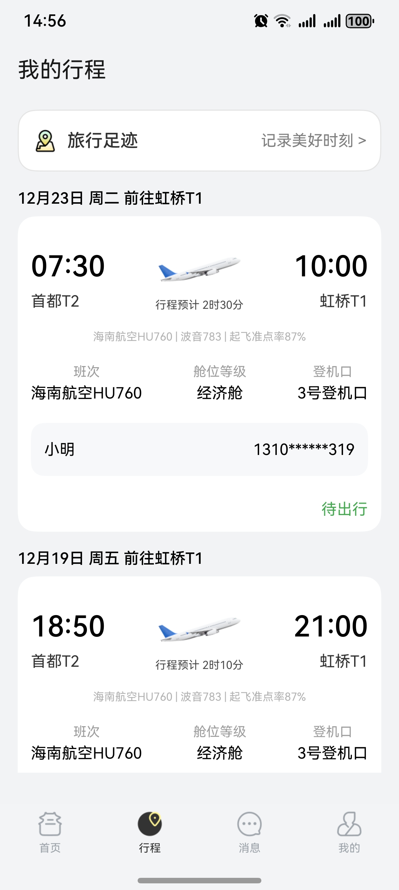 | 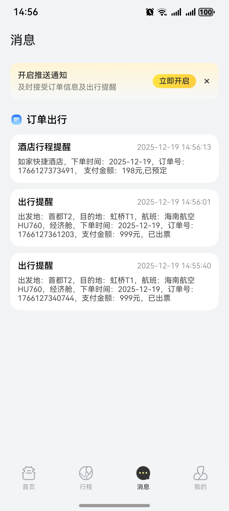 |  |

本模板主要页面及核心功能如下所示：

```text
旅游攻略模板
  ├──首页模块                            
  │   ├──搜索功能  
  │   │   ├── 旅游攻略搜索                         
  │   │   ├── 搜索历史
  │   │   └── 热门搜索推荐                        
  │   │         
  │   ├──分类导航  
  │   │   ├── 酒店
  │   │   ├── 机票
  │   │   ├── 火车票
  │   │   ├── 旅游
  │   │   └── 景点
  │   │         
  │   └──内容展示                         
  │       ├── 旅游热点展示
  │       ├── 口碑榜
  │       └── 帖子瀑布流                                                    
  │
  ├──行程模块                            
  │   ├──旅行足迹  
  │   │   ├── 城市足迹 
  │   │   └── 添加足迹     
  │   │         
  │   └──行程状态列表
  │
  ├──消息模块
  │   └──消息展示
  │       ├── 订单出行
  │       └── 系统通知
  │
  └──个人中心
      ├──用户管理
      │   ├── 华为账号登录
      │   ├── 微信登录
      │   └── 个人资料编辑
      │
      ├──内容管理
      │   ├── 全部订单
      │   ├── 订单管理
      │   ├── 我的点赞
      │   └── 我的帖子
      │
      ├──我的收藏
      │   └── 收藏内容展示
      │
      └──常用服务    
            ├── 常用信息                                                         
            │   ├── 旅客管理
            │   ├── 地址管理
            │   └── 发票抬头  
            │
            ├── 发布帖子                                                          
            └── 设置
                 ├── 实名认证
                 ├── 个人信息              
                 ├── 隐私设置
                 ├── 清除缓存
                 ├── 版本检测
                 ├── 关于我们 
                 └── 退出登录                               
```

本模板工程代码结构如下所示：

```text
旅游攻略模板
├── commons                                                // 公共模块
│   ├── oh_router                                          // 路由模块
│   └── common                                             // 基础模块
│       ├── basic                                          // 基础类（BaseViewModel、GlobalContext、Logger等）
│       ├── constant                                       // 通用常量（Constants、RouterMap等）
│       ├── model                                          // 数据模型（UserInfoo等）
│       ├── service                                        // 通用服务
│       ├── ui                                             // 通用UI组件（CommonHeader、ProtocolWebView等）
│       └── util                                           // 通用工具方法（权限、缓存、时间等工具类）
│
├── components                                             // 组件模块
│   ├── aggregated_login                                   // 通用登录组件
│   ├── aggregated_payment                                 // 通用支付组件
│   ├── aggregated_share                                   // 通用分享组件
│   ├── base_apis                                          // 集成能力组件
│   ├── category_list                                      // 通用分类列表组件
│   ├── check_app_update                                   // 检测应用更新组件
│   ├── city_select                                        // 通用城市选择组件
│   ├── collect_personal_info                              // 通用个人信息组件
│   ├── common_travel_guide                                // 通用旅游指南组件
│   ├── look_ad                                            // 看广告领奖励组件
│   ├── module_auth                                        // 实名认证组件
│   ├── module_base                                        // 基础能力组件
│   ├── module_filter_list                                 // 列表筛选组件
│   ├── search                                             // 搜索组件
│   ├── travel_footprint                                   // 旅游足迹组件
│   ├── travel_invoice                                     // 发票编辑组件
│   ├── travel_map                                   	   // 地图（定位选点）组件
│   └── travel_planning                                    // 路线规划组件
│
├── features                                               // 功能模块
│   │
│   ├── homepage/src/main/ets                              // 首页模块
│   │   ├── common                                         // 公共资源
│   │   │   ├── mock                                       // 模拟数据
│   │   │   │   ├── AttractionDetailMockData.ets           // 景点详情模拟数据
│   │   │   │   ├── CityGuideMockData.ets                  // 城市指南模拟数据
│   │   │   │   └── TravelHotspotMockData.ets              // 旅游热点模拟数据
│   │   │   ├── model                                      // 数据模型
│   │   │   │   └── RemarksModel.ets                       // 评论模型
│   │   │   ├── service                                    // 服务接口
│   │   │   │   └── PostDetailService.ets                  // 帖子详情服务
│   │   │   └── model.ets                                  // 模型定义
│   │   ├── components                                     // 组件
│   │   │   ├── FilterDialog.ets                           // 筛选对话框
│   │   │   ├── LocationDialog.ets                         // 位置选择对话框
│   │   │   ├── TourGrid.ets                               // 旅游网格组件
│   │   │   └── ...                                        // 其他组件
│   │   ├── view                                           // 视图
│   │   │   ├── MainPage.ets                               // 主页面
│   │   │   ├── AttractionPage.ets                         // 景点页面
│   │   │   ├── CityGuidePage.ets                          // 城市指南页面
│   │   │   ├── HotelPage.ets                              // 酒店页面
│   │   │   ├── PlaneTicketPage.ets                        // 机票页面
│   │   │   ├── TourPage.ets                               // 旅游页面
│   │   │   └── ...                                        // 其他页面
│   │   └── viewmodel                                      // 视图模型
│   │       ├── MainPageVM.ets                             // 主页面视图模型
│   │       ├── HotelPageVM.ets                            // 酒店页面视图模型
│   │       ├── TourPageVM.ets                             // 旅游页面视图模型
│   │       └── ...                                        // 其他视图模型
│   │
│   ├── journey/src/main/ets                               // 行程模块
│   │   ├── components                                     // 组件
│   │   │   └── JourneyCard.ets                            // 行程卡片组件
│   │   └── views                                          // 视图
│   │       ├── JourneyFootprintPage.ets                   // 行程足迹页面
│   │       └── MyJourneyPage.ets                          // 我的行程页面
│   │
│   ├── message/src/main/ets                               // 消息模块
│   │   ├── viewmodel                                      // 视图模型
│   │   │   ├── MessageModel.ets                           // 消息数据模型
│   │   │   └── MessageVM.ets                              // 消息视图模型
│   │   └── views                                          // 视图
│   │       └── MessagePage.ets                            // 消息页面
│   │
│   └── person/src/main/ets                                // 个人中心模块
│       ├── comp                                           // 组件
│       │   ├── CommonInfoList.ets                         // 通用信息列表组件
│       │   ├── FoldText.ets                               // 折叠文本组件
│       │   └──...                                         // 其他组件
│       ├── constants                                      // 常量
│       │   └── ErrorCode.ets                              // 错误码常量
│       ├── utils                                          // 工具
│       │   └── TypeConversion.ets                         // 类型转换工具
│       ├── viewmodel                                      // 视图模型
│       │   ├── CommonInfoAddVM.ets                        // 通用信息添加视图模型
│       │   ├── EditPersonalVM.ets                         // 编辑个人信息视图模型
│       │   ├── LikesModel.ets                             // 收藏数据模型
│       │   └──...                                         // 其他视图模型
│       └── views                                          // 视图
│           ├── AboutPage.ets                              // 关于页面
│           ├── CommonInfoAddPage.ets                      // 通用信息添加页面
│           ├── CommonInfoPage.ets                         // 通用信息页面
│           ├── EditPersonalCenterPage.ets                 // 编辑个人中心页面
│           ├── InvoiceAddPage.ets                         // 发票添加页面
│           ├── LoginPage.ets                              // 登录页面
│           └──...                                         // 其他页面
│
└── products                                               // 产品模块
    └── entry/src/main/ets                                 // 应用入口模块
            └── entryability                               // 入口能力
            │   └── EntryAbility.ets                       // 应用入口能力
            ├── entrybackupability                         // 备份能力
            │   └── EntryBackupAbility.ets                 // 应用备份能力
            ├── pages                                      // 页面目录
            │   ├── HomePage.ets                           // 主页面
            │   └── Index.ets                              // 入口页面
            └── viewmodels                                 // 视图模型
                └── IndexVM.ets                            // 首页视图模型
```

## 约束与限制

### 环境

- DevEco Studio版本：DevEco Studio 5.0.5 Release及以上
- HarmonyOS SDK版本：HarmonyOS 5.0.3(15) Release SDK及以上
- 设备类型：华为手机（包括双折叠和阔折叠）
- 系统版本：HarmonyOS 5.0.3 及以上

### 权限

- 网络权限: ohos.permission.INTERNET
- 网络信息权限: ohos.permission.GET_NETWORK_INFO
- 位置信息权限: ohos.permission.LOCATION
- 模糊位置信息权限: ohos.permission.APPROXIMATELY_LOCATION
- 相机权限: ohos.permission.CAMERA

## 快速入门

### 配置工程

在运行此模板前，需要完成以下配置：

1. 在AppGallery Connect创建应用，将包名配置到模板中。

   a. 参考[创建HarmonyOS应用](https://developer.huawei.com/consumer/cn/doc/app/agc-help-create-app-0000002247955506)为应用创建APP ID，并将APP ID与应用进行关联。

   b. 返回应用列表页面，查看应用的包名。

   c. 将模板工程根目录下AppScope/app.json5文件中的bundleName替换为创建应用的包名。

2. 配置华为账号服务。

   a. 将应用的Client ID配置到products/entry/src/main路径下的module.json5文件中，详细参考：[配置Client ID](https://developer.huawei.com/consumer/cn/doc/harmonyos-guides/account-client-id)。

   b. 申请华为账号登录所需权限，详细参考：[申请账号权限](https://developer.huawei.com/consumer/cn/doc/harmonyos-guides/account-config-permissions)。

3. 接入微信SDK（可选）。

   前往微信开放平台申请AppID并配置鸿蒙应用信息，详情参考：[鸿蒙接入指南](https://developers.weixin.qq.com/doc/oplatform/Mobile_App/Access_Guide/ohos.html)。

4. 配置推送服务（可选）。

   a. [开启推送服务](https://developer.huawei.com/consumer/cn/doc/harmonyos-guides/push-config-setting)。

   b. [按照需要申请通知消息权益](https://developer.huawei.com/consumer/cn/doc/harmonyos-guides/push-apply-right)

5. 对应用进行[手工签名](https://developer.huawei.com/consumer/cn/doc/harmonyos-guides/ide-signing#section297715173233)。

6. 添加手工签名所用证书对应的公钥指纹，详细参考：[配置公钥指纹](https://developer.huawei.com/consumer/cn/doc/app/agc-help-cert-fingerprint-0000002278002933)。

### 运行调试工程

1. 连接调试手机和PC。
2. 菜单选择"Run > Run 'entry' "或者"Run > Debug 'entry' "，运行或调试模板工程。

## 示例效果

### 首页模块

|                         旅游攻略首页                         |                          帖子详情页                          |                          旅游查询页                          |
| :----------------------------------------------------------: | :----------------------------------------------------------: | :----------------------------------------------------------: |
|  |  | 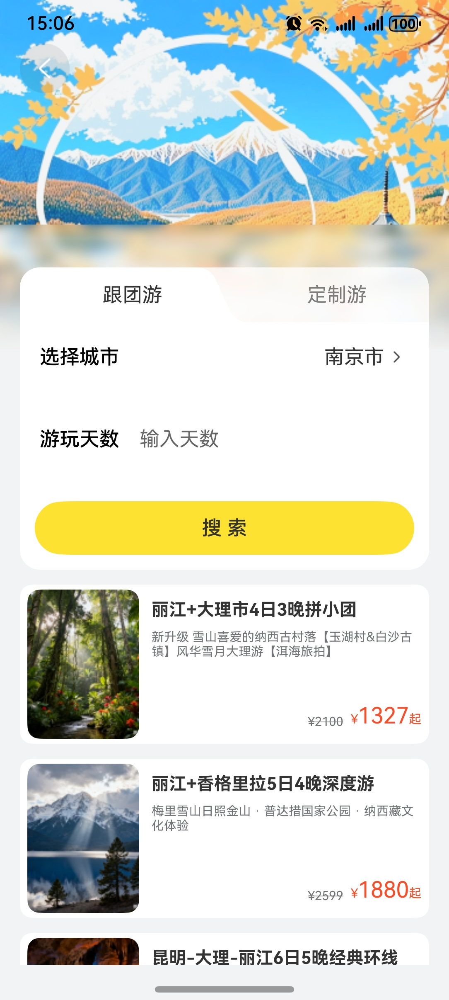 |

|                          旅游热点页                          |                          景点详情页                          |                          城市指南页                          |
| :----------------------------------------------------------: | :----------------------------------------------------------: | :----------------------------------------------------------: |
| 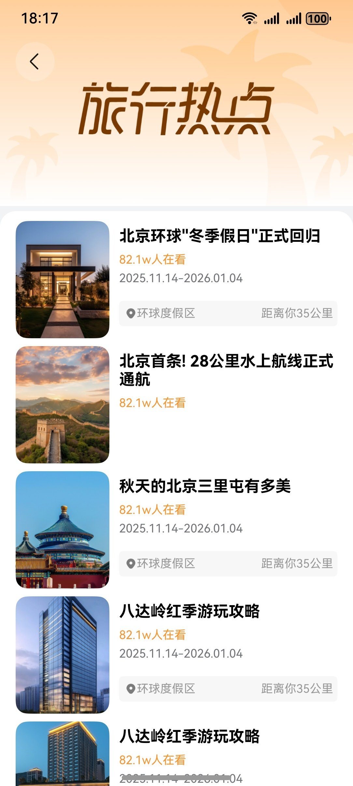 | 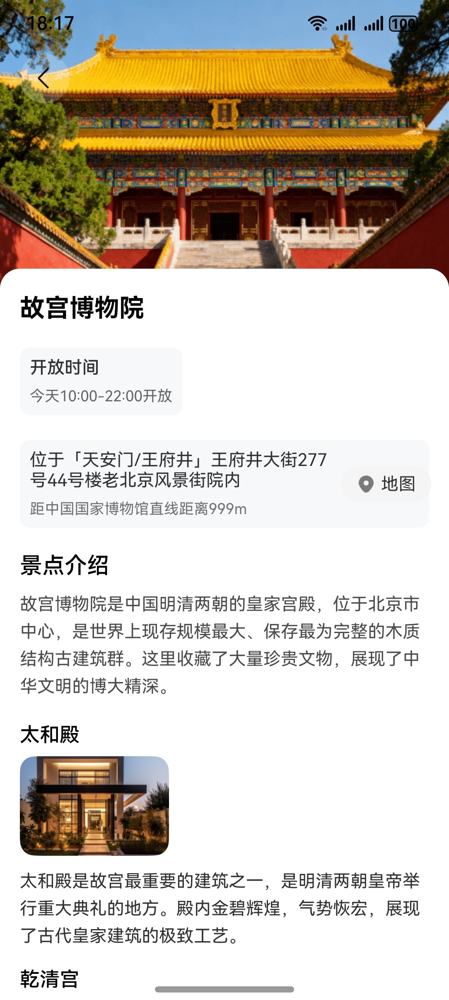 | 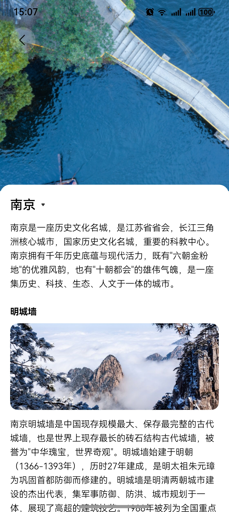 |

### 行程模块及消息模块

|                           行程首页                           |                           旅行足迹                           |                           消息首页                           |
| :----------------------------------------------------------: | :----------------------------------------------------------: | :----------------------------------------------------------: |
|  | 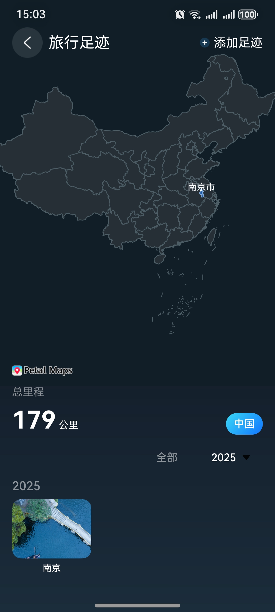 |  |

### 个人中心模块

|                           个人信息                           |                           发布帖子                           |                             设置                             |
| :----------------------------------------------------------: | :----------------------------------------------------------: | :----------------------------------------------------------: |
| 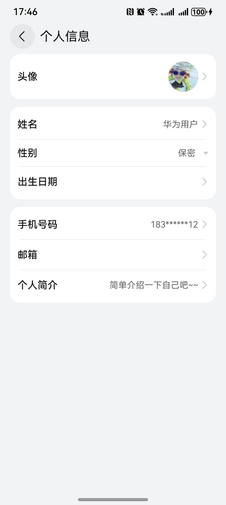 | 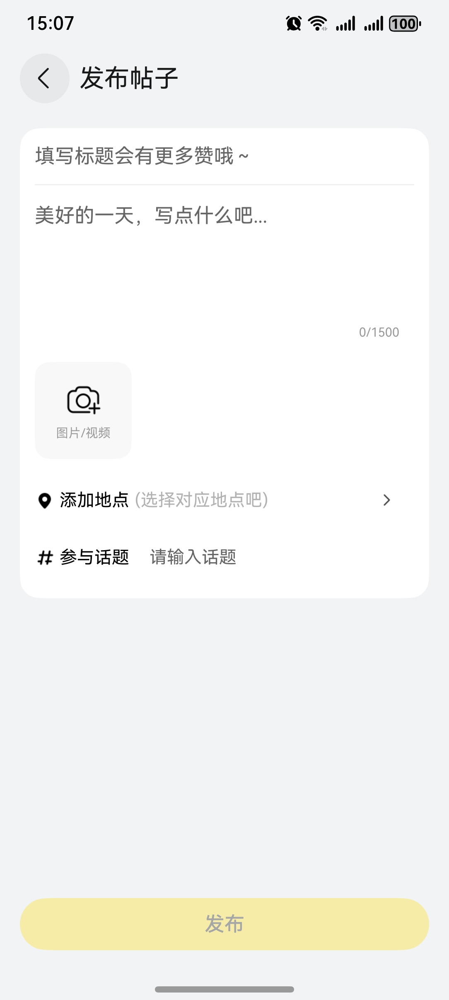 | 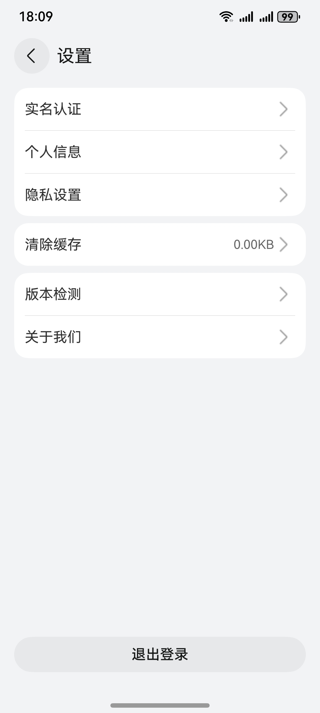 |

## 开源许可协议

该代码经过[Apache 2.0 授权许可](http://www.apache.org/licenses/LICENSE-2.0)。

