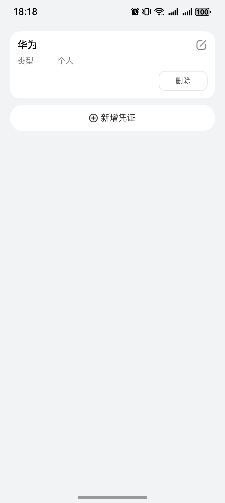
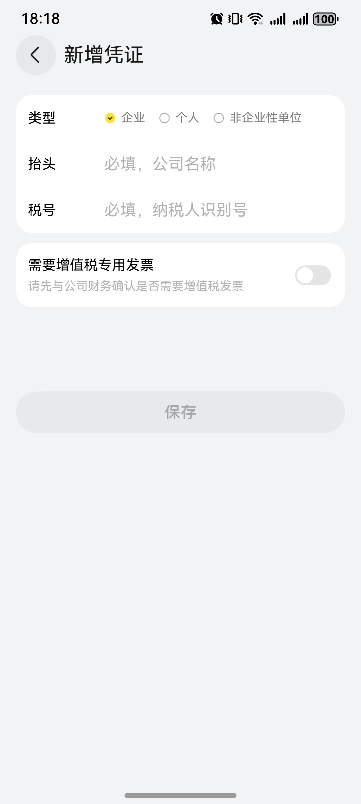

# 发票编辑组件快速入门

##  目录

- [简介](#简介)
- [约束与限制](#约束与限制)
- [使用](#使用)
- [API参考](#API参考)
- [示例代码](#示例代码)

##  简介

本组件提供了发票管理的相关功能，支持发票列表展示、添加新发票、编辑现有发票、删除发票等能力。组件采用列表展示形式呈现发票信息，并提供添加、编辑、删除操作入口。

支持发票列表展示、添加新发票、编辑现有发票、删除发票、表单验证等功能。

| 发票列表视图                                                 | 新增/编辑发票视图                                            |
| ------------------------------------------------------------ | ------------------------------------------------------------ |
|  |  |

## 约束与限制

###  环境

- DevEco Studio版本：DevEco Studio 5.0.5 Release及以上
- Harmony0s SDK版本：Harmony0s 5.0.3(15)Release SDK及以上
- 设备类型：华为手机（包括双折叠和阔折叠）
- 系统版本：HarmonyOS 5.0.3及以上

### 权限
无

## 使用

1. 安装组件。  
   如果是在DevEco Studio使用插件集成组件，则无需安装组件，请忽略此步骤。
   如果是从生态市场下载组件，请参考以下步骤安装组件。  
   a. 解压下载的组件包，将包中所有文件夹拷贝至您工程根目录的xxx目录下。  
   b. 在项目根目录build-profile.json5并添加travel_invoice模块。

   ```
   // 在项目根目录的build-profile.json5填写travel_invoice路径。其中xxx为组件存在的目录名
   "modules": [
     {
       "name": "travel_invoice",
       "srcPath": "./xxx/travel_invoice"
     }
   ]
   ```

   c. 在项目根目录oh-package.json5中添加依赖

   ```
   // xxx为组件存放的目录名称
   "dependencies": {
     "travel_invoice": "file:./xxx/travel_invoice"
   }
   ```

2. 引入组件。

   ```typescript
   import { InvoiceList, InvoiceListComp } from 'travel_invoice';
   ```

3. 调用组件，详细参数配置说明参见[API参考](#API参考)。

   ```typescript
   // 发票列表组件
   InvoiceListComp({
       invoiceList: this.myInvoiceList,
       routerModule: this.pathStack
   })
   ```

## API参考

### 接口

#### InvoiceListComp

InvoiceListComp(options: { invoiceList: [InvoiceList](#InvoiceList) })

发票列表组件，用于展示发票列表并提供添加、编辑、删除操作入口。

**参数：**

| 参数名            | 类型                    | 是否必填 | 说明               |
|------------------|-------------------------|------|------------------|
| invoiceList      | [InvoiceList](#InvoiceList) | 是    | 发票列表数据         |
| routerModule | [NavPathStack](https://developer.huawei.com/consumer/cn/doc/harmonyos-references/ts-basic-components-navigation#navpathstack10) | 是 | 传入当前组件所在路由栈 |

#### AddInvoiceComp

AddInvoiceComp(options: { invoiceInfo: [InvoiceInfo](#InvoiceInfo) })

发票列表组件，用于展示发票列表并提供添加、编辑、删除操作入口。

**参数：**

| 参数名      | 类型                        | 是否必填 | 说明         |
| ----------- | --------------------------- | -------- | ------------ |
| invoiceInfo | [InvoiceInfo](#InvoiceInfo) | 否       | 发票信息数据 |

### 数据类型

#### InvoiceInfo

发票信息数据模型，用于描述单个发票的详细信息。

| 属性名            | 类型                    | 说明               |
|------------------|-------------------------|------------------|
| id               | string                  | 发票唯一标识         |
| type             | [InvoiceType](#InvoiceType) | 发票类型            |
| title            | string                  | 发票抬头            |
| taxID            | string                  | 税号              |
| isNeedVAD        | boolean                 | 是否需要增值税专用发票  |

#### InvoiceList

发票列表管理模型，用于管理发票列表数据，提供添加、编辑、删除等操作。

| 参数名         | 类型                  | 是否必填           | 默认值        | 说明               |
|------------------|-------------------------|------------------|------------------|------------------|
| list | [InvoiceInfo](#InvoiceInfo)[] | 否 | [] | 发票信息数组 |
| add              | (invoiceInfo: [InvoiceInfo](#InvoiceInfo)) | 否            | -            | 添加新发票         |
| editData         | (invoiceInfo: [InvoiceInfo](#InvoiceInfo)) | 否            | -            | 编辑现有发票        |
| deleteById       | (id: string)            | 否            | -            | 根据ID删除发票      |

#### InvoiceType

发票类型枚举，定义了支持的发票类型。

| 值                    | 说明               |
|-----------------------|------------------|
| InvoiceType.ENTERPRISE | 企业发票           |
| InvoiceType.INDIVIDUAL | 个人发票           |
| InvoiceType.NON_ENTERPRISE_UNIT | 非企业单位发票 |

## 示例代码

```
import { InvoiceList, InvoiceListComp } from 'travel_invoice';
import { AppStorageV2 } from '@kit.ArkUI';

@Entry
@ComponentV2
struct Index {
  @Local myInvoiceList: InvoiceList = AppStorageV2.connect(InvoiceList, () => new InvoiceList())!
  private pathStack: NavPathStack = new NavPathStack()

  build() {
    Navigation(this.pathStack) {
      Column() {
        InvoiceListComp({
          invoiceList: this.myInvoiceList,
          routerModule: this.pathStack
        })
      }
      .padding({ top: 50, left: 16, right: 16 })
    }
    .width('100%')
    .height('100%')
    .backgroundColor("#F1F3F5")
  }
}
```
