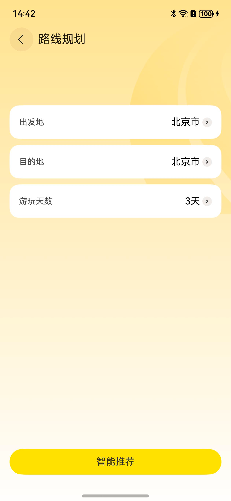
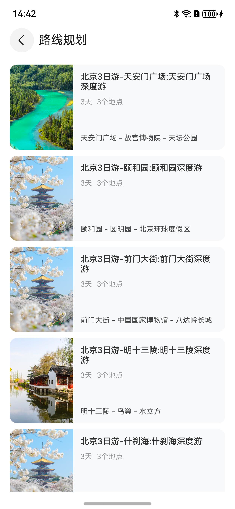

# 路线规划组件快速入门

## 目录

- [简介](#简介)
- [约束与限制](#约束与限制)
- [使用](#使用)
- [API参考](#API参考)
- [示例代码](#示例代码)

## 简介

本组件提供了旅游路线规划功能，支持用户选择出发地、目的地和游玩天数，并根据选择智能推荐旅游路线。

| 路线规划页面                                      | 路线列表页面                                      | 路线详情页面                                        |
|---------------------------------------------|---------------------------------------------|-----------------------------------------------|
|  |  |  |

## 约束与限制

### 环境

- DevEco Studio版本：DevEco Studio 5.0.5 Release及以上
- Harmony0s SDK版本：Harmony0s 5.0.3(15)Release SDK及以上
- 设备类型：华为手机（包括双折叠和阔折叠）
- 系统版本：HarmonyOS 5.0.3及以上

### 权限

- 位置权限：ohos.permission.APPROXIMATELY_LOCATION

## 使用

1. 安装组件。

   如果是在DevEco Studio使用插件集成组件，则无需安装组件，请忽略此步骤。

   如果是从生态市场下载组件，请参考以下步骤安装组件。

   a. 解压下载的组件包，将包中所有文件夹拷贝至您工程根目录的XXX目录下。

   b. 在项目根目录build-profile.json5添加travel_planning和city_select模块。

   ```
   // 在项目根目录build-profile.json5填写travel_planning和city_select路径。其中XXX为组件存放的目录名
   "modules": [
       {
       "name": "travel_planning",
       "srcPath": "./XXX/travel_planning",
       },
       {
       "name": "city_select",
       "srcPath": "./XXX/city_select",
       }
   ]
   ```
   c. 在项目根目录oh-package.json5中添加依赖。
   ```
   // XXX为组件存放的目录名称
   "dependencies": {
     "travel_planning": "file:./XXX/travel_planning",
   }
   ```

2. 引入组件。

   ```typescript
   import { 
     RoutePlanningPageBuilder, 
     RouteCitySelectPageBuilder,
     RouteListPageBuilder,
     RouteDetailPageBuilder,
     ROUTE_PLANNING_PAGE,
     ROUTE_CITY_SELECT_PAGE,
     ROUTE_LIST_PAGE,
     ROUTE_DETAIL_PAGE,
     RouteListParams,
     RouteDetailParams
   } from 'travel_planning';
   ```

3. 调用组件，详细参数配置说明参见[API参考](#API参考)。

   ```
     pageStack: NavPathStack = new NavPathStack()

     @Builder
     pageBuilder(name: string, param: string | undefined) {
       if (name === ROUTE_PLANNING_PAGE) {
         RoutePlanningPageBuilder(param)
       } else if (name === ROUTE_CITY_SELECT_PAGE) {
         RouteCitySelectPageBuilder(param)
       } else if (name === ROUTE_LIST_PAGE) {
         RouteListPageBuilder(parseRouteListParams(param))
       } else if (name === ROUTE_DETAIL_PAGE) {
         RouteDetailPageBuilder(parseRouteDetailParams(param))
       }
     }

     async aboutToAppear() {
       // 初始化时直接显示路线规划页面
       this.pageStack.pushPath({ name: ROUTE_PLANNING_PAGE, param: '' })
     }

     build() {
       Navigation(this.pageStack) {
         Column()
       }
       .width('100%')
       .height('100%')
       .navDestination(this.pageBuilder)
       .hideTitleBar(true)
     }
   
   ```

**【去除安全距离说明】**

如果需要去除 Navigation 组件的默认安全距离（让内容延伸到状态栏区域），可以在 `aboutToAppear` 方法中添加窗口全屏设置代码。取消示例代码中 `aboutToAppear` 方法内的注释即可启用。此设置会影响整个应用窗口，请根据实际需求决定是否使用。

```
   aboutToAppear() {
    // 可选：去除安全距离，设置窗口为全屏布局
     try {
       const uiContext = this.getUIContext()
       const context = uiContext.getHostContext() as common.Context
       if (context) {
         const mainWindow = await window.getLastWindow(context)
         if (mainWindow) {
           await mainWindow.setWindowLayoutFullScreen(true)
         }
       }
     } catch (e) {
     }
  }
```

## API参考

### 接口

#### 路由常量

组件提供了以下路由名称常量，用于页面路由：

| 常量名 | 类型 | 说明 |
| ------- | ---- | ---- |
| ROUTE_PLANNING_PAGE | string | 路线规划页面路由名称 |
| ROUTE_CITY_SELECT_PAGE | string | 城市选择页面路由名称 |
| ROUTE_LIST_PAGE | string | 路线列表页面路由名称 |
| ROUTE_DETAIL_PAGE | string | 路线详情页面路由名称 |

#### RoutePlanningPageBuilder

RoutePlanningPageBuilder(param?: string)

路线规划页面构建器。

**参数：**

| 参数名  | 类型                                          | 是否必填 | 说明           |
| ------- | --------------------------------------------- | ---- | -------------- |
| param | string | 否   | 页面参数。 |

#### RouteCitySelectPageBuilder

RouteCitySelectPageBuilder(params?: string)

城市选择页面构建器。

**参数：**

| 参数名  | 类型                                          | 是否必填 | 说明           |
| ------- | --------------------------------------------- | ---- | -------------- |
| params | string | 否   | 当前选中的城市名称（可选）。 |

#### RouteListPageBuilder

RouteListPageBuilder(params?: RouteListParams)

路线列表页面构建器。

**参数：**

| 参数名  | 类型                                          | 是否必填 | 说明           |
| ------- | --------------------------------------------- | ---- | -------------- |
| params | [RouteListParams](#RouteListParams对象说明) | 否   | 路线列表参数。 |

#### RouteDetailPageBuilder

RouteDetailPageBuilder(params?: RouteDetailParams)

路线详情页面构建器。

**参数：**

| 参数名  | 类型                                          | 是否必填 | 说明           |
| ------- | --------------------------------------------- | ---- | -------------- |
| params | [RouteDetailParams](#RouteDetailParams对象说明) | 否   | 路线详情参数。 |

#### RouteListParams对象说明

| 名称       | 类型      | 是否必填 | 说明     |
| :--------- |:--------| ---- |--------|
| city | string  | 是   | 目的地城市名称   |
| days | number | 是   | 游玩天数   |

#### RouteDetailParams对象说明

| 名称       | 类型                          | 是否必填 | 说明     |
| :--------- |:----------------------------| ---- |--------|
| route | [RouteItem](#RouteItem对象说明) | 是   | 路线信息对象   |

#### RouteItem对象说明

RouteItem 表示路线信息对象，包含以下字段：

| 名称       | 类型      | 是否必填 | 说明     |
| :--------- |:--------| ---- |--------|
| id | string  | 是   | 路线唯一标识符   |
| title | string | 是   | 路线标题   |
| days | number | 是   | 游玩天数   |
| locations | number | 是   | 地点数量   |
| attractions | string[] | 是   | 景点名称数组   |
| coverImage | ResourceStr | 是   | 封面图片资源   |
| city | string | 是   | 城市名称   |

## 示例代码

```
import { 
  RoutePlanningPageBuilder, 
  RouteCitySelectPageBuilder,
  RouteListPageBuilder,
  RouteDetailPageBuilder,
  ROUTE_PLANNING_PAGE,
  ROUTE_CITY_SELECT_PAGE,
  ROUTE_LIST_PAGE,
  ROUTE_DETAIL_PAGE,
  RouteListParams,
  RouteDetailParams
} from 'travel_planning';
import { window } from '@kit.ArkUI';
import { common } from '@kit.AbilityKit';

function parseRouteListParams(param: string | undefined): RouteListParams | undefined {
  if (!param) return undefined
  try {
    return JSON.parse(param) as RouteListParams
  } catch {
    return undefined
  }
}

function parseRouteDetailParams(param: string | undefined): RouteDetailParams | undefined {
  if (!param) return undefined
  try {
    return JSON.parse(param) as RouteDetailParams
  } catch {
    return undefined
  }
}

@Entry
@ComponentV2
struct Index {
  pageStack: NavPathStack = new NavPathStack()

  @Builder
  pageBuilder(name: string, param: string | undefined) {
    if (name === ROUTE_PLANNING_PAGE) {
      RoutePlanningPageBuilder(param)
    } else if (name === ROUTE_CITY_SELECT_PAGE) {
      RouteCitySelectPageBuilder(param)
    } else if (name === ROUTE_LIST_PAGE) {
      RouteListPageBuilder(parseRouteListParams(param))
    } else if (name === ROUTE_DETAIL_PAGE) {
      RouteDetailPageBuilder(parseRouteDetailParams(param))
    }
  }

  async aboutToAppear() {
    // 可选：去除安全距离，设置窗口为全屏布局
    // 注意：此设置会影响整个应用窗口，如需去除顶部和底部的安全距离，可取消下方注释
     try {
       const uiContext = this.getUIContext()
       const context = uiContext.getHostContext() as common.Context
       if (context) {
         const mainWindow = await window.getLastWindow(context)
         if (mainWindow) {
           await mainWindow.setWindowLayoutFullScreen(true)
         }
       }
     } catch (e) {
     }
    
    // 初始化时直接显示路线规划页面
    this.pageStack.pushPath({ name: ROUTE_PLANNING_PAGE, param: '' })
  }

  build() {
    Navigation(this.pageStack) {
      Column()
    }
    .width('100%')
    .height('100%')
    .navDestination(this.pageBuilder)
    .hideTitleBar(true)
  }
}
```
